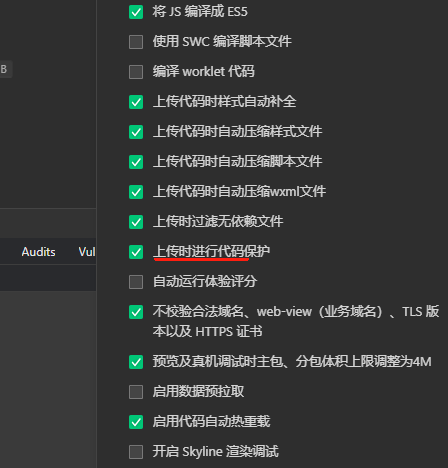

最近小程序接口被盗，频繁的请求接口。

之前在接口中加了nonce来防止攻击，但是代码没有混淆。

今天就直接来演技下小程序此反编译。

## 逆向软件
下载地址 [反编译脚本利器.zip](https://github.com/ygweric/test-files/blob/master/%E5%8F%8D%E7%BC%96%E8%AF%91%E8%84%9A%E6%9C%AC%E5%88%A9%E5%99%A8.zip)


## 小程序代码位置

打开下面的这个地址


直接打开的文件夹不是很对，需要往上层目录找，找到有**All Users**和**Applet**的目录，进去**Applet**,


打开一个小程序，（已经有的可以删除，避免混乱）可以看到有文件夹生成，就是你的小程序的文件


进去以后能找到对应的 **__APP__.wxapkg** ,如果有子包，也会有对应文件，这个文件就是我们要破解的文件。


## 破解 wxapkg
打开**反编译脚本利器\小程序包解密工具** 这个软件，选择对应的**wxapkg**文件，


然后回看到破解成功，破解后的地址在**反编译脚本利器\小程序包解密工具\wxpack**


### 未加密

如果是体验版小程序（自测）时候，会提示没有加密。后面可以直接提取文件，一会说。


## 从 wxapkg提取小程序原生文件

到到**反编译脚本利器\wxappUnpacker-master** 目录中，安装依赖 **npm i**。


复制解密后的**wxapkg** 到**反编译脚本利器\wxappUnpacker-master** 目录中，运行
```
node wuWxapkg.js wx1a512a5456e6aad1.wxapkg 
```
 对应提取的原生文件在**wx1a512a5456e6aad1**目录中，可以正常看看源码了。


### 有子包

用下面命令，指定子包和主包。

```
node wuWxapkg.js wx997403c489bfae42_packageA.wxapkg", "-s=wx997403c489bfae42_main.wxapkg
```


### 未加密的wxapkg内容提取。


使用下面python文件，运行
```
python unwxapkg.py wx997403c489bfae42.wxapkg
```

**unwxapkg.py***
```python
# coding: utf-8
# py2 origin author lrdcq
# usage python3 unwxapkg.py filename

__author__ = 'Integ: https://github.com./integ'

import sys, os
import struct

class WxapkgFile(object):
    nameLen = 0
    name = ""
    offset = 0
    size = 0

if len(sys.argv) < 2:
    print('usage: unwxapkg.py filename [output_dir]')
    exit()

with open(sys.argv[1], "rb") as f:
    root = os.path.dirname(os.path.realpath(f.name))
    name = os.path.basename(f.name) + '_dir'
    if len(sys.argv) > 2:
        name = sys.argv[2]

    #read header
    firstMark = struct.unpack('B', f.read(1))[0]
    print('first header mark = {}'.format(firstMark))

    info1 = struct.unpack('>L', f.read(4))[0]
    print('info1 = {}'.format(info1))

    indexInfoLength = struct.unpack('>L', f.read(4))[0]
    print('indexInfoLength = {}'.format(indexInfoLength))

    bodyInfoLength = struct.unpack('>L', f.read(4))[0]
    print('bodyInfoLength = {}'.format(bodyInfoLength))

    lastMark = struct.unpack('B', f.read(1))[0]
    print('last header mark = {}'.format(lastMark))

    if firstMark != 0xBE or lastMark != 0xED:
        print('its not a wxapkg file!!!!!')
        f.close()
        exit()

    fileCount = struct.unpack('>L', f.read(4))[0]
    print('fileCount = {}'.format(fileCount))

    #read index
    fileList = []
    for i in range(fileCount):
        data = WxapkgFile()
        data.nameLen = struct.unpack('>L', f.read(4))[0]
        data.name = f.read(data.nameLen)
        data.offset = struct.unpack('>L', f.read(4))[0]
        data.size = struct.unpack('>L', f.read(4))[0]
        print('readFile = {} at Offset = {}'.format(str(data.name, encoding = "utf-8"), data.offset))

        fileList.append(data)

    #save files
    for d in fileList:
        d.name = '/' + name + str(d.name, encoding = "utf-8")
        path = root + os.path.dirname(d.name)

        if not os.path.exists(path):
            os.makedirs(path)

        w = open(root + d.name, 'wb')
        f.seek(d.offset)
        w.write(f.read(d.size))
        w.close()

        print('writeFile = {}{}'.format(root, d.name))

    f.close()
```


## 怎么加固防破解

### 代码保护
开发者工具有“代码保护”选项，但效果不好，只是重命名了变量名，没有真正混淆。




### 代码加固

https://developers.weixin.qq.com/miniprogram/dev/devtools/code_obfuscation.html
官方有加固的插件。

效果很好，完全看不到内容了，可以自行试一下。

效果可以参考下面

https://obfuscator.io/


# 关于我
国 wei (Eric)
[Github](https://github.com/ygweric)

# [扫码加入独立开发微信群-二维码经常更新](https://raw.githubusercontent.com/ygweric/ygweric.github.io/main/assets/qr-schedule-update/indenpendent_dev.png)

# 关注公众号 [开发副业](https://github.com/ygweric/ygweric.github.io/blob/main/assets/jinjing/wx_office_account_qr.png?raw=true)，闲谈代码人生
