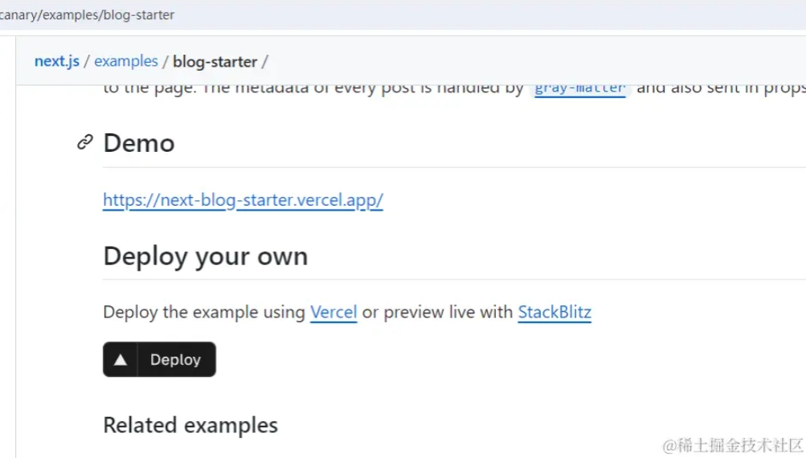
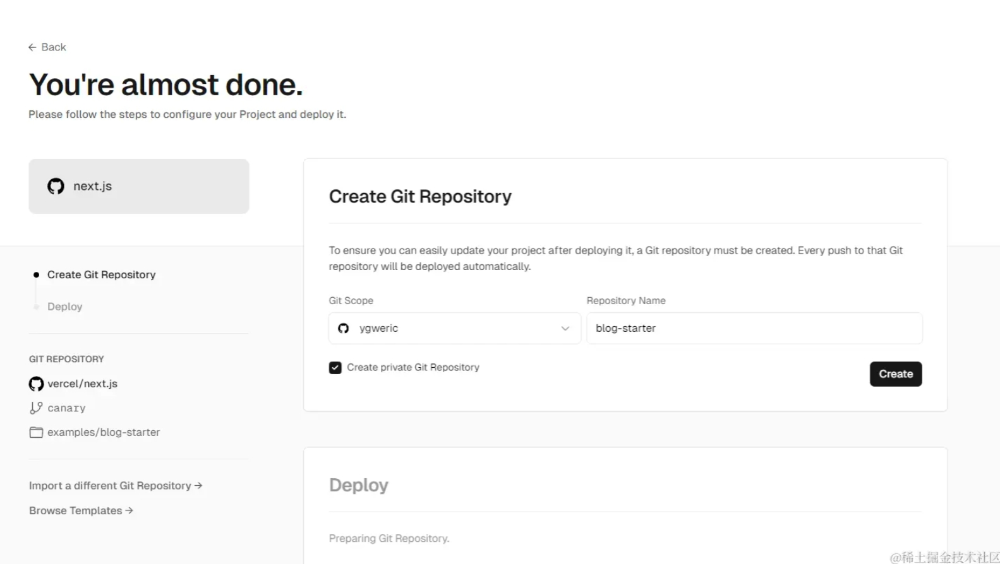
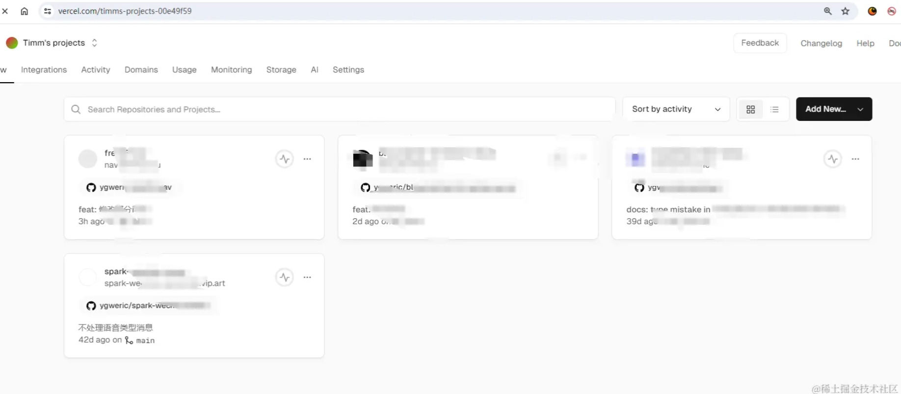
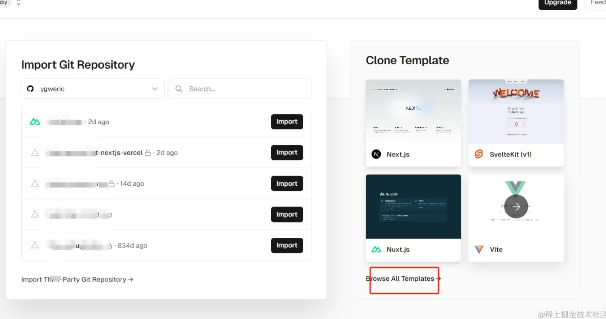
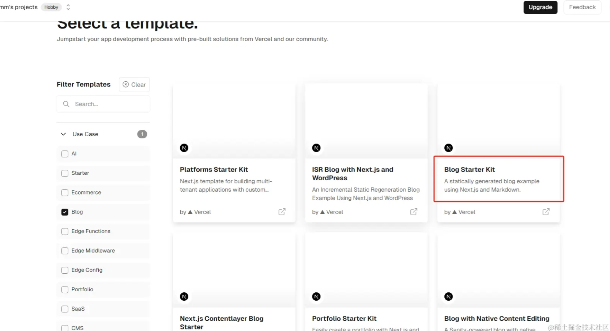
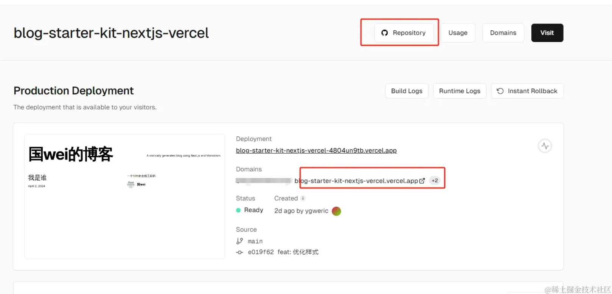
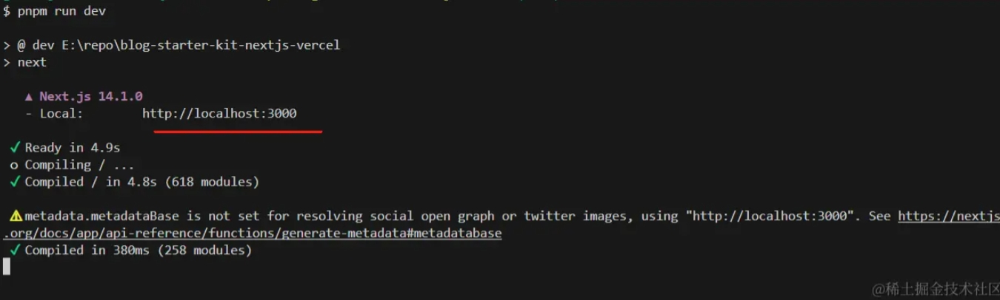
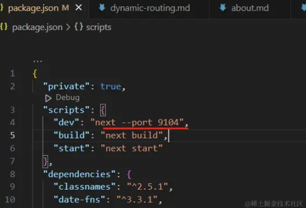

# 背景介绍
最近突然又想动摇了，想搞点自己的好玩东西，于是又打起了自建博客的主意。

很久以前自建博客大家选择的技术方案都是wordpress,或者是hexo/jekyll + GIthub Page的组合。
但现在已经是2024年了。React和Vue已经一统天下。Next.js的自建网站更是如火如荼，背后的金主Vercel也为开发者提供了很多免费的功能，比如静态网站托管，serveless函数托管等。

身为白嫖党，我们今天就来白嫖一下这些最新技术和服务，来折腾点有意思的东西。

所以本次写作的目标是通过 next.js + tailwindcss + markdown + vercel 搭建一个博客系统, 全部时间在10分钟内完成，全部费用是0。

为了彰显自己的个性，并投入一部分资金来表现自己认真的态度，但又不过度消费，我们可花7元钱在阿里云买个nb的域名，绑定我们的博客。

后续我们会为我们的博客添加我们我们自定义的风格，进行二开等内容。

以后内，如果有时间，我们可以考虑搞个chrome插件或者服务，能方便的同步我们的博客内容到 掘金、公众号等平台，这些取决于我是否还有精力来继续做这些事情。

下面我们开始部署我们的博客。

# 白嫖部署

next.js的github仓库中，是提供有一个简单的博客系统代码。
https://github.com/vercel/next.js/tree/canary/examples/blog-starter

这里是他的线上demo https://next-blog-starter.vercel.app/

对应的readme中，还告诉我们如何搭建博客。



我们的故事从这里开始。

根据next.js的文档按图索骥，我们来到 vercel的后台，当然你需要提前登录好，免费的。

https://vercel.com/new/clone?repository-url=https://github.com/vercel/next.js/tree/canary/examples/blog-starter&project-name=blog-starter&repository-name=blog-starter

如果你已经授权了vercel访问你的github仓库，下面的操作会非常的无缝。如果你第一次使用，可能需要授权github给你的vercel，我反正是授权了所有的权限，毕竟vercel是值得我们信赖的(github里面有什么非常贵重的机密）

在这地方，我们输入自己的博客系统名称，vercel会为你自动创建像一个的github仓库，这里我输入的是 **blog-starter-kit-nextjs-vercel**， 点击**create**，然后**deploy**,稍等三五分钟，我们的博客系统就上线了。


vercel本身提供了很多模板可以部署，我们可以来到后台，点击**Add New Project**， 


然后浏览模板


可以看到vercel有很多模板，可以一键部署，我们刚才选择的blog模板也在里面，可以直接点击部署。



部署成功后，我们能看到vercel给我们分配的地址，点击就能打开我们博客。
对应的repository就是我们github中自动创建的博客代码，他使用他的技术栈是 **next.js+tailwindCss+ts+markdown+vercel**， 后续我们的blog都是再找个仓库里面更新的，更新push到github后，vercel会收到通知，然后自动更新部署，全程在5分钟之内还是非常方便的。




好了，白嫖内容到此结束。

我们也可以做些补充，在aliyun买个最便宜的域名，绑定到我们的博客上，我刚买另一个，**devhub.icu**，具体的意思相信你也懂得~。然后加一个二级域名，所以我的博客地址是  https://blog.devhub.icu/。 我后续的内容都会更新到这个地址上，同时我也会为这个有趣的域名**devhub.icu**增加一些有趣的功能。

# 代码介绍

vercel为我们的github自动clone了一份代码仓库，地址在vercel的后台可以找到，或者去github上，也能看到刚创建的代码。

我们去github后台clone下来。准备本地写blog。next.js需要node.js >=18的版本，如果本地node版本不对，可以试用nvm来切换下。

用了多年的npm、yarn、pnpm，他们几个各有千秋，pnpm可以节省本地node_modules的体积，所以最近我一直在用它，你也可以用别的，没啥区别。

clone我的blog仓库后，命令行执行下面命令

```bash
pnpm i 
pnpm run dev
```
会启动服务，打开对应的网址  http://localhost:3000 可以看到我们博客系统。





修改端口，可以直接package.json 中修改如下 **"dev": "next --port 9104",**





今天的内容先到此结束，我们没有修改一行代码，没有花一分钱，就有了自己的博客，甚至所有的操作手机都能完成。

后面的文章中，我会以blog为契机，需介绍些next.js的用法，以及说一下next.js和普通的react.js进行开发的对比感觉。


# [加入独立开发微信群-二维码经常更新](https://raw.githubusercontent.com/ygweric/ygweric.github.io/main/assets/qr-schedule-update/indenpendent_dev.png)


