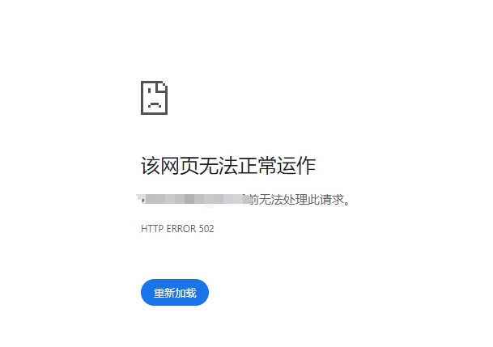

折腾了多年的海外vps，好不容易想开发个小程序，发现介入自己的服务器需要备案过的域名。

好吧，开始阿里云买域名，买ECS，然后备案。

然后安装宝塔，建站，域名映射，一顿轻车熟路的操作，提示 **HTTP ERROR 502**，一脸懵逼，不知道是阿里云我没用对，还是**cloudfare**对阿里云的支持有问题。

一顿搜索查询，还是不行。

突然意识到，没有备案，然后赶紧搜索 **阿里云服务器 备案前无法访问**, 才知道需要备案。。。

哎，继续等着吧，已经3周了，估计也快了。
