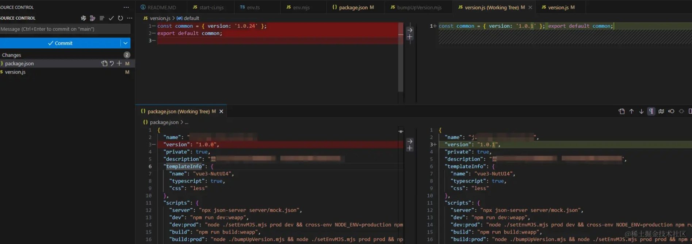

## 维护版本信息原理
创建一个文件**version.js**如下，在代码中需要显示版本的地方可以引入这个js文件，显示对应版本信息，或者进行相关判断操作

```js
const common = { version: '1.0.24' };
export default common;
```

## 什么时候修改这个**version.js文件**？
可以用下面几种方法
1. 使用git的**pre-commit**的hook来执行更新版本操作
2. 使用**husky**，[**simple-git-hooks**](https://github.com/toplenboren/simple-git-hooks)等插件插件，其实原理还是搞过了git的hook
3. 自定**package.json**的命令，在需要时候执行版本更新命令。

## 版本更新脚本
这里我们在**package.json**中配置自定义命令更新版本
```
  "bumpup-version": "node ./bumpUpVersion.mjs",
```

新建更新**version.js**的脚本**bumpUpVersion.mjs**：
```js
import * as fs from 'fs'

const packageJson = JSON.parse(fs.readFileSync('./package.json', 'utf-8')) // 读取package.json中的版本
const oldVersion = packageJson.version
const oldVersionArr = oldVersion.split('.')//获取大版本、小版本信息
const lastVersionIndex = oldVersionArr.length - 1
oldVersionArr[lastVersionIndex] = `${parseInt(oldVersionArr[lastVersionIndex], 10) + 1}`//小版本+1
const newVersion = oldVersionArr.join('.')// 生成新版本
packageJson.version = newVersion
fs.writeFileSync('./package.json', JSON.stringify(packageJson, null, 2)) //用新版本覆盖package.json
const versionStr = `const common = { version: '${newVersion}' }; export default common;`
fs.writeFileSync('./version.js', versionStr)//更新version.js
```
运行命令后，会修改**package.json**和**version.js**这两个文件，可以随git一块提交编译



相关实践在开源项目[微信小程序：查看进京证摄像头分布和信息，智能规划线路，避让摄像头，适合短距离出行](https://github.com/ygweric/jinjing-route-plan-mp-opensource)中有使用。


## 优点
以上更新版本的方式灵活自由，可以使用**1.2.3**这种标准的版本号记录，也可以使用时、字符串等任意内容记录，可以根据自己的业务调整，技术栈和前台后台没有关系，可以在**web**，**后端**，**爬虫**，**ReactNative**，**小程序**等任意平台使用。

 [加入独立开发微信群-二维码经常更新](https://raw.githubusercontent.com/ygweric/ygweric.github.io/main/assets/qr-schedule-update/indenpendent_dev.png)


