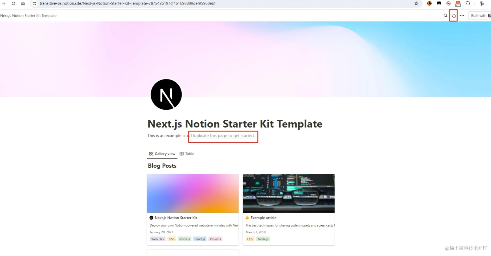
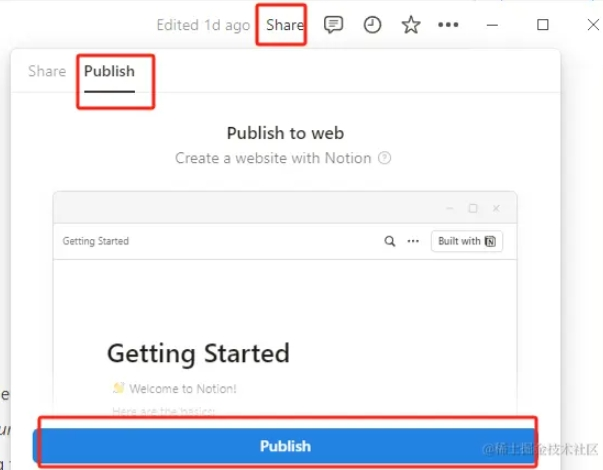
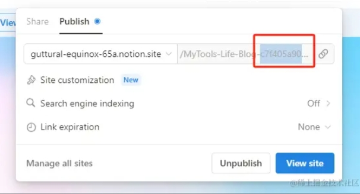
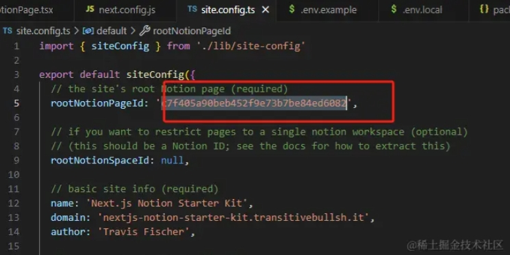
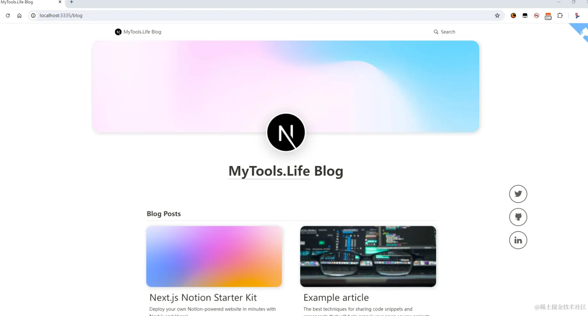
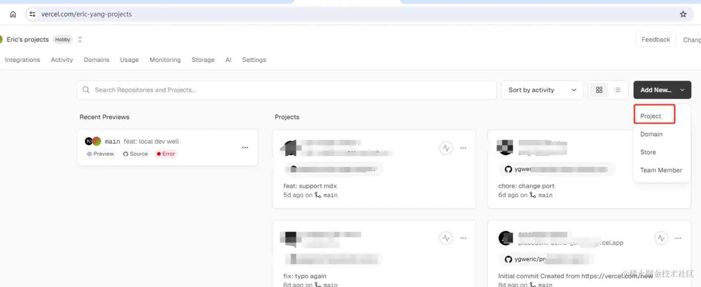
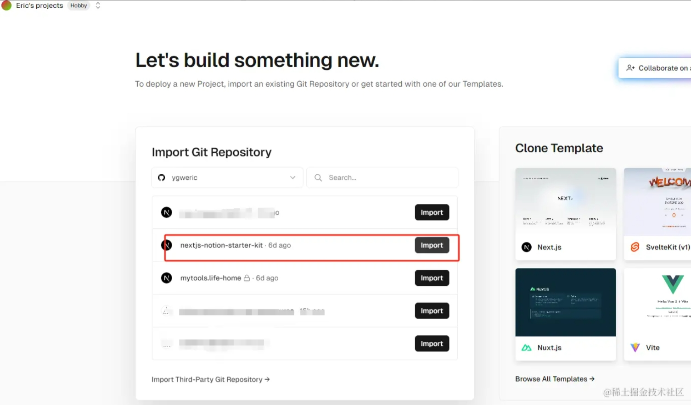
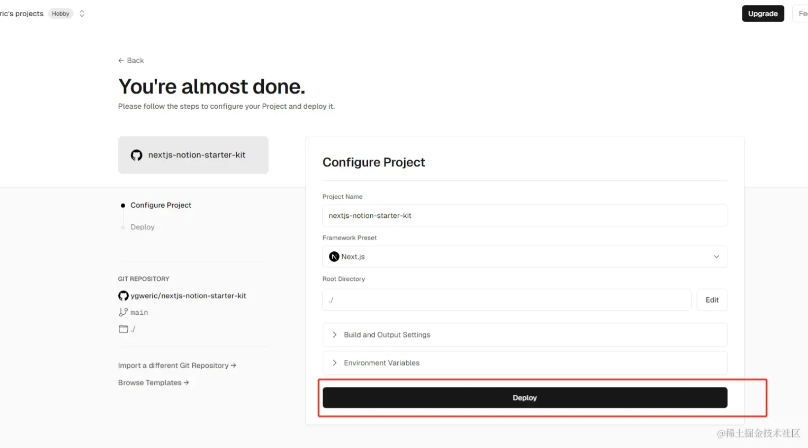
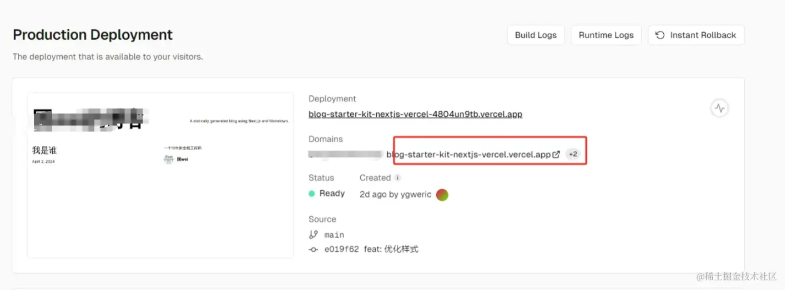
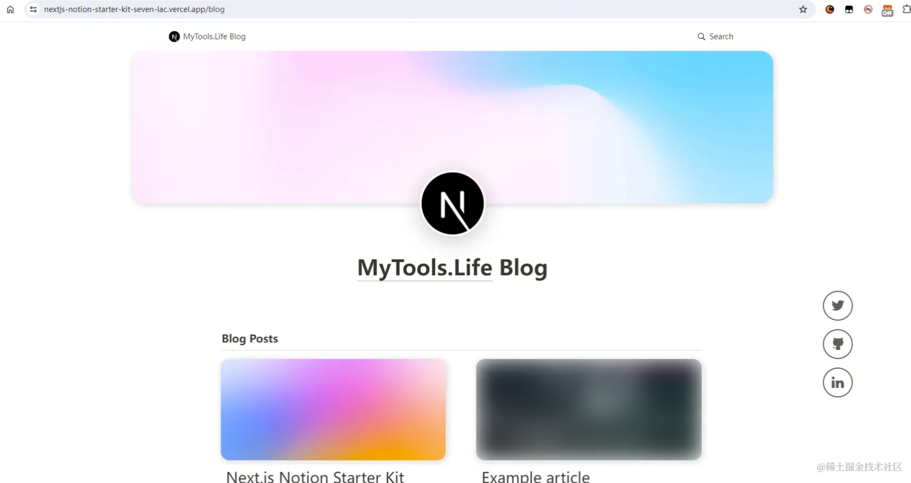

# 先说目的
为什么要选择这个技术栈？博客技术那么多，这个有什么特点？

## 这个技术栈的优点如下：

### 1. 免费！！！
一分钱都不需要，除非你想要一个自定义的域名，阿里云买一个最便宜的十几块就行
1. 使用notion免费版本，对博客来说功能完全足够。
2. 系统部署在vercel，免费流量对个人来说绰绰有余。  
### 2. 存储空间无限。
数据、文件、图片、视频存储在notion服务器上，个人版本免费，除非你要上传超大文件，否则普通博客没限制, 具体对比 [参考notion官网](https://www.notion.so/pricing)。

### 3. 可视化编辑
使用notion这个风靡全球的笔记软件，不需要任何如开发知识。[notion官网在这里](https://www.notion.so/)

### 4. Next.js自定义UI
通过在Next.js项目中，接入notion笔记系统，我们可以编写自己的主题css文件，定制化页面分隔，添加各种新功能。

# 用法

## 环境准备
1. [下载 or fork 代码](https://github.com/ygweric/nextjs-notion-starter-kit)
2. [注册notion](https://www.notion.so/)，可以使用web版本或者电脑端软件
3. [注册vercel](https://vercel.com/)
4. 下载node.js, 版本 >= v18.20.1
5. 推荐使用pnpm，不过yarn和npm应该也可以，我没有测试

## 启动代码
1. 在**nextjs-notion-starter-kit**目录下，执行**pnpm i** 安装依赖包
2. 假设你已经在web注册并登录了notion，这里有[默认首页模板](https://transitive-bs.notion.site/Next-js-Notion-Starter-Kit-Template-7875426197cf461698809def95960ebf)，强烈推荐使用，后面你可以自己修改，这里可以方便最快的创建内容。点击“复制”。复制模板到你的空间，如下图所示，两个按钮都可以复制。

3. 复制后如下图，修改成你自己的名字。我修改成了[MyTools.Life Blog](https://nextjs-notion-starter-kit-pearl-gamma.vercel.app/)，内容你可以随便修改，notion没有文件夹的概念，他的文章里面无限可以嵌套文章，可以理解为文件夹。

4. 上面的文章就是我们未来博客的数据源，因此我们要修改文章权限，让匿名用户可以无限制访问。点击分享按钮, 点击“publish”进行分享

6. publish后，有个share的链接，最后这一串数字是我们的**pageId**，复制下来，待回用

7. 打开**nextjs-notion-starter-kit**的**site.config.ts**，这个文件是我们的博客配置相关内容，待会可以仔细看。现在我们复制刚才notion的**pageId**给**rootNotionPageId**，如下图

8. 接着看**site.config.ts**，里面有twitter、github的账号等，blog的title，description等配置项，可以根据自己需要配置。
9. 运行**pnpm run dev**，本地启动，可以看到博客的内容

## 发布到vercel
1. 如果是fork的代码，直接push到自己的分支上；如果是clone的代码，去github新建仓库，push上去。
2. 进入[verce后台](https://vercel.com/eric-yang-projects),如果第一次，需要创建自己的工程，然后新建项目如下图

3. 找到刚才push的工程**nextjs-notion-starter-kit**， 导入

4. 保持默认配置，直接**deploy**

5. 稍等片刻，提示编译成功，点击对应地址，能打开博客。

# 改进项
**大功告成**,剩下的就是进行改进：
1. 优化自己的notion内容和风格色彩，notion很强大，可以持续探索。
2. 修改对应的next.js代码，配置博客风格，添加更多内容，比如登录、数据统计、评论，甚至付费阅读等功能，都是可以研究的。

# 代码
原始仓库[在这里](https://github.com/transitive-bullshit/nextjs-notion-starter-kit)，做的非常好，,我fork了一份自用，[地址在这里](https://github.com/ygweric/nextjs-notion-starter-kit),这篇文章也是基于我fork的仓库演示的。

# demo地址

我自己部署的博客地址在[https://nextjs-notion-starter-kit-pearl-gamma.vercel.app/](https://nextjs-notion-starter-kit-pearl-gamma.vercel.app/)，内容还在充实。

git仓库原作者自己的博客地址[在这里](https://transitivebullsh.it/)

 # [加入独立开发微信群-二维码经常更新](https://raw.githubusercontent.com/ygweric/ygweric.github.io/main/assets/qr-schedule-update/indenpendent_dev.png)

