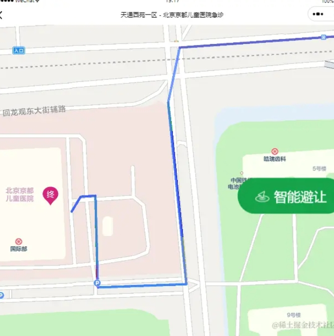
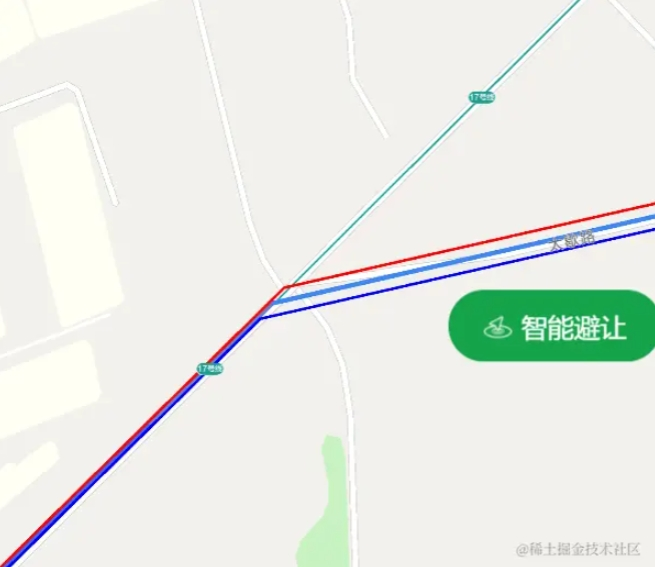
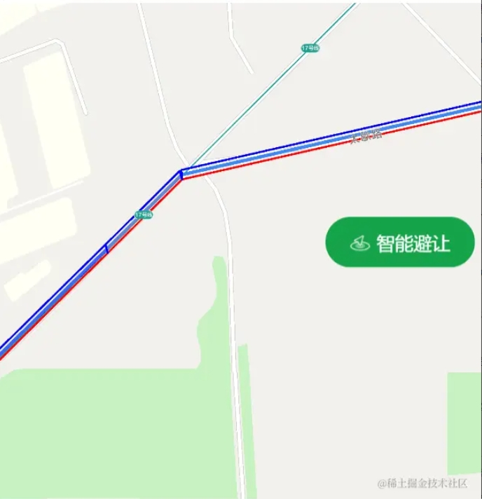
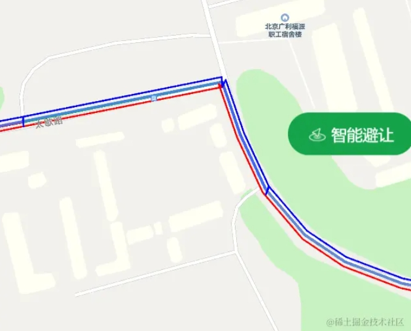
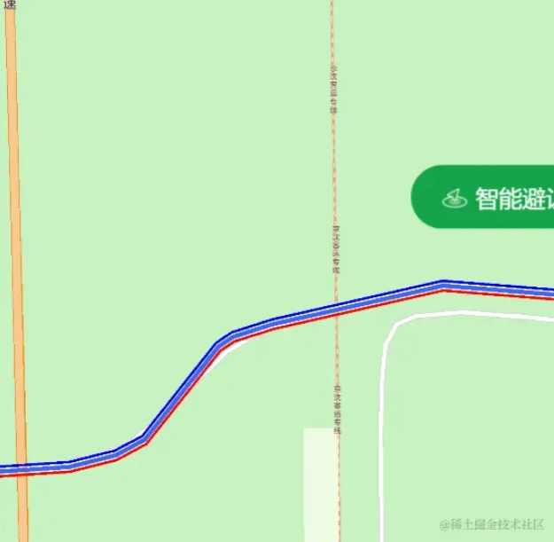

在[开源一个日赚5毛的小程序【北漂开车指南】，欢迎star](https://juejin.cn/post/7393209265572773951) 中，有很多值得研究的算法，这里想分享一下。

相关实践在开源项目[微信小程序：查看进京证摄像头分布和信息，智能规划线路，避让摄像头，适合短距离出行](https://github.com/ygweric/jinjing-route-plan-mp-opensource)中有使用。

这个小程序的主要算法点是：**判断摄像头点位是否在导航线路之上，也就是判断摄像头点位是否和线路重合**

## 这里有几个前置情况需要说明下：
1. 目前小程序的摄像头点位有5000+，每个摄像头对应一个二维的经纬度点位。数据结构如下
```ts
export type Location = {
  longitude: number;
  latitude: number;
};
```
2. 导航线路，是通过调用高德接口返回的，返回的数据格式是n个二位的点，组成的折线（线段），如下图，原始数据并不是一个或者多个封闭的多边形。



3. 高德的原始数据如下`"tmc_polyline": "116.408477,40.06518;116.408525,40.0651;116.408627,40.065041;116.408718,40.065041;116.408799,40.065078"`

实际使用中，我将其映射为简单的经纬度数组，可以理解为 `Array<Location>`,如下：
```json
[{"longitude":116.408477,"latitude":40.06518},
{"longitude":116.408525,"latitude":40.0651},
{"longitude":116.408627,"latitude":40.065041},
{"longitude":116.408718,"latitude":40.065041},
{"longitude":116.408799,"latitude":40.065078},
{"longitude":116.408799,"latitude":40.065078},
{"longitude":116.409287,"latitude":40.064719},
{"longitude":116.409287,"latitude":40.064719},
{"longitude":116.409314,"latitude":40.065207},
{"longitude":116.409314,"latitude":40.065207}]
```

4. 高德提供线路避让的接口，避让参数需要是多边形，不可以是二维点， [文档在这里](https://lbs.amap.com/api/webservice/guide/api/newroute#s1), 参数字段是**avoidpolygons**

> avoidpolygons 
> 
> 区域避让，默认支持1个避让区域，每个区域最多可有16个顶点；多个区域坐标按顺序以英文竖线符号“|”分隔，如果是四边形则有四个坐标点，如果是五边形则有五个坐标点；最大支持32个避让区域。同时传入避让区域及避让道路，仅支持避让道路；每个避让区域不能超过81平方公里，否则避让区域会失效。


所以，我们要
1. 判断并标记出摄像头（**二维点位**），是否与导航的线路（**二维点位数组（无宽度折线）**）有重合。
2. 将重合的点位转换为面，传给高德api。


我们先尝试解决第一个问题：
# 判断并标记出摄像头是否与导航的线路有重合
当然，只判断点位和曲线是否重合，和简单，这里不描述，可以直接问大模型。

在**实际业务中**， 摄像头位置会有误差（网友上报提供），导航的无宽度折现，也无法覆盖实际宽两三米的道路，所以，我们需要（方案二选一）
1. **将摄像头扩展为一个具有面积的正方形**，正方形的宽度可以配置，在进行点位重合测试的时候选择合适的精度。当然，也可以扩展成圆、菱形、五角星、三角形、可以自由探索~。
2. **将线路的“无宽度折线”，扩展为有宽度的折线**，这个比较复杂，也走了弯路，一会细说。

我当时选择了第二种，估计当时脑子没有反应过来，直接忘记了第一种~


## 将线路的“无宽度折线”，扩展为有宽度的折线


### 方案v1， 有bug
当时我想着直接将经纬度都加减10，得到一个误差，初期结果如下，效果看着不错。


但测试多了，就发现有问题，在垂直、水平的路线中，显示良好，但在45度倾斜的情况下，回显示，如图：




v1代码可以在 [https://github.com/ygweric/jinjing-route-plan-mp-opensource/tree/expandLineV1](https://github.com/ygweric/jinjing-route-plan-mp-opensource/tree/expandLineV1) 的**expandLineV1**分支的**src\pages\route\index.vue**文件中查看

### 方案v2，用起来效果不错（目前线上版本的方案）

意识到自己的错误后，我发现进入了自己的知识盲区，好像很复杂的样子。

但是我们有GPT，直接开文，在经历过ChatGPT、文心一言、通义千问等来回对比测试，改进提问后，终于得到了正确答案。

大概原始是先计算每跟线段的法线，在再法线的方向上向两个方向同时扩展线段。

先看下效果，截图是和方案一错误效果对应的位置对比图：







可以看到，这次折线扩充的就很丝滑了，虽然转折处有一些缝隙，但已经无伤大雅了，上代码：
```ts

/**
 * 该函数用于将一条由多个点组成的线向外扩展指定宽度，生成一个新的多边形。
 * 如果给定的点数量少于2个，则会抛出错误。
 * 函数内部通过计算向量方向和角度，然后向外扩展得到新的点。
 * 最后，将所有扩展点连接起来形成一个多边形，并闭合回到起点。
 * 扩展线条为某个宽度的带状
 * @param points 
 * @param width 
 * @returns 
 */
export function expandLineWithWidth(points: Point[], width: number): Point[] {
    if (points.length < 2) {
        throw new Error('至少需要两个点来定义一条线');
    }

    // 计算向量方向并外扩得到新点
    function getExpandedPoints(point1: Point, point2: Point, widthHalf: number): Point[] {
        const dx = point2.longitude - point1.longitude;
        const dy = point2.latitude - point1.latitude;
        const length = Math.sqrt(dx ** 2 + dy ** 2);
        const angle = Math.atan2(dy, dx); // 获取当前线段的角度
        // 外扩向量
        const offsetVector1 = { longitude: point1.longitude + widthHalf * Math.cos(angle - Math.PI / 2), latitude: point1.latitude + widthHalf * Math.sin(angle - Math.PI / 2) };
        const offsetVector2 = { longitude: point2.longitude + widthHalf * Math.cos(angle - Math.PI / 2), latitude: point2.latitude + widthHalf * Math.sin(angle - Math.PI / 2) };
        return [offsetVector1, offsetVector2];
    }

    const halfWidth = width / 2;
    let polygonPoints: Point[] = [points[0]];

    for (let i = 1; i < points.length; i++) {
        const expandedPair = getExpandedPoints(points[i - 1], points[i], halfWidth);
        polygonPoints.push(...expandedPair);
    }

    // 闭合多边形，回到起点
    const firstPair = getExpandedPoints(points[points.length - 1], points[0], halfWidth);
    polygonPoints.push(firstPair[0]); // 注意，这里我们只添加了第一个外扩点以闭合多边形，避免重复添加最后一个点

    return polygonPoints;
}
```


接着进行下一个问题：

## 判断点位是否在多边形中

这个比较简单，就是循环遍历判断即可，上代码：


```ts
/**
   * chatGPT 提供的算法
   * @param point
   * @param polygon
   */
  function isPointInPolygon(point: Location, polygon: Location[]) {
    let x = point.latitude; // 维度-x
    let y = point.longitude; // 经度-y
    let inside = false;
    for (let i = 0, j = polygon.length - 1; i < polygon.length; j = i++) {
      let xi = polygon[i].latitude;
      let yi = polygon[i].longitude;
      let xj = polygon[j].latitude;
      let yj = polygon[j].longitude;
      let intersect =
        yi > y !== yj > y && x < ((xj - xi) * (y - yi)) / (yj - yi) + xi;
      if (intersect) inside = !inside;
    }
    return inside;
  }
```


好了，接着我们来解决第二个问题：
# 将重合的点位转换为面，传给高德api
检测到哪些摄像头点位和摄像头重合后，需要调用高德接口避让。我们需要将点转为面，以适应高德接口：

## 将摄像头扩展为一个具有面积的正方形
这个很简单，直接将以点位为中心，分别计算出左上、右上、右下、左下四个点位的坐标，得到一个正方形。代码如下：
```ts
  /**
   * 该函数接收一个point参数，返回一个包含四个对象的数组。
   * 每个对象都有longitude和latitude属性，表示地理坐标。
   * 函数根据给定的point，通过计算得到一个正方形区域的四个顶点坐标，
   * 该正方形的边长为precision * 0.00001的一半。
   * @param point 
   */
  const getPologyonFromPoint = (point: Location) => {
    const precision = 10;
    const diffGeo = (precision * 0.00001) / 2;
    const { longitude, latitude } = point;
    return [
      { longitude: longitude - diffGeo, latitude: latitude - diffGeo },
      { longitude: longitude + diffGeo, latitude: latitude + diffGeo },
      { longitude: longitude - diffGeo, latitude: latitude + diffGeo },
      { longitude: longitude + diffGeo, latitude: latitude - diffGeo },
    ];
  };
```


以上，就是“北漂开车指南”这个开源小程序中，算法方面还算有些挑战的地方了，这里公开，主要是备忘，说不定一年后自己都看不懂了。


**如果对您有帮助，欢迎加群讨论沟通**

 #  [加入独立开发微信群-二维码经常更新](https://raw.githubusercontent.com/ygweric/ygweric.github.io/main/assets/qr-schedule-update/indenpendent_dev.png)


