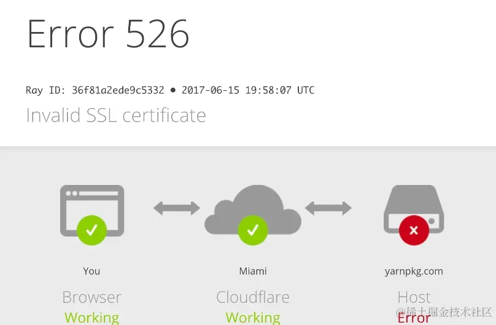
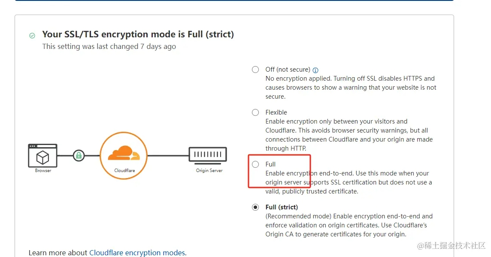
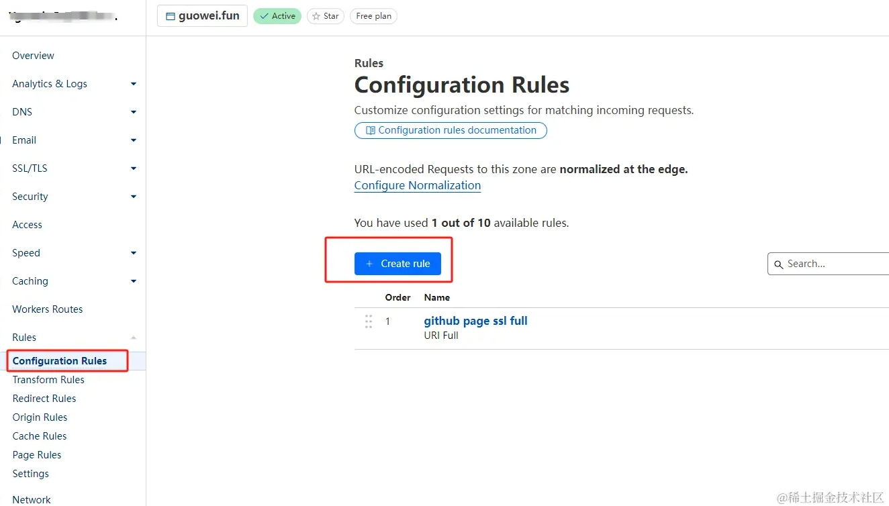
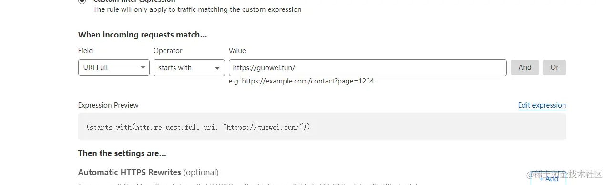
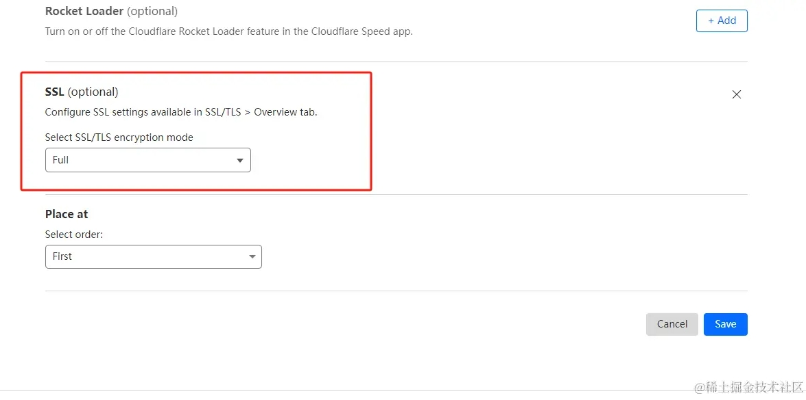

CloudFlare映射到github page，启动github page的ssl，会提示 **526 (Invalid SSL certificate)** ，截图如下：

网上说需要将CloudFlare的 **SSL/TLS encryption mode** 设置为**Full**。

但当时之所以从默认的**FUll** 改为**Full (strict)**，是因为代理到**Vercel**会出现**ERR TOO MANY REDIRECTS**，需要将ssl设置为**Full (strict)** 才能解决。

两个网站产生了悖论，怎么办。

CloudFlare可以配置host的转发rule，来解决这个问题， 步骤如下。

1. 打开配置页面

2. 制定规则，选择域名

3. 为规则选择对应ssl策略。

# [加入独立开发微信群-二维码经常更新](https://raw.githubusercontent.com/ygweric/ygweric.github.io/main/assets/qr-schedule-update/indenpendent_dev.png)
