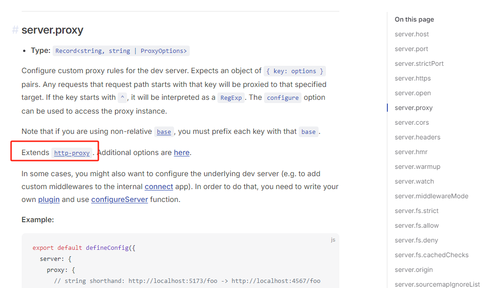
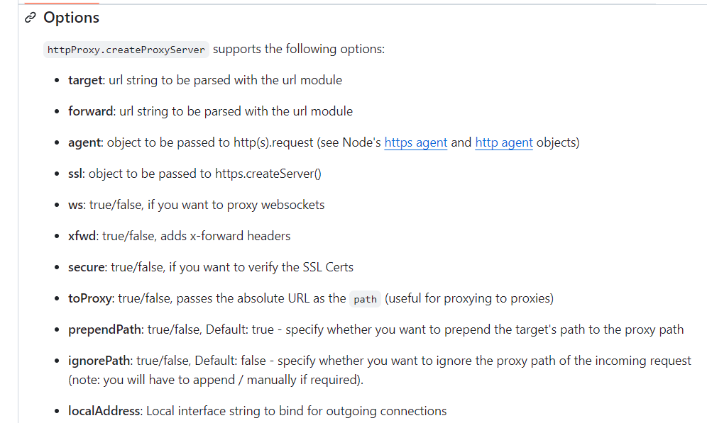
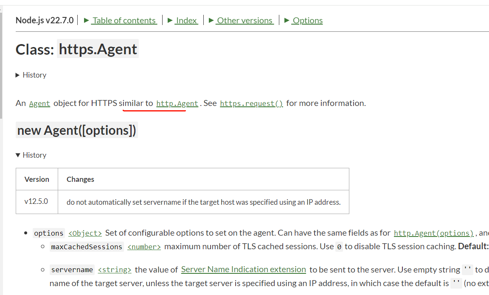

  
  

vite项目本地开发时候，遇到以下问题：

```

Error: Hostname/IP does not match certificate's altnames: Host: iot-test.xxx.com. is not in the cert's altnames: DNS:sys-test.xxx.com

```

  

看描述，是两个同源的证书不一致，这个问题在开发环境中非常常见。

  
  

解决方法：


第一步，先查看vite的官方文档，看一下vite的server和proxy的配置方法。

https://vitejs.dev/config/server-options#server-proxy



能看到vite的proxy使用的时 [`http-proxy`](https://github.com/http-party/node-http-proxy#options). 进入看看详情：

https://github.com/http-party/node-http-proxy#options


对应的参数中找相关的配置一次查看，然后我们找到了**agent**的这个参数。

- **agent**: object to be passed to http(s).request (see Node's [https agent](http://nodejs.org/api/https.html#https_class_https_agent) and [http agent](http://nodejs.org/api/http.html#http_class_http_agent) objects)

可以看到他继承于 Node's [https agent](http://nodejs.org/api/https.html#https_class_https_agent)

继续阅读[https agent](http://nodejs.org/api/https.html#https_class_https_agent) 文档



接着又来到了 [`http.Agent`](https://nodejs.org/api/http.html#class-httpagent).

然后不断的探索。

找到了最终的答案，需要设置 **rejectUnauthorized：false**

最终方法如下, 在vite.config.js的server.proxy添加如下代码

```
agent: new https.Agent({
    // fix: Error: Hostname/IP does not match certificate's altnames: Host: iot-test.lihufuturetown.com. is not in the cert's altnames: DNS:sys-test.lihufuturetown.com
    rejectUnauthorized: false,

}),
```

最终结果如下：
```
server: {
    host:'0.0.0.0',
    proxy: {
        [env.VITE_APP_BASE_API]: {
            target: 'https://iot-test.xxx.com:11183',
            agent: new https.Agent({
                // fix: Error: Hostname/IP does not match certificate's altnames: Host: iot-test.lihufuturetown.com. is not in the cert's altnames: DNS:sys-test.lihufuturetown.com
                rejectUnauthorized: false,

            }),
        }
    }
},
```


国 wei (Eric)
[Github](https://github.com/ygweric)

# [扫码加入独立开发微信群-二维码经常更新](https://raw.githubusercontent.com/ygweric/ygweric.github.io/main/assets/qr-schedule-update/indenpendent_dev.png)
# 关注公众号 [开发副业](https://github.com/ygweric/ygweric.github.io/blob/main/assets/jinjing/wx_office_account_qr.png?raw=true)，闲谈代码人生


