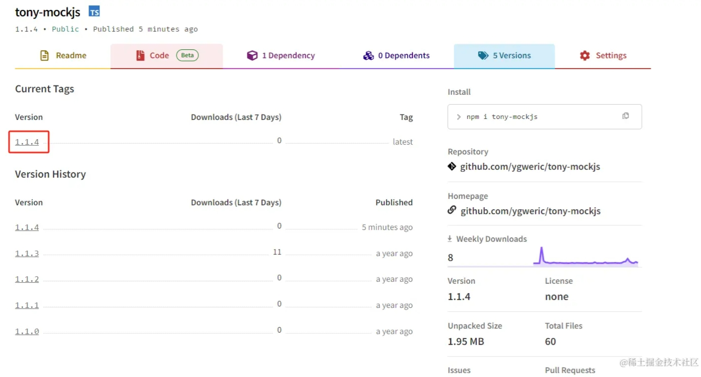

工作中总会需要发布一个npm，比如
1. 第三方npm库不维护了，fork一个发布自用，
2. 或者造了一个轮子，分享给大家

我就遇到了第一种，mockjs对图片、视频等内容的mock有问题，官方也不怎么维护了，我就fork了一份，发布出去，然后提了pr，等待原作者merge。

这里介绍下npm库的发布流程, 最终仓库地址在 https://www.npmjs.com/package/tony-mockjs

# 使用了镜像地址
首先，官网 https://www.npmjs.com/ 在国内访问很不稳定， 国内大部分用淘宝镜像活其他镜像。我们发布npm时候需要将地址切换为官方地址，否则提示如下

```
npm notice total files:   60
npm notice
npm ERR! code ENEEDAUTH
npm ERR! need auth This command requires you to be logged in to https://registry.npmmirror.com/
npm ERR! need auth You need to authorize this machine using `npm adduser`
```

附上我常用的几个npm镜像，一个抽风慢了就换另一个
```
淘宝镜像: registry.npm.taobao.org/
cnpmjs镜像: registry.npmjs.com.cn/
华为云镜像: https://mirrors.huaweicloud.com/repository/npm/
阿里云镜像: registry.npm.aliyun.com/
npm官方镜像: registry.npmjs.org/
```


# 关闭淘宝镜像，使用官方镜像
```
npm config set registry https://registry.npmjs.org // 官方地址
npm config set registry https://registry.npmmirror.com // 镜像1
npm config set registry registry.npm.taobao.org // 镜像2
```

# 登录
如果没有登陆过，会提示登录，如下
```
npm notice package size:  716.2 kB
npm notice unpacked size: 2.0 MB
npm notice shasum:        d8f96ef5da027799982b775951cd433e5ffae450
npm notice integrity:     sha512-jZ6cb9hY9gP+Z[...]Hf8hJH9vqOP2A==
npm notice total files:   60
npm notice
npm ERR! code ENEEDAUTH
npm ERR! need auth This command requires you to be logged in to https://registry.npmjs.org/
npm ERR! need auth You need to authorize this machine using `npm adduser`
```

登录命令为 **npm login**， 根据提示输入用户名密码即可。


# 提示网络超时
由于官网 https://www.npmjs.com/ 在国内访问很不稳定，登录时候回提示网络错误如下
```
$ npm login
npm WARN adduser `adduser` will be split into `login` and `register` in a future version. `adduser` will become an alias of `register`. `login` (currently an alias) will become its own command.
npm notice Log in on https://registry.npmjs.org/
npm ERR! code ECONNRESET
npm ERR! syscall read
npm ERR! errno ECONNRESET
npm ERR! network request to https://registry.npmjs.org/-/v1/login failed, reason: read ECONNRESET
npm ERR! network This is a problem related to network connectivity.
npm ERR! network In most cases you are behind a proxy or have bad network settings.
npm ERR! network
npm ERR! network If you are behind a proxy, please make sure that the
npm ERR! network 'proxy' config is set properly.  See: 'npm help config'

npm ERR! A complete log of this run can be found in:
npm ERR!     C:\Users\yanggw\AppData\Local\npm-cache\_logs\2024-08-08T01_51_38_122Z-debug-0.log
```

解决方案是配置代理，你懂得！

# 配置代理
我的环境是windows，这里配置了本地代理，在 **git bash**种执行下面命令，配置http和https

mac或者linux可以自行搜索配置方案，不过都大同小异。
```
export http_proxy=http://127.0.0.1:7890 && export https_proxy=http://127.0.0.1:7890
```


# 发布 
发布命令是 **npm publish**， 默认会将node项目所有内容发布到npm上面，执行效果如下
```
$ npm publish
npm notice 
npm notice 📦  tony-mockjs@1.1.4
npm notice === Tarball Contents ===
npm notice 277B    .editorconfig
npm notice 13B     .gitattributes
npm notice 146B    .jshintrc
npm notice 35B     .spmignore
npm notice 227B    .travis.yml
npm notice 4.7kB   CHANGELOG.md
npm notice 1.1kB   LICENSE
npm notice 2.7kB   README.md
npm notice 2.3kB   bin/random
npm notice 414B    bower.json
npm notice 139.7kB dist/mock-min.js
npm notice 790.4kB dist/mock-min.js.map
npm notice 280.7kB dist/mock.js
npm notice 5.3kB   gulpfile.js
npm notice 8.0kB   index.d.ts
npm notice 1.2kB   package.json
npm notice 344.4kB src/dependencies.png
npm notice 1.6kB   src/mock.js
npm notice 868B    src/mock/constant.js
npm notice 21.3kB  src/mock/handler.js
npm notice 1.8kB   src/mock/parser.js
npm notice 117.1kB src/mock/random/address_dict.js
npm notice 1.5kB   src/mock/random/address.js
npm notice 4.2kB   src/mock/random/basic.js
npm notice 3.5kB   src/mock/random/color_convert.js
npm notice 1.4kB   src/mock/random/color_dict.js
npm notice 5.4kB   src/mock/random/color.js
npm notice 4.2kB   src/mock/random/date.js
npm notice 3.0kB   src/mock/random/helper.js
npm notice 9.4kB   src/mock/random/image.js
npm notice 538B    src/mock/random/index.js
npm notice 3.0kB   src/mock/random/misc.js
npm notice 3.0kB   src/mock/random/name.js
npm notice 5.2kB   src/mock/random/text.js
npm notice 3.7kB   src/mock/random/web.js
npm notice 11.2kB  src/mock/RE_KEY.svg
npm notice 12.2kB  src/mock/regexp/handler.js
npm notice 128B    src/mock/regexp/index.js
npm notice 27.7kB  src/mock/regexp/parser.js
npm notice 36B     src/mock/schema/index.js
npm notice 1.4kB   src/mock/schema/schema.js
npm notice 3.3kB   src/mock/util.js
npm notice 35B     src/mock/valid/index.js
npm notice 17.3kB  src/mock/valid/valid.js
npm notice 33B     src/mock/xhr/index.js
npm notice 15.5kB  src/mock/xhr/xhr.js
npm notice 185B    test/bower.json
npm notice 78B     test/materiels/noop.html
npm notice 23B     test/materiels/noop.js
npm notice 74B     test/package.json
npm notice 1.2kB   test/test.coveralls.js
npm notice 2.0kB   test/test.mock.html
npm notice 2.3kB   test/test.mock.mock.js
npm notice 17.2kB  test/test.mock.random.js
npm notice 16.3kB  test/test.mock.request.js
npm notice 7.6kB   test/test.mock.schema.js
npm notice 8.5kB   test/test.mock.spec.dpd.js
npm notice 22.1kB  test/test.mock.spec.dtd.js
npm notice 6.5kB   test/test.mock.valid.js
npm notice 5.4kB   test/valid.js
npm notice === Tarball Details ===
npm notice name:          tony-mockjs
npm notice version:       1.1.4
npm notice filename:      tony-mockjs-1.1.4.tgz
npm notice package size:  716.2 kB
npm notice unpacked size: 2.0 MB
npm notice shasum:        d8f96ef5da027799982b775951cd433e5ffae450
npm notice integrity:     sha512-jZ6cb9hY9gP+Z[...]Hf8hJH9vqOP2A==
npm notice total files:   60
npm notice
npm notice Publishing to https://registry.npmjs.org/
This operation requires a one-time password.
Enter OTP: 545857
+ tony-mockjs@1.1.4
```

# 发布成功

可以在 https://www.npmjs.com/package/tony-mockjs 查看最新版本信息。



# 配置 .npmignore
有时候我们不想将所有内容发布上去，可以配置**.npmignore**， 用法和 **.gitignore**一样，放在根目录，如下
```
# Exclude everything but the contents of the dist directory.
**/* # 忽略所有
!dist/** # 不忽略（上传）dist
```

这个例子是上传dist目录里面的内容，忽略其他所有。

# 发布时候先自动编译

我们想上传编译后的文件，但又不想每次都手动编译，所以可以用npm的钩子 **prepublishOnly** 和 **postpublish** 来实现， 配置在**package.json**中，如下：
```
  "scripts": {
    "build": "vite build --config ./config/vite.config.ts",
    "prepublishOnly": "node ./scripts/buildPreNpmPublish.js && npm run build",
    "postpublish": "node ./scripts/buildPostNpmPublish.js",
    ...
```
我这里是写了脚本，配合build来执行自己想做的内容。用node写脚本的方法，后面我在介绍。


# [扫码加入独立开发微信群-二维码经常更新](https://raw.githubusercontent.com/ygweric/ygweric.github.io/main/assets/qr-schedule-update/indenpendent_dev.png)


