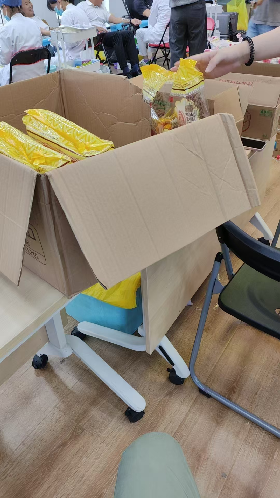

公司组织周五献血，地点就在公司对面的社区居委会。

登记、量血压、抽血化验，等化验结果。

等待过程中有免费的果汁、面包吃，而且是必须喝水的，因为后面抽血，护士知道我没喝水，专门给我拿了瓶果汁~。

10分钟后结果出来，开始排队。

开始献血，400ml，血袋放在一个小秤上面计量。针头挺粗的，扎进去跟被马蜂蛰了一样。

抽血大概五六分钟，结束后，护士要求抽完后**3指** 按压**10分钟**

有人抽完大大咧咧，按了两分钟就松开了，以为是体检抽血呢！！直接血喷到衣服上，前胸部分一片血，地上也滴了好几滴。。。看着还是比较瘆人的。

工作人员忙继续让他按压10分钟，并在旁边盯着他！！但这哥们2分钟后手又松开了。。工作人员忙让他按住！只能说**可怜之人必有可恨之处**。

10分钟后，领取了额献血卡，爱心早餐，完美，早餐内容还挺丰盛的，牛奶、果汁、巧克力、面包。

# 关于我
国 wei (Eric)
[Github](https://github.com/ygweric)

# [扫码加入独立开发微信群-二维码经常更新](https://raw.githubusercontent.com/ygweric/ygweric.github.io/main/assets/qr-schedule-update/indenpendent_dev.png)

# 关注公众号 [开发副业](https://github.com/ygweric/ygweric.github.io/blob/main/assets/jinjing/wx_office_account_qr.png?raw=true)，闲谈代码人生
