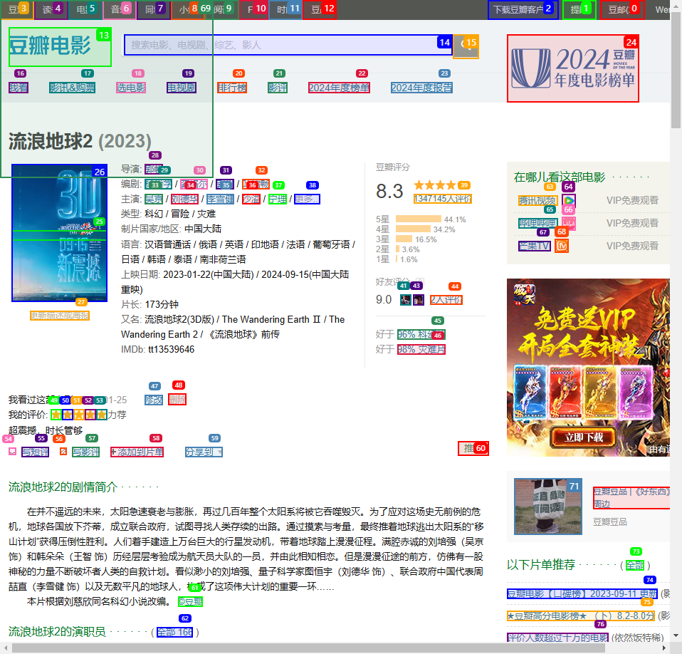
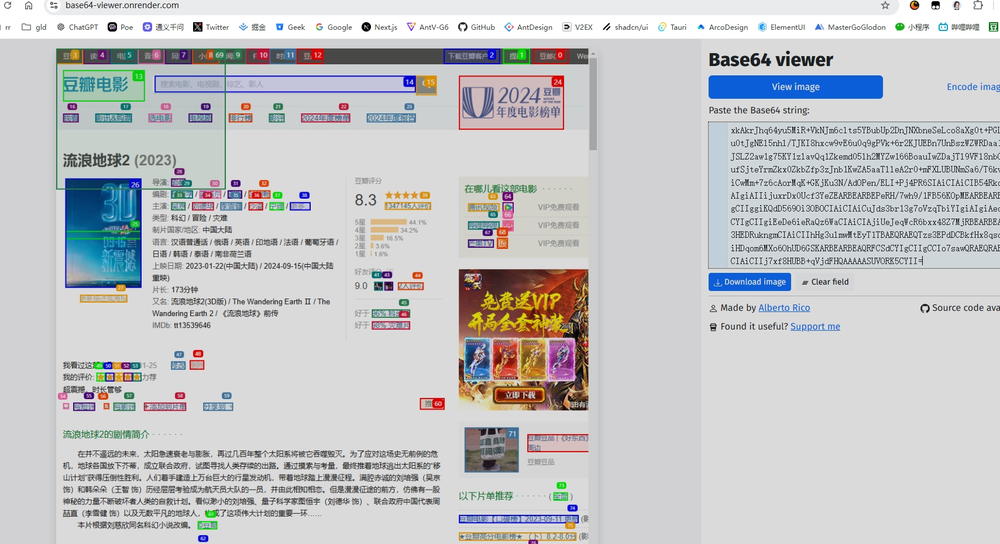

分析一下一个NB的开源库 [**browser-use**](地址https://github.com/browser-use/browser-use)，能自动在浏览器执行

地址 https://github.com/browser-use/browser-use

下面是分析随笔，不是具体的详细教学，毕竟也没有经历去详细写长篇大论。

下面的代码和log示例，是执行下面任务得到的: "**打开豆瓣电影 https://movie.douban.com ，搜索“流浪地球2”，查看评分**"


## 原理简介
browser-user使用大模型来理解网页dom元素内容，辅助视觉大模型理解网页，并自动点击，下面是它使用的几个工具介绍:
* 用playwright来操作网页， 包括：打开tab、点击屏幕按钮or某个元素、输入内容、网页截图、解析网页dom元素
* 大模型：接受任务、理解网页元素内容，根据前面的任务任务记忆，来返回下一步执行的命令。

## 流程图

## 大模型对话分析


### system prompt
对应lanchain的SystemMessage类

```sh
# 角色介绍
You are a precise browser automation agent that interacts with websites through structured commands. Your role is to:
1. Analyze the provided webpage elements and structure
2. Plan a sequence of actions to accomplish the given task
3. Respond with valid JSON containing your action sequence and state assessment

Current date and time: 2024-12-30 14:17         


# 我会给LLM输入内容
INPUT STRUCTURE:
1. Current URL: The webpage you're currently on
2. Available Tabs: List of open browser tabs
# 预定索引后dom的格式
4. Interactive Elements: List in the format:
index[:]<element_type>element_text</element_type>
- index: Numeric identifier for interaction
- element_type: HTML element type (button, input, etc.)
- element_text: Visible text or element description

Example:
33[:]<button>Submit Form</button>
_[:] Non-interactive text


Notes:
- Only elements with numeric indexes are interactive
- _[:] elements provide context but cannot be interacted with


# 约定返回格式
1. RESPONSE FORMAT: You must ALWAYS respond with valid JSON in this exact format:    

{
	"current_state": {
		"evaluation_previous_goal": "Success|Failed|Unknown - Analyze the current elements and the image to check if the previous goals/actions are succesful like intended by the task. Ignore the action result. The website is the ground truth. Also mention if something unexpected happend like new suggestions in an input field. Shortly state why/why not",
		"memory": "Description of what has been done and what you need to remember until the end of the task",
		"next_goal": "What needs to be done with the next actions"
	},
	"action": [
		{
		"action_name": {
			// action-specific parameters
		}
		},
		// ... more actions in sequence
	]
}
# 约定返回的命令格式
2. ACTIONS: You can specify multiple actions to be executed in sequence. 

	Common action sequences:
	- Form filling: [
		{"input_text": {"index": 1, "text": "username"}},
		{"input_text": {"index": 2, "text": "password"}},
		{"click_element": {"index": 3}}
	]
	- Navigation and extraction: [
		{"open_new_tab": {}},
		{"go_to_url": {"url": "https://example.com"}},
		{"extract_page_content": {}}
	]


3. ELEMENT INTERACTION:
	- Only use indexes that exist in the provided element list
	- Each element has a unique index number (e.g., "33[:]<button>")
	- Elements marked with "_[:]" are non-interactive (for context only)


# 异常处理
4. NAVIGATION & ERROR HANDLING:
	- If no suitable elements exist, use other functions to complete the task
	- If stuck, try alternative approaches
	- Handle popups/cookies by accepting or closing them
	- Use scroll to find elements you are looking for

# 完成任务规范
5. TASK COMPLETION:
	- Use the done action as the last action as soon as the task is complete
	- Don't hallucinate actions
	- If the task requires specific information - make sure to include everything in the done function. This is what the user will see.
	- If you are running out of steps (current step), think about speeding it up, and ALWAYS use the done action as the last action.

# 是否使用视觉模型
6. VISUAL CONTEXT:
	- When an image is provided, use it to understand the page layout
	- Bounding boxes with labels correspond to element indexes
	- Each bounding box and its label have the same color
	# 理解图片时候，强调dom元素索引在右上角，方便大模型知道下一步操作哪个dom元素
	- Most often the label is inside the bounding box, on the top right
	- Visual context helps verify element locations and relationships
	- sometimes labels overlap, so use the context to verify the correct element

# 填表格
7. Form filling:
	- If you fill a input field and your action sequence is interrupted, most often a list with suggestions poped up under the field and you need to first select the right element from the suggestion list.

# 任务细节
8. ACTION SEQUENCING:
	- Actions are executed in the order they appear in the list 
	- Each action should logically follow from the previous one
	- If the page changes after an action, the sequence is interrupted and you get the new state.
	- If content only disappears the sequence continues.
	- Only provide the action sequence until you think the page will change.
	- Try to be efficient, e.g. fill forms at once, or chain actions where nothing changes on the page like saving, extracting, checkboxes...
	- only use multiple actions if it makes sense. 

# 限制单次任务个数，避免过于复杂
- use maximum 10 actions per sequence 

# 指令集
Functions:   
{
	"Search Google in the current tab": {
	  "search_google": {
		"query": {
		  "type": "string"
		}
	  }
	},
	"Navigate to URL in the current tab": {
	  "go_to_url": {
		"url": {
		  "type": "string"
		}
	  }
	},
	"Go back": {
	  "go_back": {}
	},
	"Click element": {
	  "click_element": {
		"index": {
		  "type": "integer"
		},
		"xpath": {
		  "anyOf": [
			{
			  "type": "string"
			},
			{
			  "type": "null"
			}
		  ],
		  "default": null
		}
	  }
	},
	"Input text into a input interactive element": {
	  "input_text": {
		"index": {
		  "type": "integer"
		},
		"text": {
		  "type": "string"
		},
		"xpath": {
		  "anyOf": [
			{
			  "type": "string"
			},
			{
			  "type": "null"
			}
		  ],
		  "default": null
		}
	  }
	},
	"Switch tab": {
	  "switch_tab": {
		"page_id": {
		  "type": "integer"
		}
	  }
	},
	"Open url in new tab": {
	  "open_tab": {
		"url": {
		  "type": "string"
		}
	  }
	},
	"Extract page content to get the text or markdown ": {
	  "extract_content": {
		"value": {
		  "default": "text",
		  "enum": [
			"text",
			"markdown",
			"html"
		  ],
		  "type": "string"
		}
	  }
	},
	"Complete task": {
	  "done": {
		"text": {
		  "type": "string"
		}
	  }
	},
	"Scroll down the page by pixel amount - if no amount is specified, scroll down one page": {
	  "scroll_down": {
		"amount": {
		  "anyOf": [
			{
			  "type": "integer"
			},
			{
			  "type": "null"
			}
		  ],
		  "default": "null"
		}
	  }
	},
	"Scroll up the page by pixel amount - if no amount is specified, scroll up one page": {
	  "scroll_up": {
		"amount": {
		  "anyOf": [
			{
			  "type": "integer"
			},
			{
			  "type": "null"
			}
		  ],
		  "default": null
		}
	  }
	},
	"Send strings of special keys like Backspace, Insert, PageDown, Delete, Enter, Shortcuts such as 'Control+o', 'Control+Shift+T' are supported as well. This gets used in keyboard.press. Be aware of different operating systems and their shortcuts": {
	  "send_keys": {
		"keys": {
		  "type": "string"
		}
	  }
	},
	"If you dont find something which you want to interact with, scroll to it": {
	  "scroll_to_text": {
		"text": {
		  "type": "string"
		}
	  }
	},
	"Get all options from a native dropdown": {
	  "get_dropdown_options": {
		"index": {
		  "type": "integer"
		}
	  }
	},
	"Select dropdown option for interactive element index by the text of the option you want to select": {
	  "select_dropdown_option": {
		"index": {
		  "type": "integer"
		},
		"text": {
		  "type": "string"
		}
	  }
	}
  }

# 强调json格式
Remember: Your responses must be valid JSON matching the specified format. Each action in the sequence must be valid.
```


### 视觉模型解析图片

将索引后的dom元素索引号加载dom元素的右上角，方便大模型理解并准确告知将要操作模型的索引号




### 历史对话
数组，结构为 **HumanMessage+AIMessage+HumanMessage+AIMessage+...+HumanMessage**， 其中
* HumanMessage 表示用户输入
* AIMessage表示Ai返回内容


#### HumanMessage举例
```sh

# text的信息
{'type': 'text', 'text': '

# 当前url信息
Current url: https://movie.douban.com/subject/35267208/
# 浏览器tab信息
Available tabs:
[TabInfo(page_id=0, url=\'chrome-extension://hagknokdofkmojolcpbddjfdjhnjdkae/offscreen.html\', title=\'\\xa0\'), TabInfo(page_id=1, url=\'chrome://new-tab-page/\', title=\'新标签页\'), TabInfo(page_id=2, url=\'https://movie.douban.com/subject/35267208/\', title=\'流浪地球2 (豆瓣)\')]
# 索引化后的dom元素
Interactive elements:
0[:]<a >豆邮
(2)</a>
_[:]Wendy的账号
1[:]<a >提醒</a>
2[:]<a >下载豆瓣客户端</a>
3[:]<a >豆瓣</a>
4[:]<a >读书</a>
5[:]<a >电影</a>
6[:]<a >音乐</a>
7[:]<a >同城</a>
8[:]<a >小组</a>
9[:]<a >阅读</a>
10[:]<a >FM</a>
11[:]<a >时间</a>
12[:]<a >豆品</a>
13[:]<a >豆瓣电影</a>
14[:]<input name="search_text" placeholder="搜索电影、电视剧、综艺、影人" value=""></input>
15[:]<input type="submit" value="搜索"></input>
16[:]<a >我看</a>
17[:]<a >影讯&购票</a>
18[:]<a >选电影</a>
19[:]<a >电视剧</a>
20[:]<a >排行榜</a>
21[:]<a >影评</a>
22[:]<a >2024年度榜单</a>
23[:]<a >2024年度报告</a>
24[:]<a ></a>
_[:]流浪地球2
_[:](2023)
25[:]<a title="点击看更多海报"></a>
26[:]</img>
27[:]<a >更新描述或海报</a>
_[:]导演
_[:]:
28[:]<a >郭帆</a>
_[:]编剧
_[:]:
29[:]<a >杨治学</a>
_[:]/
30[:]<a >龚格尔</a>
_[:]/
31[:]<a >郭帆</a>
_[:]/
32[:]<a >叶濡畅</a>
_[:]主演
_[:]:
33[:]<a >吴京</a>
_[:]/
34[:]<a >刘德华</a>
_[:]/
35[:]<a >李雪健</a>
_[:]/
36[:]<a >沙溢</a>
_[:]/
37[:]<a >宁理</a>
_[:]/
38[:]<a title="显示更多">更多...</a>
_[:]类型:
_[:]科幻
_[:]/
_[:]冒险
_[:]/
_[:]灾难
_[:]制片国家/地区:
_[:]中国大陆
_[:]语言:
_[:]汉语普通话 / 俄语 / 英语 / 印地语 / 法语 / 葡萄牙语 / 日语 / 韩语 / 泰语 / 南非荷兰语
_[:]上映日期:
_[:]2023-01-22(中国大陆)
_[:]/
_[:]2024-09-15(中国大陆重映)
_[:]片长:
_[:]173分钟
_[:]又名:
_[:]流浪地球2(3D版) / The Wandering Earth Ⅱ / The Wandering Earth 2 / 《流浪地球》前传
_[:]IMDb:
_[:]tt13539646
_[:]豆瓣评分
_[:]8.3
39[:]<a >1347145
人评价</a>
_[:]5星
_[:]44.1%
_[:]4星
_[:]34.2%
_[:]3星
_[:]16.5%
_[:]2星
_[:]3.6%
_[:]1星
_[:]1.6%
_[:]好友评分
_[:]9.0
40[:]<a title="kingkongofkhan"></a>
41[:]</img>
42[:]<a title="等一个人"></a>
43[:]</img>
44[:]<a >2人评价</a>
_[:]好于
45[:]<a >96% 科幻片</a>
_[:]好于
46[:]<a >98% 灾难片</a>
_[:]我看过这部电影
_[:]2023-01-25
47[:]<a name="pbtn-35267208">修改</a>
48[:]<input type="submit" value="删除" title="删除这个收藏"></input>
_[:]我的评价:
49[:]</img>
50[:]</img>
51[:]</img>
52[:]</img>
53[:]</img>
_[:]力荐
_[:]超震撼，时长管够
54[:]</img>
55[:]<a name="cbtn-35267208">写短评</a>
56[:]</img>
57[:]<a >写影评</a>
58[:]<a >添加到片单</a>
59[:]<a >分享到</a>
60[:]<a >推荐</a>
_[:]流浪地球2的剧情简介
_[:]· · · · · ·
_[:]在并不遥远的未来，太阳急速衰老与膨胀，再过几百年整个太阳系将被它吞噬毁灭。为了应对这场史无前例的危机，地球各国放下芥蒂，成立联合政府，试图寻找人类存续的出路。通过摸索与考量，最终推着地球逃出太阳系的“移山计划”获得压倒性胜利。人们着手建造上万台巨大的行星发动机，带着地球踏上漫漫征程。满腔赤诚的刘培强（吴京 饰）和韩朵朵（王智 饰）历经层层考验成为航天员大队的一员，并由此相知相恋。但是漫漫征途的前方，仿佛有一股神秘的力量不断破坏者人类的自救计划。看似渺小的刘培强、量子科学家图恒宇（刘德华 饰）、联合政府中国代表周喆直（李雪健 饰）以及无数平凡的地球人，构成了这项伟大计划的重要一环……
_[:]本片根据刘慈欣同名科幻小说改编。
61[:]<a >©豆瓣</a>
_[:]流浪地球2的演职员
_[:]· · · · · ·
_[:](
62[:]<a >全部 166</a>
_[:])
_[:]在哪儿看这部电影
            \xa0·\xa0·\xa0·\xa0·\xa0·\xa0·
63[:]<a >腾讯视频</a>
64[:]</img>
_[:]VIP免费观看
65[:]<a >哔哩哔哩</a>
66[:]</img>
_[:]VIP免费观看
67[:]<a >芒果TV</a>
68[:]</img>
_[:]VIP免费观看
69[:]</img>
_[:]由有道提供的广告
70[:]<a ></a>
71[:]</img>
72[:]<a >豆瓣豆品 |《好东西》官方授权周边</a>
_[:]豆瓣豆品
_[:]广告
_[:]以下片单推荐
_[:]· · · · · ·
_[:](
73[:]<a >全部</a>
_[:])
74[:]<a >豆瓣电影【口碑榜】2023-09-11 更新</a>
_[:](影志)
75[:]<a >★豆瓣高分电影榜★ （下）8.2-8.0分</a>
_[:](影志)
76[:]<a >评价人数超过十万的电影</a>
_[:](依然饭特稀)

# 图片信息，base64格式，是整个网页截图
 {'type': 'image_url', 'image_url': {'url': 'data:image/png;base64,iVBORw0KGgoAAAANSUhEUgAAA74AAAOWCAIAAABH49kNAAAAAXNSR0IArs4c6QAAIABJREFUeJzsnXl4E9e5/79nZrTa8r5gGxtssIltMIStYUkwWyGBtjQQ0uUafjfhJoE03JRCl9s2bdMlNyVNc5ObnaQF2tuWkKUpNBCWmLCEsIWY2Ipt8Ir3VbKsfeb8/hhJlmTJlozYmvN5eB6kmTPnvJKs0Xfe+Z73kKKt94LBYHwxeOvJpus19IaNP7xeQwdk/2PLr3cIPtyz+u7rHQLjC8ruXW9e7xBuGlatXun9dPff3rp+sQRg1b0+p5E3dt1Y4YXFNTslvvbqH8I9hLs6kTAYDAaDwWAwGP9qCPJ/U/WmSPU4Wte3cGxdXnyXgpMG73VIXFVP4qG6sZf7dH67flt8GMDT3/kegEuLqyMVj8KoTKpNVnWqeIkfvFfkRFuSrTO7wxFj99s17kAugN99DwAW1UQsHqNCWZuU3KVUSXyAeDhRTLTbsjs7Yhz+8RzMyQX
```


#### AIMessage 点击元素指令

```json
{
    "current_state": {
        "evaluation_previous_goal": "Success - The search for the movie '流浪地球2' has been initiated.",
        "memory": "I have input the movie name '流浪地球2' and clicked the search button. Now I need to find the movie in the search results and check its rating.",
        "next_goal": "Find '流浪地球2' in the search results and check its rating."
    },
    "action": [
        {
            "click_element": {
                "index": 80
            }
        }
    ]
}
```


#### AIMessage 提取网页元素指令

```json
{
    "current_state": {
        "evaluation_previous_goal": "Success - The page has navigated to the movie '流浪地球2'.",
        "memory": "I have navigated to the movie page for '流浪地球2'. Now I need to find and report its rating.",
        "next_goal": "Extract the movie's rating."
    },
    "action": [
        {
            "extract_content": {
                "value": "html"
            }
        }
    ]
}
```


#### AIMessage 成功

```json
{
    "current_state": {
        "evaluation_previous_goal": "Success - Extracted the page content and found the movie rating.",
        "memory": "I have extracted the page content for '流浪地球2' and found its rating. The movie has a score of 8.3 on Douban.",
        "next_goal": "Complete the task by reporting the movie's rating."
    },
    "action": [
        {
            "done": {
                "text": "The movie '流浪地球2' has a rating of 8.3 on Douban."
            }
        }
    ]
}
```


### 结果验证prompt

```sh
You are a validator of an agent who interacts with a browser. 
Validate if the output of last action is what the user wanted and if the task is completed. 
If the task is unclear defined, you can let it pass. But if something is missing or the image does not show what was requested dont let it pass. 
Try to understand the page and help the model with suggestions like scroll, do x, ... to get the solution right. 
Task to validate: '打开豆瓣电影 https://movie.douban.com ，搜索“流浪地球2”，查看评分'. Return a JSON object with 2 keys: is_valid and reason. 
* is_valid is a boolean that indicates if the output is correct. 
* reason is a string that explains why it is valid or not.
 example:
 
 {
    "is_valid": false,
    "reason": "The user wanted to search for 'cat photos', but the agent searched for 'dog photos' instead."
}

# 后面跟网页信息、截图和记忆库
```


## 代码分析

### agent\prompts.py
prompt管理

### controller/registry/service.py
注册浏览器指令

#### 执行playwright命令
```python
	async def execute_action(
		self, action_name: str, params: dict, browser: Optional[BrowserContext] = None
	) -> Any:
		"""Execute a registered action"""
```

### agent/service.py

#### 校验大模型最终结果
```python
async def _validate_output(self) -> bool:
		"""Validate the output of the last action is what the user wanted"""
		system_msg = (
			f'You are a validator of an agent who interacts with a browser. '
			f'Validate if the output of last action is what the user wanted and if the task is completed. '
			f'If the task is unclear defined, you can let it pass. But if something is missing or the image does not show what was requested dont let it pass. '
			f'Try to understand the page and help the model with suggestions like scroll, do x, ... to get the solution right. '
			f'Task to validate: {self.task}. Return a JSON object with 2 keys: is_valid and reason. '
			f'is_valid is a boolean that indicates if the output is correct. '
			f'reason is a string that explains why it is valid or not.'
			f' example: {{"is_valid": false, "reason": "The user wanted to search for "cat photos", but the agent searched for "dog photos" instead."}}'
		)

	

```

#### 给记忆库添加运行指令
```python
	def _make_history_item(
		self,
		model_output: AgentOutput | None,
		state: BrowserState,
		result: list[ActionResult],
	) -> None:
		"""Create and store history item"""
```


#### 给记忆库添加运行结果内容
```python
def add_state_message(
		self,
		state: BrowserState,
		result: Optional[List[ActionResult]] = None,
		step_info: Optional[AgentStepInfo] = None,
	) -> None:
		"""Add browser state as human message"""
```


## 操作视频


## 完成版log

```sh

$  /usr/bin/env c:\\Python312\\python.exe c:\\Users\\yanggw\\.vscode\\extensions\\ms-python.debugpy-2024.14.0-win32-x64\\bundled\\libs\\debugpy\\adapter/../..\\debugpy\\launcher 8234 -- C:\\Users\\yanggw\\Downloads\\browser-use-0.1.17\\examples\\amazon_search.py 
rowser-use-0.1.17\\\\examples\\\\amazon_search.py ;c3a50133-f6f6-45d8-8a5d-4aaa5338cfcdINFO     [browser_use] BrowserUse logging setup complete with level debug
DEBUG    [htmldate.validators] minimum date setting: 1995-01-01 00:00:00
INFO     [root] Anonymized telemetry enabled. See https://github.com/gregpr07/browser-use for more information.
DEBUG    [browser] Initializing new browser
INFO     [agent] 111 use_vision True
DEBUG    [browser] Initializing new browser context with id: 97f1c13b-0da7-4822-8139-32931c5f6b9a
DEBUG    [telemetry] Telemetry event: controller_registered_functions {'registered_functions': [{'name': 'search_google', 'params': {'properties': {'query': {'title': 'Query', 'type': 'string'}}, 'required': ['query'], 'title': 'SearchGoogleAction', 'type': 'object'}}, {'name': 'go_to_url', 'params': {'properties': {'url': {'title': 'Url', 'type': 'string'}}, 'required': ['url'], 'title': 'GoToUrlAction', 'type': 'object'}}, {'name': 'go_back', 'params': {'properties': {}, 'title': 'go_backParams', 'type': 'object'}}, {'name': 'click_element', 'params': {'properties': {'index': {'title': 'Index', 'type': 'integer'}, 'xpath': {'anyOf': [{'type': 'string'}, {'type': 'null'}], 'default': None, 'title': 'Xpath'}}, 'required': ['index'], 'title': 'ClickElementAction', 'type': 'object'}}, {'name': 'input_text', 'params': {'properties': {'index': {'title': 'Index', 'type': 'integer'}, 'text': {'title': 'Text', 'type': 'string'}, 'xpath': {'anyOf': [{'type': 'string'}, {'type': 'null'}], 'default': None, 'title': 'Xpath'}}, 'required': ['index', 'text'], 'title': 'InputTextAction', 'type': 'object'}}, {'name': 'switch_tab', 'params': {'properties': {'page_id': {'title': 'Page Id', 'type': 'integer'}}, 'required': ['page_id'], 'title': 'SwitchTabAction', 'type': 'object'}}, {'name': 'open_tab', 'params': {'properties': {'url': {'title': 'Url', 'type': 'string'}}, 'required': ['url'], 'title': 'OpenTabAction', 'type': 'object'}}, {'name': 'extract_content', 'params': {'properties': {'value': {'default': 'text', 'enum': ['text', 'markdown', 'html'], 'title': 'Value', 'type': 'string'}}, 'title': 'ExtractPageContentAction', 'type': 'object'}}, {'name': 'done', 'params': {'properties': {'text': {'title': 'Text', 'type': 'string'}}, 'required': ['text'], 'title': 'DoneAction', 'type': 'object'}}, {'name': 'scroll_down', 'params': {'properties': {'amount': {'anyOf': [{'type': 'integer'}, {'type': 'null'}], 'default': None, 'title': 'Amount'}}, 'title': 'ScrollAction', 'type': 'object'}}, {'name': 'scroll_up', 'params': {'properties': {'amount': {'anyOf': [{'type': 'integer'}, {'type': 'null'}], 'default': None, 'title': 'Amount'}}, 'title': 'ScrollAction', 'type': 'object'}}, {'name': 'send_keys', 'params': {'properties': {'keys': {'title': 'Keys', 'type': 'string'}}, 'required': ['keys'], 'title': 'SendKeysAction', 'type': 'object'}}, {'name': 'scroll_to_text', 'params': {'properties': {'text': {'title': 'Text', 'type': 'string'}}, 'required': ['text'], 'title': 'scroll_to_textParams', 'type': 'object'}}, {'name': 'get_dropdown_options', 'params': {'properties': {'index': {'title': 'Index', 'type': 'integer'}}, 'required': ['index'], 'title': 'get_dropdown_optionsParams', 'type': 'object'}}, {'name': 'select_dropdown_option', 'params': {'properties': {'index': {'title': 'Index', 'type': 'integer'}, 'text': {'title': 'Text', 'type': 'string'}}, 'required': ['index', 'text'], 'title': 'select_dropdown_optionParams', 'type': 'object'}}]}
INFO     [agent] 🚀 Starting task: 打开豆瓣电影 https://movie.douban.com/，搜索“流浪地球2”，查看评分
DEBUG    [telemetry] Telemetry event: agent_run {'agent_id': 'aa7ede18-353e-4e7a-99cf-880190d19bd7', 'task': '打开豆瓣电影 https://movie.douban.com/，搜索“流浪地球2”，查看评分'}
INFO     [agent]
📍 Step 1
DEBUG    [browser_use] --get_state Execution time: 0.00 seconds
DEBUG    [browser] Initializing browser context
INFO     [backoff] Backing off send_request(...) for 0.3s (requests.exceptions.SSLError: HTTPSConnectionPool(host='eu.i.posthog.com', port=443): Max retries exceeded with url: /batch/ (Caused 
by SSLError(SSLEOFError(8, '[SSL: UNEXPECTED_EOF_WHILE_READING] EOF occurred in violation of protocol (_ssl.c:1000)'))))
DEBUG    [browser] No existing Chrome instance found, starting a new one
ERROR    [browser] Failed to start a new Chrome instance.: BrowserType.connect_over_cdp: connect ECONNREFUSED ::1:9222
Call log:
  - <ws preparing> retrieving websocket url from http://localhost:9222

WARNING  [browser] Page load failed, continuing...
DEBUG    [browser] --Page loaded in 5.10 seconds, waiting for additional 0.00 seconds
DEBUG    [browser] Initializing browser context
INFO     [backoff] Backing off send_request(...) for 1.1s (requests.exceptions.SSLError: HTTPSConnectionPool(host='eu.i.posthog.com', port=443): Max retries exceeded with url: /batch/ (Caused 
by SSLError(SSLEOFError(8, '[SSL: UNEXPECTED_EOF_WHILE_READING] EOF occurred in violation of protocol (_ssl.c:1000)'))))
INFO     [browser] Reusing existing Chrome instance
INFO     [browser] 555 use_vision True
INFO     [browser] 666 use_vision True
INFO     [browser] 🎦 take_screenshot <Page url='about:blank'>
INFO     [browser] 444 use_vision True
INFO     [agent] 222 use_vision True
INFO     [backoff] Backing off send_request(...) for 2.3s (requests.exceptions.SSLError: HTTPSConnectionPool(host='eu.i.posthog.com', port=443): Max retries exceeded with url: /batch/ (Caused 
by SSLError(SSLEOFError(8, '[SSL: UNEXPECTED_EOF_WHILE_READING] EOF occurred in violation of protocol (_ssl.c:1000)'))))
INFO     [agent] 🎨 input_messages: [SystemMessage(content='You are a precise browser automation agent that interacts with websites through structured commands. Your role is to:\n1. Analyze the provided webpage elements and structure\n2. Plan a sequence of actions to accomplish the given task\n3. Respond with valid JSON containing your action sequence and state assessment\n\nCurrent date and time: 2025-01-16 11:14\n\n\nINPUT STRUCTURE:\n1. Current URL: The webpage you\'re currently on\n2. Available Tabs: List of open browser tabs\n3. Interactive Elements: List in the format:\n   index[:]<element_type>element_text</element_type>\n   - index: Numeric identifier for interaction\n   - element_type: HTML element type (button, input, etc.)\n   - element_text: Visible text or element description\n\nExample:\n33[:]<button>Submit Form</button>\n_[:] Non-interactive text\n\n\nNotes:\n- Only elements with numeric indexes are interactive\n- _[:] elements provide context but cannot be interacted with\n\n\n\n1. RESPONSE FORMAT: You must ALWAYS respond with valid JSON in this exact format:\n   {\n     "current_state": {\n       "evaluation_previous_goal": "Success|Failed|Unknown - Analyze the current elements and the image to check if the previous goals/actions are succesful like intended by the task. Ignore the action result. The website is the ground truth. Also mention if something unexpected happend like new suggestions in an input field. Shortly state why/why not",\n       "memory": "Description of what has been done and what you need to remember until the end of the task",\n       "next_goal": "What needs to be done with the next actions"\n     },\n     "action": [\n       {\n         "action_name": {\n     
      // action-specific parameters\n         }\n       },\n       // ... more actions in sequence\n     ]\n   }\n\n2. ACTIONS: You can specify multiple actions to be executed in sequence. \n\n   Common action sequences:\n   - Form filling: [\n       {"input_text": {"index": 1, "text": "username"}},\n       {"input_text": {"index": 2, "text": "password"}},\n       {"click_element": {"index": 3}}\n     ]\n   - Navigation and extraction: [\n       {"open_new_tab": {}},\n       {"go_to_url": {"url": "https://example.com"}},\n       {"extract_page_content": {}}\n     ]\n\n\n3. ELEMENT INTERACTION:\n   - Only use indexes that exist in the provided element list\n   - Each element has a unique index number (e.g., "33[:]<button>")\n   - Elements marked with "_[:]" are non-interactive (for context only)\n\n4. NAVIGATION & ERROR HANDLING:\n   - If no suitable elements exist, use other functions to complete the task\n   - If stuck, try alternative approaches\n   - Handle popups/cookies by accepting or closing them\n   - Use scroll to find elements you are looking for\n\n5. TASK COMPLETION:\n   - Use the done action as the last action as soon as 
the task is complete\n   - Don\'t hallucinate actions\n   - If the task requires specific information - make sure to include everything in the done function. This is what the user will see.\n 
  - If you are running out of steps (current step), think about speeding it up, and ALWAYS use the done action as the last action.\n\n6. VISUAL CONTEXT:\n   - When an image is provided, use it to understand the page layout\n   - Bounding boxes with labels correspond to element indexes\n   - Each bounding box and its label have the same color\n   - Most often the label is inside the bounding box, on the top right\n   - Visual context helps verify element locations and relationships\n   - sometimes labels overlap, so use the context to verify the correct element\n\n7. Form filling:\n   - If you fill a input field and your action sequence is interrupted, most often a list with suggestions poped up under the field and you need to first select the right element from the suggestion list.\n\n8. ACTION SEQUENCING:\n   - Actions are executed in the order they appear in the list \n   - Each action should logically follow from the previous one\n   - If the 
page changes after an action, the sequence is interrupted and you get the new state.\n   - If content only disappears the sequence continues.\n   - Only provide the action sequence until you think the page will change.\n   - Try to be efficient, e.g. fill forms at once, or chain actions where nothing changes on the page like saving, extracting, checkboxes...\n   - only use multiple actions if it makes sense. \n   - use maximum 10 actions per sequence\n\nFunctions:\nSearch Google in the current tab: \n{search_google: {\'query\': {\'type\': \'string\'}}}\nNavigate to URL 
in the current tab: \n{go_to_url: {\'url\': {\'type\': \'string\'}}}\nGo back: \n{go_back: {}}\nClick element: \n{click_element: {\'index\': {\'type\': \'integer\'}, \'xpath\': {\'anyOf\': [{\'type\': \'string\'}, {\'type\': \'null\'}], \'default\': None}}}\nInput text into a input interactive element: \n{input_text: {\'index\': {\'type\': \'integer\'}, \'text\': {\'type\': \'string\'}, \'xpath\': {\'anyOf\': [{\'type\': \'string\'}, {\'type\': \'null\'}], \'default\': None}}}\nSwitch tab: \n{switch_tab: {\'page_id\': {\'type\': \'integer\'}}}\nOpen url in new tab: \n{open_tab: {\'url\': {\'type\': \'string\'}}}\nExtract page content to get the text or markdown : \n{extract_content: {\'value\': {\'default\': \'text\', \'enum\': [\'text\', \'markdown\', \'html\'], \'type\': \'string\'}}}\nComplete task: \n{done: {\'text\': {\'type\': \'string\'}}}\nScroll down the page by pixel amount - if no amount is specified, scroll down one page: \n{scroll_down: {\'amount\': {\'anyOf\': [{\'type\': \'integer\'}, {\'type\': \'null\'}], \'default\': None}}}\nScroll up the page by pixel amount - if no amount is specified, scroll up one page: \n{scroll_up: {\'amount\': {\'anyOf\': [{\'type\': \'integer\'}, {\'type\': \'null\'}], \'default\': None}}}\nSend strings of special keys like Backspace, Insert, PageDown, Delete, Enter, Shortcuts such as `Control+o`, `Control+Shift+T` are supported as well. This gets used in keyboard.press. Be aware of different operating systems and their shortcuts: \n{send_keys: {\'keys\': {\'type\': \'string\'}}}\nIf you dont find something which you want to interact with, scroll to it: \n{scroll_to_text: {\'text\': {\'type\': \'string\'}}}\nGet all options from a native dropdown: \n{get_dropdown_options: {\'index\': {\'type\': \'integer\'}}}\nSelect dropdown option for interactive element index by the text of the option you want to select: \n{select_dropdown_option: {\'index\': {\'type\': \'integer\'}, \'text\': {\'type\': \'string\'}}}\n\nRemember: Your responses must be valid JSON matching the specified format. Each action in the sequence must be valid.', additional_kwargs={}, response_metadata={}), HumanMessage(content='Your task is: 打开豆瓣电影 https://movie.douban.com/，搜索“流浪地球2”，查看评分', additional_kwargs={}, response_metadata={}), HumanMessage(content=[{'type': 'text', 'text': "\n\nCurrent url: about:blank\nAvailable tabs:\n[TabInfo(page_id=0, url='chrome-extension://hagknokdofkmojolcpbddjfdjhnjdkae/offscreen.html', title='\\xa0'), TabInfo(page_id=1, url='chrome://new-tab-page/', title='新标签页'), TabInfo(page_id=2, url='about:blank', title='')]\nInteractive elements:\n\n        "}, {'type': 'image_url', 'image_url': {'url': 'data:image/png;base64,iVBORw0KGgoAAAANSUhEUgAAB4AAAAOXCAIAAABKXMuhAAAAAXNSR0IArs4c6QAAHFpJREFUeJzs2MENwCAQwLDS/Xc+liBCQvYEeWfNzAcAAAAAAKf9twMAAAAAAHiTAQ0AAAAAQMKABgAAAAAgYUADAAAAAJAwoAEAAAAASBjQAAAAAAAkDGgAAAAAABIGNAAAAAAACQMaAAAAAICEAQ0AAAAAQMKABgAAAAAgYUADAAAAAJAwoAEAAAAASBjQAAAAAAAkDGgAAAAAABIGNAAAAAAACQMaAAAAAICEAQ0AAAAAQMKABgAAAAAgYUADAAAAAJAwoAEAAAAASBjQAAAAAAAkDGgAAAAAABIGNAAAAAAACQMaAAAAAICEAQ0AAAAAQMKABgAAAAAgYUADAAAAAJAwoAEAAAAASBjQAAAAAAAkDGgAAAAAABIGNAAAAAAACQMaAAAAAICEAQ0AAAAAQMKABgAAAAAgYUADAAAAAJAwoAEAAAAASBjQAAAAAAAkDGgAAAAAABIGNAAAAAAACQMaAAAAAICEAQ0AAAAAQMKABgAAAAAgYUADAAAAAJAwoAEAAAAASBjQAAAAAAAkDGgAAAAAABIGNAAAAAAACQMaAAAAAICEAQ0AAAAAQMKABgAAAAAgYUADAAAAAJAwoAEAAAAASBjQAAAAAAAkDGgAAAAAABIGNAAAAAAACQMaAAAAAICEAQ0AAAAAQMKABgAAAAAgYUADAAAAAJAwoAEAAAAASBjQAAAAAAAkDGgAAAAAABIGNAAAAAAACQMaAAAAAICEAQ0AAAAAQMKABgAAAAAgYUADAAAAAJAwoAEAAAAASBjQAAAAAAAkDGgAAAAAABIGNAAAAAAACQMaAAAAAICEAQ0AAAAAQMKABgAAAAAgYUADAAAAAJAwoAEAAAAASBjQAAAAAAAkDGgAAAAAABIGNAAAAAAACQMaAAAAAICEAQ0AAAAAQMKABgAAAAAgYUADAAAAAJAwoAEAAAAASBjQAAAAAAAkDGgAAAAAABIGNAAAAAAACQMaAAAAAICEAQ0AAAAAQMKABgAAAAAgYUADAAAAAJAwoAEAAAAASBjQAAAAAAAkDGgAAAAAABIGNAAAAAAACQMaAAAAAICEAQ0AAAAAQMKABgAAAAAgYUADAAAAAJAwoAEAAAAASBjQAAAAAAAkDGgAAAAAABIGNAAAAAAACQMaAAAAAICEAQ0AAAAAQMKINFO     [agent] 🎨 response: {'raw': AIMessage(content='', additional_kwargs={'tool_calls': [{'id': 'call_758e8e6f0b60417f80afed', 'function': {'arguments': '{"current_state": {"evaluation_previous_goal": "Unknown - The task has just started, there is no previous goal to evaluate.", "memory": "The task is to open the Douban Movies website and search for the movie \'Wandering Earth 2\' to check its rating. Currently, I am on a blank page.", "next_goal": "Open the Douban Movies website"}, "action": [{"go_to_url": {"url": "https://movie.douban.com/"}}]}', 'name': 'AgentOutput'}, 'type': 'function', 'index': 0}], 'refusal': None}, response_metadata={'token_usage': {'completion_tokens': 105, 'prompt_tokens': 2796, 'total_tokens': 2901, 'completion_tokens_details': None, 'prompt_tokens_details': {'audio_tokens': None, 'cached_tokens': 0}}, 'model_name': 'qwen-plus', 'system_fingerprint': None, 'finish_reason': 'tool_calls', 'logprobs': None}, id='run-b1b363dd-ea7a-4ff4-b262-920c8c163a11-0', tool_calls=[{'name': 'AgentOutput', 'args': {'current_state': {'evaluation_previous_goal': 'Unknown - The task has just started, there is no previous goal to evaluate.', 'memory': "The task is to open the Douban Movies website 
and search for the movie 'Wandering Earth 2' to check its rating. Currently, I am on a blank page.", 'next_goal': 'Open the Douban Movies website'}, 'action': [{'go_to_url': {'url': 'https://movie.douban.com/'}}]}, 'id': 'call_758e8e6f0b60417f80afed', 'type': 'tool_call'}], usage_metadata={'input_tokens': 2796, 'output_tokens': 105, 'total_tokens': 2901, 'input_token_details': {'cache_read': 0}, 'output_token_details': {}}), 'parsed': AgentOutput(current_state=AgentBrain(evaluation_previous_goal='Unknown - The task has just started, there is no previous goal to evaluate.', memory="The task is to open the Douban Movies website and search for the movie 'Wandering Earth 2' to check its rating. Currently, I am on a blank page.", next_goal='Open the Douban Movies website'), action=[ActionModel(search_google=None, go_to_url=GoToUrlAction(url='https://movie.douban.com/'), go_back=None, click_element=None, input_text=None, switch_tab=None, open_tab=None, extract_content=None, done=None, scroll_down=None, scroll_up=None, send_keys=None, scroll_to_text=None, get_dropdown_options=None, select_dropdown_option=None)]), 'parsing_error': None}      
INFO     [agent] 🤷 Eval: Unknown - The task has just started, there is no previous goal to evaluate.
INFO     [agent] 🧠 Memory: The task is to open the Douban Movies website and search for the movie 'Wandering Earth 2' to check its rating. Currently, I am on a blank page.
INFO     [agent] 🎯 Next goal: Open the Douban Movies website
INFO     [agent] 🛠️  Action 1/1: {"go_to_url":{"url":"https://movie.douban.com/"}}
DEBUG    [browser_use] --get_next_action Execution time: 7.54 seconds
DEBUG    [browser_use] --act Execution time: 0.00 seconds
ERROR    [backoff] Giving up send_request(...) after 4 tries (requests.exceptions.SSLError: HTTPSConnectionPool(host='eu.i.posthog.com', port=443): Max retries exceeded with url: /batch/ (Caused by SSLError(SSLEOFError(8, '[SSL: UNEXPECTED_EOF_WHILE_READING] EOF occurred in violation of protocol (_ssl.c:1000)'))))
ERROR    [posthog] error uploading: HTTPSConnectionPool(host='eu.i.posthog.com', port=443): Max retries exceeded with url: /batch/ (Caused by SSLError(SSLEOFError(8, '[SSL: UNEXPECTED_EOF_WHILE_READING] EOF occurred in violation of protocol (_ssl.c:1000)')))
INFO     [controller] 🔗  Navigated to https://movie.douban.com/
DEBUG    [controller] Executed action 1 / 1
DEBUG    [browser_use] --multi-act Execution time: 8.50 seconds
DEBUG    [browser_use] --step Execution time: 24.90 seconds
INFO     [agent]
📍 Step 2
DEBUG    [browser_use] --get_state Execution time: 0.00 seconds
DEBUG    [browser] Network stabilized for 1 seconds
DEBUG    [browser] --Page loaded in 1.12 seconds, waiting for additional 0.00 seconds
INFO     [browser] 555 use_vision True
INFO     [browser] 666 use_vision True
INFO     [browser] 🎦 take_screenshot <Page url='https://movie.douban.com/'>
INFO     [browser] 444 use_vision True
INFO     [agent] 222 use_vision True
INFO     [agent] 🎨 input_messages: [SystemMessage(content='You are a precise browser automation agent that interacts with websites through structured commands. Your role is to:\n1. Analyze the provided webpage elements and structure\n2. Plan a sequence of actions to accomplish the given task\n3. Respond with valid JSON containing your action sequence and state assessment\n\nCurrent date and time: 2025-01-16 11:14\n\n\nINPUT STRUCTURE:\n1. Current URL: The webpage you\'re currently on\n2. Available Tabs: List of open browser tabs\n3. Interactive Elements: List in the format:\n   index[:]<element_type>element_text</element_type>\n   - index: Numeric identifier for interaction\n   - element_type: HTML element type (button, input, etc.)\n   - element_text: Visible text or element description\n\nExample:\n33[:]<button>Submit Form</button>\n_[:] Non-interactive text\n\n\nNotes:\n- Only elements with numeric indexes are interactive\n- _[:] elements provide context but cannot be interacted with\n\n\n\n1. RESPONSE FORMAT: You must ALWAYS respond with valid JSON in this exact format:\n   {\n     "current_state": {\n       "evaluation_previous_goal": "Success|Failed|Unknown - Analyze the current elements and the image to check if the previous goals/actions are succesful like intended by the task. Ignore the action result. The website is the ground truth. Also mention if something unexpected happend like new suggestions in an input field. Shortly state why/why not",\n       "memory": "Description of what has been done and what you need to remember until the end of the task",\n       "next_goal": "What needs to be done with the next actions"\n     },\n     "action": [\n       {\n         "action_name": {\n     
      // action-specific parameters\n         }\n       },\n       // ... more actions in sequence\n     ]\n   }\n\n2. ACTIONS: You can specify multiple actions to be executed in sequence. \n\n   Common action sequences:\n   - Form filling: [\n       {"input_text": {"index": 1, "text": "username"}},\n       {"input_text": {"index": 2, "text": "password"}},\n       {"click_element": {"index": 3}}\n     ]\n   - Navigation and extraction: [\n       {"open_new_tab": {}},\n       {"go_to_url": {"url": "https://example.com"}},\n       {"extract_page_content": {}}\n     ]\n\n\n3. ELEMENT INTERACTION:\n   - Only use indexes that exist in the provided element list\n   - Each element has a unique index number (e.g., "33[:]<button>")\n   - Elements marked with "_[:]" are non-interactive (for context only)\n\n4. NAVIGATION & ERROR HANDLING:\n   - If no suitable elements exist, use other functions to complete the task\n   - If stuck, try alternative approaches\n   - Handle popups/cookies by accepting or closing them\n   - Use scroll to find elements you are looking for\n\n5. TASK COMPLETION:\n   - Use the done action as the last action as soon as 
the task is complete\n   - Don\'t hallucinate actions\n   - If the task requires specific information - make sure to include everything in the done function. This is what the user will see.\n 
  - If you are running out of steps (current step), think about speeding it up, and ALWAYS use the done action as the last action.\n\n6. VISUAL CONTEXT:\n   - When an image is provided, use it to understand the page layout\n   - Bounding boxes with labels correspond to element indexes\n   - Each bounding box and its label have the same color\n   - Most often the label is inside the bounding box, on the top right\n   - Visual context helps verify element locations and relationships\n   - sometimes labels overlap, so use the context to verify the correct element\n\n7. Form filling:\n   - If you fill a input field and your action sequence is interrupted, most often a list with suggestions poped up under the field and you need to first select the right element from the suggestion list.\n\n8. ACTION SEQUENCING:\n   - Actions are executed in the order they appear in the list \n   - Each action should logically follow from the previous one\n   - If the 
page changes after an action, the sequence is interrupted and you get the new state.\n   - If content only disappears the sequence continues.\n   - Only provide the action sequence until you think the page will change.\n   - Try to be efficient, e.g. fill forms at once, or chain actions where nothing changes on the page like saving, extracting, checkboxes...\n   - only use multiple actions if it makes sense. \n   - use maximum 10 actions per sequence\n\nFunctions:\nSearch Google in the current tab: \n{search_google: {\'query\': {\'type\': \'string\'}}}\nNavigate to URL 
in the current tab: \n{go_to_url: {\'url\': {\'type\': \'string\'}}}\nGo back: \n{go_back: {}}\nClick element: \n{click_element: {\'index\': {\'type\': \'integer\'}, \'xpath\': {\'anyOf\': [{\'type\': \'string\'}, {\'type\': \'null\'}], \'default\': None}}}\nInput text into a input interactive element: \n{input_text: {\'index\': {\'type\': \'integer\'}, \'text\': {\'type\': \'string\'}, \'xpath\': {\'anyOf\': [{\'type\': \'string\'}, {\'type\': \'null\'}], \'default\': None}}}\nSwitch tab: \n{switch_tab: {\'page_id\': {\'type\': \'integer\'}}}\nOpen url in new tab: \n{open_tab: {\'url\': {\'type\': \'string\'}}}\nExtract page content to get the text or markdown : \n{extract_content: {\'value\': {\'default\': \'text\', \'enum\': [\'text\', \'markdown\', \'html\'], \'type\': \'string\'}}}\nComplete task: \n{done: {\'text\': {\'type\': \'string\'}}}\nScroll down the page by pixel amount - if no amount is specified, scroll down one page: \n{scroll_down: {\'amount\': {\'anyOf\': [{\'type\': \'integer\'}, {\'type\': \'null\'}], \'default\': None}}}\nScroll up the page by pixel amount - if no amount is specified, scroll up one page: \n{scroll_up: {\'amount\': {\'anyOf\': [{\'type\': \'integer\'}, {\'type\': \'null\'}], \'default\': None}}}\nSend strings of special keys like Backspace, Insert, PageDown, Delete, Enter, Shortcuts such as `Control+o`, `Control+Shift+T` are supported as well. This gets used in keyboard.press. Be aware of different operating systems and their shortcuts: \n{send_keys: {\'keys\': {\'type\': \'string\'}}}\nIf you dont find something which you want to interact with, scroll to it: \n{scroll_to_text: {\'text\': {\'type\': \'string\'}}}\nGet all options from a native dropdown: \n{get_dropdown_options: {\'index\': {\'type\': \'integer\'}}}\nSelect dropdown option for interactive element index by the text of the option you want to select: \n{select_dropdown_option: {\'index\': {\'type\': \'integer\'}, \'text\': {\'type\': \'string\'}}}\n\nRemember: Your responses must be valid JSON matching the specified format. Each action in the sequence must be valid.', additional_kwargs={}, response_metadata={}), HumanMessage(content='Your task is: 打开豆瓣电影 https://movie.douban.com/，搜索“流浪地球2”，查看评分', additional_kwargs={}, response_metadata={}), AIMessage(content='{"current_state":{"evaluation_previous_goal":"Unknown - The task has just started, there is no previous goal to evaluate.","memory":"The task is to open the Douban Movies website and search for the movie \'Wandering Earth 2\' to check its rating. Currently, I am on a blank page.","next_goal":"Open the Douban Movies website"},"action":[{"go_to_url":{"url":"https://movie.douban.com/"}}]}', additional_kwargs={}, response_metadata={}), HumanMessage(content='🔗  Navigated to https://movie.douban.com/', additional_kwargs={}, response_metadata={}), HumanMessage(content=[{'type': 'text', 'text': '\n\nCurrent url: https://movie.douban.com/\nAvailable tabs:\n[TabInfo(page_id=0, url=\'chrome-extension://hagknokdofkmojolcpbddjfdjhnjdkae/offscreen.html\', title=\'\\xa0\'), TabInfo(page_id=1, url=\'chrome://new-tab-page/\', title=\'新标签页\'), TabInfo(page_id=2, url=\'https://movie.douban.com/\', title=\'豆瓣电影\')]\nInteractive elements:\n0[:]<a >豆邮\n(2)</a>\n1[:]<a >Wendy的账号</a>\n2[:]<a >提醒</a>\n3[:]<a >下载豆瓣客户端</a>\n4[:]<a >豆瓣</a>\n5[:]<a >读书</a>\n6[:]<a >电影</a>\n7[:]<a >音乐</a>\n8[:]<a >同城</a>\n9[:]<a >小组
</a>\n10[:]<a >阅读</a>\n11[:]<a >FM</a>\n12[:]<a >时间</a>\n13[:]<a >豆品</a>\n14[:]<a >豆瓣电影</a>\n15[:]<input name="search_text" placeholder="搜索电影、电视剧、综艺、影人" value=""></input>\n16[:]<input type="submit" value="搜索"></input>\n17[:]<a >我看</a>\n18[:]<a >影讯&购票</a>\n19[:]<a >选电影</a>\n20[:]<a >电视剧</a>\n21[:]<a >排行榜</a>\n22[:]<a >影评</a>\n23[:]<a >2024 
年度榜单</a>\n24[:]<a >2024年度报告</a>\n25[:]<a ></a>\n26[:]</img>\n27[:]<a ></a>\n28[:]<a ></a>\n_[:]1\n_[:]/\n_[:]13\n_[:]正在热映\n29[:]<a >全部正在热映»</a>\n30[:]<a >即将上映»</a>\n_[:]丁托列托：威...\n_[:]7.3\n_[:]选座购票\n31[:]<a ></a>\n32[:]</img>\n33[:]<a >穿越时空的少...</a>\n_[:]8.6\n34[:]<a >选座购票</a>\n35[:]<a ></a>\n36[:]</img>\n37[:]<a >恶行之外</a>\n_[:]4.6\n38[:]<a >选座购票</a>\n39[:]<a ></a>\n40[:]</img>\n41[:]<a >假爸爸</a>\n_[:]6.1\n42[:]<a >选座购票</a>\n43[:]<a ></a>\n44[:]</img>\n45[:]<a >破·地狱</a>\n_[:]8.4\n46[:]<a >选座购票</a>\n47[:]<a ></a>\n48[:]</img>\n49[:]<a >误杀3</a>\n_[:]6.1\n50[:]<a >选座购票</a>\n_[:]小小的我\n_[:]7.1\n_[:]选座购票\n_[:]“骗骗”喜欢...\n_[:]6.8\n_[:]选座购票\n_[:]误判\n_[:]7.2\n_[:]选座购票\n_[:]火锅艺术家\n_[:]暂无评分\n_[:]选座购票\n_[:]雄狮少年2\n_[:]8.5\n_[:]选座购票\n_[:]刺猬索尼
克3...\n_[:]暂无评分\n_[:]选座购票\n_[:]好东西\n_[:]9.1\n_[:]选座购票\n_[:]帕丁顿熊3：...\n_[:]6.9\n_[:]选座购票\n_[:]名侦探柯南：...\n_[:]8.5\n_[:]选座购票\n_[:]因果报应\n_[:]8.6\n_[:]选座购 
票\n_[:]窗前明月，咣...\n_[:]5.6\n_[:]选座购票\n_[:]狮子王：木法...\n_[:]6.6\n_[:]选座购票\n_[:]魔法坏女巫\n_[:]7.2\n_[:]选座购票\n_[:]大红包2：龙...\n_[:]暂无评分\n_[:]选座购票\n_[:]爆裂鼓手\n_[:]8.6\n_[:]选座购票\n_[:]好运来\n_[:]3.4\n_[:]选座购票\n_[:]碟仙玩偶\n_[:]暂无评分\n_[:]选座购票\n_[:]毒液：最后一...\n_[:]6.3\n_[:]选座购票\n_[:]波提切利，佛...\n_[:]8.0\n_[:]选座购票\n_[:]蓦然回首\n_[:]8.2\n_[:]选座购票\n_[:]完美的日子\n_[:]8.5\n_[:]选座购票\n_[:]最后的告别\n_[:]7.1\n_[:]选座购票\n_[:]角斗士2\n_[:]6.5\n_[:]选座购票\n_[:]海洋奇缘2\n_[:]6.8\n_[:]选座购票\n_[:]孤
星计划\n_[:]5.9\n_[:]选座购票\n_[:]张杰曜北斗巡...\n_[:]7.4\n_[:]选座购票\n_[:]鸳鸯楼·惊魂...\n_[:]4.6\n_[:]选座购票\n_[:]这个杀手不太...\n_[:]9.4\n_[:]选座购票\n_[:]皇后乐队蒙特...\n_[:]9.4\n_[:]选座购票\n_[:]蜡笔小新：我...\n_[:]6.6\n_[:]选座购票\n_[:]幸运阁\n_[:]暂无评分\n_[:]选座购票\n_[:]美人鱼的夏天...\nINFO     [agent] 🎨 response: {'raw': AIMessage(content='', additional_kwargs={'tool_calls': [{'id': 'call_b046b07f3d5f493cbf1611', 'function': {'arguments': '{"current_state":{"evaluation_previous_goal":"Success - The Douban Movies website has been successfully opened.","memory":"The task is to search for the movie \'Wandering Earth 2\' and check its rating. I am now on the Douban Movies homepage.","next_goal":"Input the search term \'流浪地球2\' into 
the search box"},"action":[{"input_text":{"index":15,"text":"流浪地球2"}}]}', 'name': 'AgentOutput'}, 'type': 'function', 'index': 0}], 'refusal': None}, response_metadata={'token_usage': {'completion_tokens': 91, 'prompt_tokens': 5676, 'total_tokens': 5767, 'completion_tokens_details': None, 'prompt_tokens_details': {'audio_tokens': None, 'cached_tokens': 0}}, 'model_name': 'qwen-plus', 'system_fingerprint': None, 'finish_reason': 'tool_calls', 'logprobs': None}, id='run-808fba8f-484c-49b0-9b0b-1d8443a7e9cb-0', tool_calls=[{'name': 'AgentOutput', 'args': {'current_state': {'evaluation_previous_goal': 'Success - The Douban Movies website has been successfully opened.', 'memory': "The task is to search for the movie 'Wandering Earth 2' and check its rating. I am now on the Douban Movies homepage.", 'next_goal': "Input the search term '流浪地球2' into the search box"}, 'action': [{'input_text': {'index': 15, 'text': '流浪地球2'}}]}, 'id': 'call_b046b07f3d5f493cbf1611', 'type': 'tool_call'}], usage_metadata={'input_tokens': 5676, 'output_tokens': 91, 'total_tokens': 5767, 'input_token_details': {'cache_read': 0}, 'output_token_details': 
{}}), 'parsed': AgentOutput(current_state=AgentBrain(evaluation_previous_goal='Success - The Douban Movies website has been successfully opened.', memory="The task is to search for the movie 'Wandering Earth 2' and check its rating. I am now on the Douban Movies homepage.", next_goal="Input the search term '流浪地球2' into the search box"), action=[ActionModel(search_google=None, go_to_url=None, go_back=None, click_element=None, input_text=InputTextAction(index=15, text='流浪地球2', xpath=None), switch_tab=None, open_tab=None, extract_content=None, done=None, scroll_down=None, scroll_up=None, send_keys=None, scroll_to_text=None, get_dropdown_options=None, select_dropdown_option=None)]), 'parsing_error': None}
INFO     [agent] 👍 Eval: Success - The Douban Movies website has been successfully opened.
INFO     [agent] 🧠 Memory: The task is to search for the movie 'Wandering Earth 2' and check its rating. I am now on the Douban Movies homepage.
INFO     [agent] 🎯 Next goal: Input the search term '流浪地球2' into the search box
INFO     [agent] 🛠️  Action 1/1: {"input_text":{"index":15,"text":"流浪地球2"}}
DEBUG    [browser_use] --get_next_action Execution time: 5.33 seconds
DEBUG    [browser_use] --act Execution time: 0.00 seconds
INFO     [controller] ⌨️  Input "流浪地球2" into index 15
DEBUG    [controller] Element xpath: html/body/div[2]/div/div/div[2]/form/fieldset/div/input
DEBUG    [controller] Executed action 1 / 1
DEBUG    [browser_use] --multi-act Execution time: 0.20 seconds
DEBUG    [browser_use] --step Execution time: 7.50 seconds
INFO     [agent]
📍 Step 3
DEBUG    [browser_use] --get_state Execution time: 0.00 seconds
DEBUG    [browser] Network stabilized for 1 seconds
DEBUG    [browser] --Page loaded in 1.86 seconds, waiting for additional 0.00 seconds
INFO     [browser] 555 use_vision True
INFO     [browser] 666 use_vision True
INFO     [browser] 🎦 take_screenshot <Page url='https://movie.douban.com/'>
INFO     [browser] 444 use_vision True
INFO     [agent] 222 use_vision True
INFO     [agent] 🎨 input_messages: [SystemMessage(content='You are a precise browser automation agent that interacts with websites through structured commands. Your role is to:\n1. Analyze the provided webpage elements and structure\n2. Plan a sequence of actions to accomplish the given task\n3. Respond with valid JSON containing your action sequence and state assessment\n\nCurrent date and time: 2025-01-16 11:14\n\n\nINPUT STRUCTURE:\n1. Current URL: The webpage you\'re currently on\n2. Available Tabs: List of open browser tabs\n3. Interactive Elements: List in the format:\n   index[:]<element_type>element_text</element_type>\n   - index: Numeric identifier for interaction\n   - element_type: HTML element type (button, input, etc.)\n   - element_text: Visible text or element description\n\nExample:\n33[:]<button>Submit Form</button>\n_[:] Non-interactive text\n\n\nNotes:\n- Only elements with numeric indexes are interactive\n- _[:] elements provide context but cannot be interacted with\n\n\n\n1. RESPONSE FORMAT: You must ALWAYS respond with valid JSON in this exact format:\n   {\n     "current_state": {\n       "evaluation_previous_goal": "Success|Failed|Unknown - Analyze the current elements and the image to check if the previous goals/actions are succesful like intended by the task. Ignore the action result. The website is the ground truth. Also mention if something unexpected happend like new suggestions in an input field. Shortly state why/why not",\n       "memory": "Description of what has been done and what you need to remember until the end of the task",\n       "next_goal": "What needs to be done with the next actions"\n     },\n     "action": [\n       {\n         "action_name": {\n     
      // action-specific parameters\n         }\n       },\n       // ... more actions in sequence\n     ]\n   }\n\n2. ACTIONS: You can specify multiple actions to be executed in sequence. \n\n   Common action sequences:\n   - Form filling: [\n       {"input_text": {"index": 1, "text": "username"}},\n       {"input_text": {"index": 2, "text": "password"}},\n       {"click_element": {"index": 3}}\n     ]\n   - Navigation and extraction: [\n       {"open_new_tab": {}},\n       {"go_to_url": {"url": "https://example.com"}},\n       {"extract_page_content": {}}\n     ]\n\n\n3. ELEMENT INTERACTION:\n   - Only use indexes that exist in the provided element list\n   - Each element has a unique index number (e.g., "33[:]<button>")\n   - Elements marked with "_[:]" are non-interactive (for context only)\n\n4. NAVIGATION & ERROR HANDLING:\n   - If no suitable elements exist, use other functions to complete the task\n   - If stuck, try alternative approaches\n   - Handle popups/cookies by accepting or closing them\n   - Use scroll to find elements you are looking for\n\n5. TASK COMPLETION:\n   - Use the done action as the last action as soon as 
the task is complete\n   - Don\'t hallucinate actions\n   - If the task requires specific information - make sure to include everything in the done function. This is what the user will see.\n 
  - If you are running out of steps (current step), think about speeding it up, and ALWAYS use the done action as the last action.\n\n6. VISUAL CONTEXT:\n   - When an image is provided, use it to understand the page layout\n   - Bounding boxes with labels correspond to element indexes\n   - Each bounding box and its label have the same color\n   - Most often the label is inside the bounding box, on the top right\n   - Visual context helps verify element locations and relationships\n   - sometimes labels overlap, so use the context to verify the correct element\n\n7. Form filling:\n   - If you fill a input field and your action sequence is interrupted, most often a list with suggestions poped up under the field and you need to first select the right element from the suggestion list.\n\n8. ACTION SEQUENCING:\n   - Actions are executed in the order they appear in the list \n   - Each action should logically follow from the previous one\n   - If the 
page changes after an action, the sequence is interrupted and you get the new state.\n   - If content only disappears the sequence continues.\n   - Only provide the action sequence until you think the page will change.\n   - Try to be efficient, e.g. fill forms at once, or chain actions where nothing changes on the page like saving, extracting, checkboxes...\n   - only use multiple actions if it makes sense. \n   - use maximum 10 actions per sequence\n\nFunctions:\nSearch Google in the current tab: \n{search_google: {\'query\': {\'type\': \'string\'}}}\nNavigate to URL 
in the current tab: \n{go_to_url: {\'url\': {\'type\': \'string\'}}}\nGo back: \n{go_back: {}}\nClick element: \n{click_element: {\'index\': {\'type\': \'integer\'}, \'xpath\': {\'anyOf\': [{\'type\': \'string\'}, {\'type\': \'null\'}], \'default\': None}}}\nInput text into a input interactive element: \n{input_text: {\'index\': {\'type\': \'integer\'}, \'text\': {\'type\': \'string\'}, \'xpath\': {\'anyOf\': [{\'type\': \'string\'}, {\'type\': \'null\'}], \'default\': None}}}\nSwitch tab: \n{switch_tab: {\'page_id\': {\'type\': \'integer\'}}}\nOpen url in new tab: \n{open_tab: {\'url\': {\'type\': \'string\'}}}\nExtract page content to get the text or markdown : \n{extract_content: {\'value\': {\'default\': \'text\', \'enum\': [\'text\', \'markdown\', \'html\'], \'type\': \'string\'}}}\nComplete task: \n{done: {\'text\': {\'type\': \'string\'}}}\nScroll down the page by pixel amount - if no amount is specified, scroll down one page: \n{scroll_down: {\'amount\': {\'anyOf\': [{\'type\': \'integer\'}, {\'type\': \'null\'}], \'default\': None}}}\nScroll up the page by pixel amount - if no amount is specified, scroll up one page: \n{scroll_up: {\'amount\': {\'anyOf\': [{\'type\': \'integer\'}, {\'type\': \'null\'}], \'default\': None}}}\nSend strings of special keys like Backspace, Insert, PageDown, Delete, Enter, Shortcuts such as `Control+o`, `Control+Shift+T` are supported as well. This gets used in keyboard.press. Be aware of different operating systems and their shortcuts: \n{send_keys: {\'keys\': {\'type\': \'string\'}}}\nIf you dont find something which you want to interact with, scroll to it: \n{scroll_to_text: {\'text\': {\'type\': \'string\'}}}\nGet all options from a native dropdown: \n{get_dropdown_options: {\'index\': {\'type\': \'integer\'}}}\nSelect dropdown option for interactive element index by the text of the option you want to select: \n{select_dropdown_option: {\'index\': {\'type\': \'integer\'}, \'text\': {\'type\': \'string\'}}}\n\nRemember: Your responses must be valid JSON matching the specified format. Each action in the sequence must be valid.', additional_kwargs={}, response_metadata={}), HumanMessage(content='Your task is: 打开豆瓣电影 https://movie.douban.com/，搜索“流浪地球2”，查看评分', additional_kwargs={}, response_metadata={}), AIMessage(content='{"current_state":{"evaluation_previous_goal":"Unknown - The task has just started, there is no previous goal to evaluate.","memory":"The task is to open the Douban Movies website and search for the movie \'Wandering Earth 2\' to check its rating. Currently, I am on a blank page.","next_goal":"Open the Douban Movies website"},"action":[{"go_to_url":{"url":"https://movie.douban.com/"}}]}', additional_kwargs={}, response_metadata={}), HumanMessage(content='🔗  Navigated to https://movie.douban.com/', additional_kwargs={}, response_metadata={}), AIMessage(content='{"current_state":{"evaluation_previous_goal":"Success - The Douban Movies website has been successfully opened.","memory":"The task is to search for the movie \'Wandering Earth 2\' and check its rating. I am now on the Douban Movies homepage.","next_goal":"Input the search term \'流浪地球2\' into the search box"},"action":[{"input_text":{"index":15,"text":"流浪地球2"}}]}', additional_kwargs={}, response_metadata={}), HumanMessage(content='⌨️  Input "流浪地球2" into index 15', additional_kwargs={}, response_metadata={}), HumanMessage(content=[{'type': 'text', 'text'
: '\n\nCurrent url: https://movie.douban.com/\nAvailable tabs:\n[TabInfo(page_id=0, url=\'chrome-extension://hagknokdofkmojolcpbddjfdjhnjdkae/offscreen.html\', title=\'\\xa0\'), TabInfo(page_id=1, url=\'chrome://new-tab-page/\', title=\'新标签页\'), TabInfo(page_id=2, url=\'https://movie.douban.com/\', title=\'豆瓣电影\')]\nInteractive elements:\n0[:]<a >豆邮\n(2)</a>\n1[:]<a >Wendy的账号</a>\n2[:]<a >提醒</a>\n3[:]<a >下载豆瓣客户端</a>\n4[:]<a >豆瓣</a>\n5[:]<a >读书</a>\n6[:]<a >电影</a>\n7[:]<a >音乐</a>\n8[:]<a >同城</a>\n9[:]<a >小组</a>\n10[:]<a >阅读</a>\n11[:]<a >FM</a>\n12[:]<a >时间</a>\n13[:]<a >豆品</a>\n14[:]<a >豆瓣电影</a>\n15[:]<input name="search_text" placeholder="搜索电影、电视剧、综艺、影人" value=""></input>\n16[:]<input type="submit" value="搜索"></input>\n17[:]<a >我看</a>\n18[:]<a >影讯&购票</a>\n_[:]选电影\n_[:]电视剧\n_[:]排行榜\n_[:]影评\n_[:]2024年度榜单\n_[:]2024年度报告\n19[:]<a ></a>\n20[:]</img>\n21[:]<a ></a>\n22[:]<a ></a>\n_[:]1\n_[:]/\n_[:]13\n_[:]正在热映\n23[:]<a >全部正在热映»</a>\n24[:]<a >即将上映»</a>\n_[:]丁托列托：威...\n_[:]7.3\n_[:]选座购票\n25[:]<a ></a>\n26[:]</img>\n27[:]<a >穿越时空的少...</a>\n_[:]8.6\n28[:]<a >选座购票</a>\n29[:]<a ></a>\n30[:]</img>\n31[:]<a >恶行之外</a>\n_[:]4.6\n32[:]<a >选座购票</a>\n33[:]<a ></a>\n34[:]</img>\n35[:]<a >假爸爸</a>\n_[:]6.1\n36[:]<a >选座购票</a>\n37[:]<a ></a>\n38[:]</img>\n39[:]<a >破·地狱</a>\n_[:]8.4\n40[:]<a >选座购票</a>\n41[:]<a ></a>\n42[:]</img>\n43[:]<a >误杀3</a>\n_[:]6.1\n44[:]<a >选座购票</a>\n_[:]小小的我\n_[:]7.1\n_[:]选座购票\n_[:]“骗骗”喜欢...\n_[:]6.8\n_[:]选座购票\n_[:]误判\n_[:]7.2\n_[:]选座购票\n_[:]火锅艺术家\n_[:]暂无评分\n_[:]选座购票\n_[:]雄狮少年2\n_[:]8.5\n_[:]选座购票\n_[:]刺猬索尼克3...\n_[:]暂无评分\n_[:]选座购票\n_[:]好东西\n_[:]9.1\n_[:]选座购票\n_[:]帕丁顿熊3：
...\n_[:]6.9\n_[:]选座购票\n_[:]名侦探柯南：...\n_[:]8.5\n_[:]选座购票\n_[:]因果报应\n_[:]8.6\n_[:]选座购票\n_[:]窗前明月，咣...\n_[:]5.6\n_[:]选座购票\n_[:]狮子王：木法...\n_[:]6.6\n_[:]选座 
购票\n_[:]魔法坏女巫\n_[:]7.2\n_[:]选座购票\n_[:]大红包2：龙...\n_[:]暂无评分\n_[:]选座购票\n_[:]爆裂鼓手\n_[:]8.6\n_[:]选座购票\n_[:]好运来\n_[:]3.4\n_[:]选座购票\n_[:]碟仙玩偶\n_[:]暂无评分\n_[:]选座购票\n_[:]毒液：最后一...\n_[:]6.3\n_[:]选座购票\n_[:]波提切利，佛...\n_[:]8.0\n_[:]选座购票\n_[:]蓦然INFO     [agent] 🎨 response: {'raw': AIMessage(content='', additional_kwargs={'tool_calls': [{'id': 'call_20470165ca884be492be56', 'function': {'arguments': '{"current_state":{"evaluation_previous_goal":"Success - The search term \\u0027\\u6d77\\u6d41\\u5730\\u74032\\u0027 has been successfully inputted into the search box.","memory":"The task is to check the rating of the movie \'Wandering Earth 2\'. I am now on the Douban Movies homepage and have entered the search term \'流浪地球2\' into the search box.","next_goal":"Click on the search button"},"action":[{"click_element":{"index":16}}]}', 'name': 'AgentOutput'}, 'type': 'function', 'index': 0}], 'refusal': None}, response_metadata={'token_usage': {'completion_tokens': 124, 'prompt_tokens': 5842, 'total_tokens': 5966, 'completion_tokens_details': None, 'prompt_tokens_details': {'audio_tokens': None, 'cached_tokens': 0}}, 'model_name': 'qwen-plus', 'system_fingerprint': None, 'finish_reason': 'tool_calls', 'logprobs': None}, id='run-b879ecf1-a360-4cd1-9b00-8947a45d2729-0', tool_calls=[{'name': 'AgentOutput', 'args': {'current_state': {'evaluation_previous_goal': "Success - The search term '海流地球2' has been successfully inputted into the search box.", 'memory': "The task is to check the rating of the movie 'Wandering Earth 2'. I am now on the Douban Movies homepage and have entered the search term '流浪地球2' into the search box.", 'next_goal': 'Click on the search button'}, 'action': [{'click_element': {'index': 16}}]}, 'id': 'call_20470165ca884be492be56', 'type': 'tool_call'}], usage_metadata={'input_tokens': 5842, 'output_tokens': 124, 'total_tokens': 5966, 'input_token_details': {'cache_read': 0}, 'output_token_details': {}}), 'parsed': AgentOutput(current_state=AgentBrain(evaluation_previous_goal="Success - The search 
term '海流地球2' has been successfully inputted into the search box.", memory="The task is to check the rating of the movie 'Wandering Earth 2'. I am now on the Douban Movies homepage and have entered the search term '流浪地球2' into the search box.", next_goal='Click on the search button'), action=[ActionModel(search_google=None, go_to_url=None, go_back=None, click_element=ClickElementAction(index=16, xpath=None), input_text=None, switch_tab=None, open_tab=None, extract_content=None, done=None, scroll_down=None, scroll_up=None, send_keys=None, scroll_to_text=None, get_dropdown_options=None, select_dropdown_option=None)]), 'parsing_error': None}
INFO     [agent] 👍 Eval: Success - The search term '海流地球2' has been successfully inputted into the search box.
INFO     [agent] 🧠 Memory: The task is to check the rating of the movie 'Wandering Earth 2'. I am now on the Douban Movies homepage and have entered the search term '流浪地球2' into the search box.
INFO     [agent] 🎯 Next goal: Click on the search button
INFO     [agent] 🛠️  Action 1/1: {"click_element":{"index":16}}
DEBUG    [browser_use] --get_next_action Execution time: 6.85 seconds
DEBUG    [browser_use] --act Execution time: 0.00 seconds
INFO     [controller] 🖱️  Clicked index 16
DEBUG    [controller] Element xpath: html/body/div[2]/div/div/div[2]/form/fieldset/div[2]/input
DEBUG    [controller] Executed action 1 / 1
DEBUG    [browser_use] --multi-act Execution time: 1.12 seconds
DEBUG    [browser_use] --step Execution time: 10.64 seconds
INFO     [agent]
📍 Step 4
DEBUG    [browser_use] --get_state Execution time: 0.00 seconds
DEBUG    [browser] Network timeout after 5s with 2 pending requests: ['https://ad.doubanio.com/', 'https://ad.doubanio.com/']
DEBUG    [browser] Network stabilized for 1 seconds
DEBUG    [browser] --Page loaded in 5.15 seconds, waiting for additional 0.00 seconds
INFO     [browser] 555 use_vision True
INFO     [browser] 666 use_vision True
INFO     [browser] 🎦 take_screenshot <Page url='https://search.douban.com/movie/subject_search?search_text=%E6%B5%81%E6%B5%AA%E5%9C%B0%E7%90%832&cat=1002'>
INFO     [browser] 444 use_vision True
INFO     [agent] 222 use_vision True
INFO     [agent] 🎨 input_messages: [SystemMessage(content='You are a precise browser automation agent that interacts with websites through structured commands. Your role is to:\n1. Analyze the provided webpage elements and structure\n2. Plan a sequence of actions to accomplish the given task\n3. Respond with valid JSON containing your action sequence and state assessment\n\nCurrent date and time: 2025-01-16 11:14\n\n\nINPUT STRUCTURE:\n1. Current URL: The webpage you\'re currently on\n2. Available Tabs: List of open browser tabs\n3. Interactive Elements: List in the format:\n   index[:]<element_type>element_text</element_type>\n   - index: Numeric identifier for interaction\n   - element_type: HTML element type (button, input, etc.)\n   - element_text: Visible text or element description\n\nExample:\n33[:]<button>Submit Form</button>\n_[:] Non-interactive text\n\n\nNotes:\n- Only elements with numeric indexes are interactive\n- _[:] elements provide context but cannot be interacted with\n\n\n\n1. RESPONSE FORMAT: You must ALWAYS respond with valid JSON in this exact format:\n   {\n     "current_state": {\n       "evaluation_previous_goal": "Success|Failed|Unknown - Analyze the current elements and the image to check if the previous goals/actions are succesful like intended by the task. Ignore the action result. The website is the ground truth. Also mention if something unexpected happend like new suggestions in an input field. Shortly state why/why not",\n       "memory": "Description of what has been done and what you need to remember until the end of the task",\n       "next_goal": "What needs to be done with the next actions"\n     },\n     "action": [\n       {\n         "action_name": {\n     
      // action-specific parameters\n         }\n       },\n       // ... more actions in sequence\n     ]\n   }\n\n2. ACTIONS: You can specify multiple actions to be executed in sequence. \n\n   Common action sequences:\n   - Form filling: [\n       {"input_text": {"index": 1, "text": "username"}},\n       {"input_text": {"index": 2, "text": "password"}},\n       {"click_element": {"index": 3}}\n     ]\n   - Navigation and extraction: [\n       {"open_new_tab": {}},\n       {"go_to_url": {"url": "https://example.com"}},\n       {"extract_page_content": {}}\n     ]\n\n\n3. ELEMENT INTERACTION:\n   - Only use indexes that exist in the provided element list\n   - Each element has a unique index number (e.g., "33[:]<button>")\n   - Elements marked with "_[:]" are non-interactive (for context only)\n\n4. NAVIGATION & ERROR HANDLING:\n   - If no suitable elements exist, use other functions to complete the task\n   - If stuck, try alternative approaches\n   - Handle popups/cookies by accepting or closing them\n   - Use scroll to find elements you are looking for\n\n5. TASK COMPLETION:\n   - Use the done action as the last action as soon as 
the task is complete\n   - Don\'t hallucinate actions\n   - If the task requires specific information - make sure to include everything in the done function. This is what the user will see.\n 
  - If you are running out of steps (current step), think about speeding it up, and ALWAYS use the done action as the last action.\n\n6. VISUAL CONTEXT:\n   - When an image is provided, use it to understand the page layout\n   - Bounding boxes with labels correspond to element indexes\n   - Each bounding box and its label have the same color\n   - Most often the label is inside the bounding box, on the top right\n   - Visual context helps verify element locations and relationships\n   - sometimes labels overlap, so use the context to verify the correct element\n\n7. Form filling:\n   - If you fill a input field and your action sequence is interrupted, most often a list with suggestions poped up under the field and you need to first select the right element from the suggestion list.\n\n8. ACTION SEQUENCING:\n   - Actions are executed in the order they appear in the list \n   - Each action should logically follow from the previous one\n   - If the 
page changes after an action, the sequence is interrupted and you get the new state.\n   - If content only disappears the sequence continues.\n   - Only provide the action sequence until you think the page will change.\n   - Try to be efficient, e.g. fill forms at once, or chain actions where nothing changes on the page like saving, extracting, checkboxes...\n   - only use multiple actions if it makes sense. \n   - use maximum 10 actions per sequence\n\nFunctions:\nSearch Google in the current tab: \n{search_google: {\'query\': {\'type\': \'string\'}}}\nNavigate to URL 
in the current tab: \n{go_to_url: {\'url\': {\'type\': \'string\'}}}\nGo back: \n{go_back: {}}\nClick element: \n{click_element: {\'index\': {\'type\': \'integer\'}, \'xpath\': {\'anyOf\': [{\'type\': \'string\'}, {\'type\': \'null\'}], \'default\': None}}}\nInput text into a input interactive element: \n{input_text: {\'index\': {\'type\': \'integer\'}, \'text\': {\'type\': \'string\'}, \'xpath\': {\'anyOf\': [{\'type\': \'string\'}, {\'type\': \'null\'}], \'default\': None}}}\nSwitch tab: \n{switch_tab: {\'page_id\': {\'type\': \'integer\'}}}\nOpen url in new tab: \n{open_tab: {\'url\': {\'type\': \'string\'}}}\nExtract page content to get the text or markdown : \n{extract_content: {\'value\': {\'default\': \'text\', \'enum\': [\'text\', \'markdown\', \'html\'], \'type\': \'string\'}}}\nComplete task: \n{done: {\'text\': {\'type\': \'string\'}}}\nScroll down the page by pixel amount - if no amount is specified, scroll down one page: \n{scroll_down: {\'amount\': {\'anyOf\': [{\'type\': \'integer\'}, {\'type\': \'null\'}], \'default\': None}}}\nScroll up the page by pixel amount - if no amount is specified, scroll up one page: \n{scroll_up: {\'amount\': {\'anyOf\': [{\'type\': \'integer\'}, {\'type\': \'null\'}], \'default\': None}}}\nSend strings of special keys like Backspace, Insert, PageDown, Delete, Enter, Shortcuts such as `Control+o`, `Control+Shift+T` are supported as well. This gets used in keyboard.press. Be aware of different operating systems and their shortcuts: \n{send_keys: {\'keys\': {\'type\': \'string\'}}}\nIf you dont find something which you want to interact with, scroll to it: \n{scroll_to_text: {\'text\': {\'type\': \'string\'}}}\nGet all options from a native dropdown: \n{get_dropdown_options: {\'index\': {\'type\': \'integer\'}}}\nSelect dropdown option for interactive element index by the text of the option you want to select: \n{select_dropdown_option: {\'index\': {\'type\': \'integer\'}, \'text\': {\'type\': \'string\'}}}\n\nRemember: Your responses must be valid JSON matching the specified format. Each action in the sequence must be valid.', additional_kwargs={}, response_metadata={}), HumanMessage(content='Your task is: 打开豆瓣电影 https://movie.douban.com/，搜索“流浪地球2”，查看评分', additional_kwargs={}, response_metadata={}), AIMessage(content='{"current_state":{"evaluation_previous_goal":"Unknown - The task has just started, there is no previous goal to evaluate.","memory":"The task is to open the Douban Movies website and search for the movie \'Wandering Earth 2\' to check its rating. Currently, I am on a blank page.","next_goal":"Open the Douban Movies website"},"action":[{"go_to_url":{"url":"https://movie.douban.com/"}}]}', additional_kwargs={}, response_metadata={}), HumanMessage(content='🔗  Navigated to https://movie.douban.com/', additional_kwargs={}, response_metadata={}), AIMessage(content='{"current_state":{"evaluation_previous_goal":"Success - The Douban Movies website has been successfully opened.","memory":"The task is to search for the movie \'Wandering Earth 2\' and check its rating. I am now on the Douban Movies homepage.","next_goal":"Input the search term \'流浪地球2\' into the search box"},"action":[{"input_text":{"index":15,"text":"流浪地球2"}}]}', additional_kwargs={}, response_metadata={}), HumanMessage(content='⌨️  Input "流浪地球2" into index 15', additional_kwargs={}, response_metadata={}), AIMessage(content='{"current_state":{"evaluat
ion_previous_goal":"Success - The search term \'海流地球2\' has been successfully inputted into the search box.","memory":"The task is to check the rating of the movie \'Wandering Earth 2\'. I am now on the Douban Movies homepage and have entered the search term \'流浪地球2\' into the search box.","next_goal":"Click on the search button"},"action":[{"click_element":{"index":16}}]}', additional_kwargs={}, response_metadata={}), HumanMessage(content='🖱️  Clicked index 16', additio nal_kwargs={}, response_metadata={}), HumanMessage(content=[{'type': 'text', 'text': '\n\nCu
rrent url: https://search.douban.com/movie/subject_search?search_text=%E6%B5%81%E6%B5%AA%E5%9C%B0%E7%90%832&cat=1002\nAvailable tabs:\n[TabInfo(page_id=0, url=\'chrome-extension://hagknokdofkmojolcpbddjfdjhnjdkae/offscreen.html\', title=\'\\xa0\'), TabInfo(page_id=1, url=\'chrome://new-tab-page/\', title=\'新标签页\'), TabInfo(page_id=2, url=\'https://search.douban.com/movie/subject_search?search_text=%E6%B5%81%E6%B5%AA%E5%9C%B0%E7%90%832&cat=1002\', title=\'流浪地球2 - 电影 - 豆瓣搜索\')]\nInteractive elements:\n0[:]<a >豆邮\n(2)</a>\n1[:]<a >Wendy的账号</a>\n2[:]<a > 
提醒</a>\n3[:]<a >下载豆瓣客户端</a>\n4[:]<a >豆瓣</a>\n5[:]<a >读书</a>\n6[:]<a >电影</a>\n7[:]<a >音乐</a>\n8[:]<a >同城</a>\n9[:]<a >小组</a>\n10[:]<a >阅读</a>\n11[:]<a >FM</a>\n12[:]<a > 
时间</a>\n13[:]<a >豆品</a>\n14[:]<a >豆瓣电影</a>\n15[:]<input name="search_text" placeholder="搜索电影、电视剧、综艺、影人" value="流浪地球2"></input>\n16[:]<input type="submit" value="搜索"></input>\n17[:]<a >我看</a>\n18[:]<a >影讯&购票</a>\n19[:]<a >选电影</a>\n20[:]<a >电视剧</a>\n21[:]<a >排行榜</a>\n22[:]<a >影评</a>\n23[:]<a >2024年度榜单</a>\n24[:]<a >2024年度报告</a>\n25[:]<a ></a>\n_[:]搜索 流浪地球2\n26[:]<a ></a>\n27[:]</img>\n28[:]<a >流浪地球2\u200e (2023)</a>\n_[:][可播放]\n_[:]8.3\n_[:](1349994人评价)\n_[:]中国大陆 /  
科幻 / 冒险 / 灾难 / 流浪地球2(3D版) / The Wandering Earth Ⅱ / 173分钟\n_[:]郭帆 / 吴京 / 刘德华 / 李雪健 / 沙溢 / 宁理 / 王智 / 朱颜曼滋 / 安地\n_[:]我看过这部电影\n29[:]<a ></a>\n30[:]</img>\n31[:]<a >流浪地球2：再次冒险\u200e (2024)</a>\n_[:][可播放]\n_[:]8.9\n_[:](3126人评价)\n_[:]中国大陆 / 纪录片 / 推向星辰：流浪地球2背后的另一场冒 
险 / 《流浪地球2》纪录片 / 103分钟\n_[:]郭思文 / 郭帆 / 刘寅 / 郜昂 / 龚格尔 / 王红卫 / 刘慈欣 / 徐建 / 魏明\n32[:]<a >想看</a>\n33[:]<a >看过</a>\n34[:]<a ></a>\n35[:]</img>\n36[:]<a >流浪地球\u200e (2019)</a>\n_[:][可播放]\n_[:]7.9\n_[:](1992867人评价)\n_[:]中国大陆 / 科幻 / 冒险 / 灾难 / 流浪地球：飞跃2020特别版 / The Wandering Earth / 125分钟\n_[:]郭帆 / 吴京 / 屈楚萧 / 李光洁 / 吴孟达 / 赵今麦 / 隋凯 / 屈菁菁 / 张亦驰\n_[:]我看过这部电影\n37[:]<a ></a>\n38[:]</img>\n39[:]<a >流浪地球3(下)\u200e 
(2028)</a>\n_[:](尚未上映)\n_[:]中国大陆 / 科幻 / 冒险 / 灾难 / 流浪地球4\n_[:]郭帆 / 吴京 / 刘德华 / 李雪健 / 屈楚萧 / 赵今麦\n40[:]<a >想看</a>\n41[:]<a >看过</a>\n_[:]添加豆瓣没有的电影/电 
视剧· · · · · ·\n42[:]<a >> 添加电影/电视剧 流浪地球2</a>\n43[:]<a >> 添加影人 流浪地球2</a>\n_[:]相关搜索· · · · · ·\n44[:]<a >> 搜索"流浪地球2"的图书</a>\n45[:]<a >> 搜索"流浪地球2"的音乐</a>\n46[:]<a >> 搜索"流浪地球2"的 舞台剧</a>\n47[:]<a >> 对搜索不满意？给我们反馈</a>\n48[:]<a >OpenSearch: RSS 2.0</a>\n_[:]© 2005－2025 douban.com, all rights reserved 北京豆网科技有限公司\n49[:]<a >关于豆瓣</a>\n_[:]·\n50[:]<a >在豆瓣工作</a>\n_[:]·\n51[:]<a >联系我们</a>\n_[:]·\n52[:]<a >法律声明</a>\n_[:]·\n53[:]<a >帮助中心</a>\n_[:]·\n54[:]<a >移动应用</a>\n        '}, {'type': 'image_url', 'image_url': {'url': 'data:image/png;base64,iVBORw0KGgoAAAANSUhEUgAAB4AAAAOXCAIAAABKXMuhAAAAAXNSR0IArs4c6QAAIABJREFUeJzs3Xt8FOW9P/DPM7PX3ElIAiwECCSwgaBcglVElgAVCyqCtbVtQk/lSFFAy4+0nh6bttTWerC0Ai3F4jmS9NQelUsFFCWERUXkIiqBLNcACQtkAyG3TfY6z++P2d3sbjbJJmwI6Pf94lWTmdmZJ7ObbOez3/k+7Ff4FW4lv7q1hgNePaG3hxBg9rojvT2EANtnFPb2EALc8c3v9PYQAmx+ydzbQwjw1NLneuvQ7xfO7q1Dh8R4b48g0KPfmdvbQyCEEEIIIYSQHvfWw5t7ewi3jW//K+A68e03N/XeWEJ49LF5/t++9eZt/Mx++zHPqX77/27jn6K3hBNoCDdlJIQQQgghhBBCCCGEEEK+dhTyf048aIrUHjX16r4nk6OrYxhY27Uc3JradHVEjS3eHrRq5Da97+tZpyI2nga1+lRScnV0DFiI8YDzVGtT5rWaOHvweHZkto7nyev/jNR4BosJD2pGZyt1LNR4OOdlTvM227EL7rqgVa/2+a7va82DxyM1Hl6vdp5MlapjEOr5AriQ2qQcUc3aPF+2baN8Xz8Z/61IjWewu/5B2+lslyX0aIAyRco2TcYFMT5o1av17/q+Tv/CFanxOLS43k+0xoV8OQMc0Q28zxW3qiV4TcWdCt/Xv53UN1Lj6W91Ta5sHl7rCDmckDhwJlGVUevwLYk50Z3XM1cn2JNHu6J1oX+VQj+GK6xmV8xA34InH4zcS6W+/sGTp7OrQ79UQg8HKEtNGVNt8S2Z9eOIjachrf7U7NPV2ZbQL5V2BpRallI9xhLGpoQQQgghhBDy1fHk+xG7FruVDY6rf3DY6exkSzuJFMpqUradzbjQ0CbiuP/dEA8AAMx68N8jNbyG+rRTJx+qrh7TXiKUmno0c8Q7cfGVQSt2bPtbe/uM4FV/l3QcEchpwLYRGRfi25zqbSFOdQSzgttCJ4EGR2pZSub2jLjK4LO346/tvlCDKMLYpgs09erBHw5tJ6sDAAYWUx0bXR1z4b5zbTPoiGtQqz9KG9pRXsZYdUxsdXTM5MpzbTPoiBssJvw89v6Q0bN3OGyMamC2Uve7xvfbZtARx+vV9g+HtfOHxjMiqTrWXh2jvu9s2ww64ga763/etK+j0QBjXJbsJsvvYia1zaAjzqHFxUyxw9cPrPHMGicOPBUig464/lbXv31RF368KWOAf/rcPVydYB1yfxeiZ8+xmX/6HEGD6+t//mFHL5XQwwH80+cIakir/+g/9nUhevYOiNJnQgghhBBCCPlKGhxX//Nv7OswkcKYFEt2suV3n05qm0H3tIb6tI8+fL7jRKi6+o7q6jGT73uhbQZ9S+k0IpDTgOxqy+/um9Q2g/6a6zzQYKgeY6nOtkx+cVLbDDpMEW7B0fdkcgfpsw8D63syObKHDulUUnJYkRljp5Juxnge1IzuIH32Gw57UDP6JozHeTK1w781rSNynky9CeN50HY6rNEAD9pO34TxXO/XYfrcOiB2vZ94E8YzubK5qwmnvxtpemxPHt3l9DliBw/hwZNhvVRumlOzT3c5fSaEEEIIIYQQ8tX14LDT4SUKeHDYzYg4gpw6+VCYidCpkw/dhPHciDAjAgY8eLIXTvUtLtxAg+HU7O6fvQgH0NHVMW0Xjskb8x8N/5Ffkt/plhFXHR1wlJL8fP7LX8r/Li5bljt0aHtb9pBspS540Q/G4C+z8JdZWHU/7tJ1tGUPkPyehd+W/GA7/4X/v9+W/CDklj0n2xVYDTp/Bd614wOODziWbehoy55hjQv4FXx60mOHf/L3L5f/8/BP/v70pMc62LKHDG9TyBz72P1Dz70/YNOfgpYMq/ko3Vya+NwT/hvfyBBd0SFekH/78ZT/fXbanUOSOl14YwcPITtkIfPx47h4Ebm5nm/z8tDQAM7BOUpKIjuAINXZIcZzHMcv4mIucv2XcHAOvgEb2m5PCCGEEEIIIeQrIzs58DpxzAp8147vccy5iNTcjra8Kaqrx/h/W1LiuXpuaEBeXkdb3oKCIwLfD3M8uIFt6DDh661toJGHvAY0lCA4SAkZfYQpwgF0yPLnO+ffqYpVhbNl5AV+2NQ/Jmb3uXPs179mv/71wFWrSs+da2/LHhtO4FF+MAZZyXjlUzy1A8vexwFzu1v22Ih8X/3n9L/PZr+R//3zNx81XG3evfFoyC1vxmgATM/D3GdRUoxvMux8DVMew/S80FvelAHNzpr8/fEPbC//6I6Xv7u9/KM52YaJaaNCbnlThgPt5HGDj27u+9IyqdHqvzDx+YX2I6azyZMb33o/fuFjsY/dH6FjB/yEv//BXe//YlbQJiEX9pDg8y2/uwR59ln86U9gDPn5mDgRG3oy8w0cUAlKeJui7xKU7Md+BvYaXnsMj+UhD4QQQgghhBBCvqICLqOH5mHQPOx5ALunAcCon7e75c3TetQVK9CnDxgDYzh4EC++2FrZFbTlrSlgfBs2YOJE5Odj2jTExweVo93qP0mv8Dspuci9iIt/xp8b0NDxll0V4QC6rakrpiYMTbhecb2nDxSm83U93lg5XCOSkJmET6pw8lqPHseQV7Bkjj6MDVvdM2/kp/86WVp8NIxte5K1AUf3AsDRvXDYocvoxbFMGJRldbS8a/oYwLumjx1uV86gUWE8rqe0fHTkwpi554beLzX4BdCTxjK1qvH/3gPQtGmX1GjV3HNnTxz9ub8fuP83O8ovXu904U0yfToYw/79AQvHj0dhIQAUF6OqCkOG3LzhYDoD24/9QQsXYAGAvdhrhz0Dvfl6JoQQQgghhBBy85wrxo5RqC5FdSkaTkDbv7cHFKCwEOPHe77+5BOo1dDdjNvye8bdd+PgQRQXo7QUO3di5MigNJ10oBSlAzEwDnH1qI/snsObhNAwf/m4lA7WW46sLDJCP2cp37bLf/nQ3KFjfzT2zM4zA++O6ERkWfOWjL+2ptjoP8T8ZYMrV200tv+g3KFD4zWaJ8aOfWLs2EaH4+kdO4qP9kTA2s5IsuYtmZmO/6lqXZKRBAATdfhWBgCcvIpXDkRmCFnzlsxMV/svSZ69fNls7zeWwx2eqB+sMKg0ir3/OBaZwUA+Jzntv4A849HPWYqNfrNnlhRjxnzMmI+SYoyZgjoLNhZGbkj+o5u/XN+0Y90mU/AKPdBudxuVqEiO6ROpIejnLJ2OXWu2Yu6i2ena4LWWIyuLLPOWjL+GfW93vB+xX193zfXGN9+XE2qpwaocdGu9q3Wb9xSZACBrHkJNU9uuvDwMGhQcT4el45cuUHPo5eIOfplCm4IpdtiN6PIDCSGEEEIIIeQrSh/yctifvWK755IQhvxFSYfkq3g5IKoa7Luu189ZOiswEQnezc7Vm8thyCuYgNYLOkNewYRke8XOXZgyW3fZdyAfQ/6yMU07V28u72CAnQdTAJCai7iRuLyz461uhH7O0py61UXGEGmevWK7L3nYsS30w++5B3Y7zObQa298bOE8O0Dgsxy+3FxoNPjkE8+3ly7d5mm6j37uohnY6zs5Qd8GJYGWw6s2Iq8grWplkdHzyxVjkr8OkXLsINFO     [agent] 🎨 response: {'raw': AIMessage(content='', additional_kwargs={'tool_calls': [{'id': 'call_d740d7d59c53453287409c', 'function': {'arguments': '{"current_state":{"evaluation_previous_goal":"Success - The search for \'流浪地球2\' has been successfully performed.","memory":"The task is to check the rating of the movie \'Wandering 
Earth 2\'. I have found the movie in the search results and can see its rating.","next_goal":"Extract the rating of \'Wandering Earth 2\'"},"action":[{"extract_content":{}}]}', 'name': 'AgentOutput'}, 'type': 'function', 'index': 0}], 'refusal': None}, response_metadata={'token_usage': {'completion_tokens': 85, 'prompt_tokens': 4447, 'total_tokens': 4532, 'completion_tokens_details': None, 'prompt_tokens_details': {'audio_tokens': None, 'cached_tokens': 0}}, 'model_name': 'qwen-plus', 'system_fingerprint': None, 'finish_reason': 'tool_calls', 'logprobs': None}, id='run-9659d49a-a456-4d78-916c-1ac568a55b7d-0', tool_calls=[{'name': 'AgentOutput', 'args': {'current_state': {'evaluation_previous_goal': "Success - The search for '流浪地球2' has been successfully 
performed.", 'memory': "The task is to check the rating of the movie 'Wandering Earth 2'. I have found the movie in the search results and can see its rating.", 'next_goal': "Extract the rating of 'Wandering Earth 2'"}, 'action': [{'extract_content': {}}]}, 'id': 'call_d740d7d59c53453287409c', 'type': 'tool_call'}], usage_metadata={'input_tokens': 4447, 'output_tokens': 85, 'total_tokens': 4532, 'input_token_details': {'cache_read': 0}, 'output_token_details': {}}), 'parsed': AgentOutput(current_state=AgentBrain(evaluation_previous_goal="Success - The search for '流浪地
球2' has been successfully performed.", memory="The task is to check the rating of the movie 'Wandering Earth 2'. I have found the movie in the search results and can see its rating.", next_goal="Extract the rating of 'Wandering Earth 2'"), action=[ActionModel(search_google=None, go_to_url=None, go_back=None, click_element=None, input_text=None, switch_tab=None, open_tab=None, extract_content=ExtractPageContentAction(value='text'), done=None, scroll_down=None, scroll_up=None, send_keys=None, scroll_to_text=None, get_dropdown_options=None, select_dropdown_option=None)]), 'parsing_error': None}
INFO     [agent] 👍 Eval: Success - The search for '流浪地球2' has been successfully performed.
INFO     [agent] 🧠 Memory: The task is to check the rating of the movie 'Wandering Earth 2'. I have found the movie in the search results and can see its rating.
INFO     [agent] 🎯 Next goal: Extract the rating of 'Wandering Earth 2'
INFO     [agent] 🛠️  Action 1/1: {"extract_content":{}}
DEBUG    [browser_use] --get_next_action Execution time: 4.51 seconds
DEBUG    [browser_use] --act Execution time: 0.00 seconds
DEBUG    [trafilatura.main_extractor] Recovering wild text elements
DEBUG    [trafilatura.htmlprocessing] list link text/total: 172/248 – short elems/total: 4/15
DEBUG    [trafilatura.htmlprocessing] list link text/total: 172/248 – short elems/total: 4/15
DEBUG    [trafilatura.htmlprocessing] list link text/total: 172/248 – short elems/total: 4/15
DEBUG    [trafilatura.htmlprocessing] list link text/total: 67/96 – short elems/total: 4/8
DEBUG    [trafilatura.htmlprocessing] list link text/total: 67/96 – short elems/total: 4/8
DEBUG    [trafilatura.htmlprocessing] list link text/total: 13/25 – short elems/total: 0/1
DEBUG    [trafilatura.htmlprocessing] list link text/total: 13/25 – short elems/total: 0/1
DEBUG    [trafilatura.htmlprocessing] list link text/total: 13/25 – short elems/total: 0/1
DEBUG    [trafilatura.htmlprocessing] list link text/total: 13/18 – short elems/total: 0/1
DEBUG    [trafilatura.htmlprocessing] list link text/total: 22/27 – short elems/total: 2/3
DEBUG    [trafilatura.htmlprocessing] list link text/total: 22/27 – short elems/total: 2/3
DEBUG    [trafilatura.htmlprocessing] list link text/total: 22/27 – short elems/total: 2/3
DEBUG    [trafilatura.htmlprocessing] list link text/total: 18/23 – short elems/total: 0/1
DEBUG    [trafilatura.htmlprocessing] list link text/total: 12/24 – short elems/total: 0/1
DEBUG    [trafilatura.htmlprocessing] list link text/total: 12/24 – short elems/total: 0/1
DEBUG    [trafilatura.htmlprocessing] list link text/total: 12/24 – short elems/total: 0/1
DEBUG    [trafilatura.htmlprocessing] list link text/total: 12/17 – short elems/total: 0/1
DEBUG    [trafilatura.htmlprocessing] list link text/total: 20/20 – short elems/total: 2/3
DEBUG    [trafilatura.htmlprocessing] list link text/total: 20/20 – short elems/total: 2/3
DEBUG    [trafilatura.htmlprocessing] list link text/total: 20/20 – short elems/total: 2/3
DEBUG    [trafilatura.htmlprocessing] list link text/total: 16/16 – short elems/total: 0/1
DEBUG    [trafilatura.htmlprocessing] list link text/total: 105/144 – short elems/total: 0/7
DEBUG    [trafilatura.htmlprocessing] list link text/total: 28/52 – short elems/total: 0/2
DEBUG    [trafilatura.htmlprocessing] list link text/total: 16/16 – short elems/total: 0/1
DEBUG    [trafilatura.htmlprocessing] list link text/total: 12/12 – short elems/total: 0/1
DEBUG    [trafilatura.htmlprocessing] list link text/total: 44/59 – short elems/total: 0/3
DEBUG    [trafilatura.htmlprocessing] list link text/total: 14/14 – short elems/total: 0/1
DEBUG    [trafilatura.htmlprocessing] list link text/total: 14/14 – short elems/total: 0/1
DEBUG    [trafilatura.htmlprocessing] list link text/total: 16/16 – short elems/total: 0/1
DEBUG    [trafilatura.htmlprocessing] list link text/total: 14/14 – short elems/total: 0/1
DEBUG    [trafilatura.htmlprocessing] list link text/total: 19/27 – short elems/total: 0/1
DEBUG    [trafilatura.htmlprocessing] list link text/total: 19/27 – short elems/total: 0/1
DEBUG    [trafilatura.htmlprocessing] list link text/total: 19/27 – short elems/total: 0/1
DEBUG    [trafilatura.htmlprocessing] list link text/total: 19/19 – short elems/total: 0/1
DEBUG    [trafilatura.htmlprocessing] list link text/total: 19/19 – short elems/total: 0/1
DEBUG    [trafilatura.readability_lxml] Top 5: div 9.344705882352942
DEBUG    [trafilatura.readability_lxml] Top 5: div 9.224666666666668
DEBUG    [trafilatura.readability_lxml] Top 5: div 8.377372262773722
DEBUG    [trafilatura.readability_lxml] Top 5: div 7.299047619047618
DEBUG    [trafilatura.readability_lxml] Top 5: div 6.976274509803922
DEBUG    [trafilatura.readability_lxml] Removed  9.345 div with weight 0 cause it has too short content length 17 without a single image.
DEBUG    [trafilatura.external] extracted length: 136 (algorithm) 0 (extraction)
DEBUG    [trafilatura.external] using generic algorithm: None
DEBUG    [trafilatura.external] unclean document triggering justext examination: None
DEBUG    [trafilatura.core] non-clean extracted length: 910 (extraction)
DEBUG    [trafilatura.core] not enough comments: None
INFO     [controller] 📄  Extracted page content
: 流浪地球2 - 电影 - 豆瓣搜索 豆邮 (2) Wendy的账号 个人主页 我的订单 我的钱包 账号管理 退出 提醒 加载中... 下载豆瓣客户端 豆瓣 6.0 全新发布 × 豆瓣 扫码直接下载 iPhone · Android 豆瓣 读书 电影 
音乐 同城 小组 阅读 FM 时间 豆品 豆瓣电影 搜索： 我看 影讯&购票 选电影 电视剧 排行榜 影评 2024年度榜单 2024年度报告 搜索 流浪地球2 流浪地球2 (2023) [可播放] 8.3 (1349994人评价) 中国大陆 / 科幻
 / 冒险 / 灾难 / 流浪地球2(3D版) / The Wandering Earth Ⅱ / 173分钟 郭帆 / 吴京 / 刘德华 / 李雪健 / 沙溢 / 宁理 / 王智 / 朱颜曼滋 / 安地 我看过这部电影 流浪地球2：再次冒险 (2024) [可播放] 8.9 (3126人评价) 中国大陆 / 纪录片 / 推向星辰：流浪地球2背后的另一场冒险 / 《流浪地球2》纪录片 / 103分钟 郭思文 / 郭帆 / 刘寅 / 郜昂 / 龚格尔 / 王红卫 / 刘慈欣 / 徐建 / 魏明 想看 看过 流浪地球 (2019) [可播放] 7.9 (1992867人评价) 中国大陆 / 科幻 / 冒险 / 灾难 / 流浪地球：飞跃2020特别版 / The Wandering Earth / 125分钟 郭帆 / 吴京 / 屈楚萧 / 李光洁 / 吴孟达 / 赵今麦 / 隋凯 / 屈菁菁 / 张亦 
驰 我看过这部电影 流浪地球3(下) (2028) (尚未上映) 中国大陆 / 科幻 / 冒险 / 灾难 / 流浪地球4 郭帆 / 吴京 / 刘德华 / 李雪健 / 屈楚萧 / 赵今麦 想看 看过 添加豆瓣没有的电影/电视剧· · · · · · > 添 
加电影/电视剧 流浪地球2 > 添加影人 流浪地球2 相关搜索· · · · · · > 搜索"流浪地球2"的图书 > 搜索"流浪地球2"的音乐 > 搜索"流浪地球2"的 舞台剧 > 对搜索不满意？给我们反馈 OpenSearch: RSS 2.0      

DEBUG    [controller] Executed action 1 / 1
DEBUG    [browser_use] --multi-act Execution time: 0.27 seconds
DEBUG    [browser_use] --step Execution time: 10.24 seconds
INFO     [agent]
📍 Step 5
DEBUG    [browser_use] --get_state Execution time: 0.00 seconds
DEBUG    [browser] Network stabilized for 1 seconds
DEBUG    [browser] --Page loaded in 1.02 seconds, waiting for additional 0.00 seconds
INFO     [browser] 555 use_vision True
INFO     [browser] 666 use_vision True
INFO     [browser] 🎦 take_screenshot <Page url='https://search.douban.com/movie/subject_search?search_text=%E6%B5%81%E6%B5%AA%E5%9C%B0%E7%90%832&cat=1002'>
INFO     [browser] 444 use_vision True
INFO     [agent] 222 use_vision True
INFO     [agent] 🎨 input_messages: [SystemMessage(content='You are a precise browser automation agent that interacts with websites through structured commands. Your role is to:\n1. Analyze the provided webpage elements and structure\n2. Plan a sequence of actions to accomplish the given task\n3. Respond with valid JSON containing your action sequence and state assessment\n\nCurrent date and time: 2025-01-16 11:14\n\n\nINPUT STRUCTURE:\n1. Current URL: The webpage you\'re currently on\n2. Available Tabs: List of open browser tabs\n3. Interactive Elements: List in the format:\n   index[:]<element_type>element_text</element_type>\n   - index: Numeric identifier for interaction\n   - element_type: HTML element type (button, input, etc.)\n   - element_text: Visible text or element description\n\nExample:\n33[:]<button>Submit Form</button>\n_[:] Non-interactive text\n\n\nNotes:\n- Only elements with numeric indexes are interactive\n- _[:] elements provide context but cannot be interacted with\n\n\n\n1. RESPONSE FORMAT: You must ALWAYS respond with valid JSON in this exact format:\n   {\n     "current_state": {\n       "evaluation_previous_goal": "Success|Failed|Unknown - Analyze the current elements and the image to check if the previous goals/actions are succesful like intended by the task. Ignore the action result. The website is the ground truth. Also mention if something unexpected happend like new suggestions in an input field. Shortly state why/why not",\n       "memory": "Description of what has been done and what you need to remember until the end of the task",\n       "next_goal": "What needs to be done with the next actions"\n     },\n     "action": [\n       {\n         "action_name": {\n     
      // action-specific parameters\n         }\n       },\n       // ... more actions in sequence\n     ]\n   }\n\n2. ACTIONS: You can specify multiple actions to be executed in sequence. \n\n   Common action sequences:\n   - Form filling: [\n       {"input_text": {"index": 1, "text": "username"}},\n       {"input_text": {"index": 2, "text": "password"}},\n       {"click_element": {"index": 3}}\n     ]\n   - Navigation and extraction: [\n       {"open_new_tab": {}},\n       {"go_to_url": {"url": "https://example.com"}},\n       {"extract_page_content": {}}\n     ]\n\n\n3. ELEMENT INTERACTION:\n   - Only use indexes that exist in the provided element list\n   - Each element has a unique index number (e.g., "33[:]<button>")\n   - Elements marked with "_[:]" are non-interactive (for context only)\n\n4. NAVIGATION & ERROR HANDLING:\n   - If no suitable elements exist, use other functions to complete the task\n   - If stuck, try alternative approaches\n   - Handle popups/cookies by accepting or closing them\n   - Use scroll to find elements you are looking for\n\n5. TASK COMPLETION:\n   - Use the done action as the last action as soon as 
the task is complete\n   - Don\'t hallucinate actions\n   - If the task requires specific information - make sure to include everything in the done function. This is what the user will see.\n 
  - If you are running out of steps (current step), think about speeding it up, and ALWAYS use the done action as the last action.\n\n6. VISUAL CONTEXT:\n   - When an image is provided, use it to understand the page layout\n   - Bounding boxes with labels correspond to element indexes\n   - Each bounding box and its label have the same color\n   - Most often the label is inside the bounding box, on the top right\n   - Visual context helps verify element locations and relationships\n   - sometimes labels overlap, so use the context to verify the correct element\n\n7. Form filling:\n   - If you fill a input field and your action sequence is interrupted, most often a list with suggestions poped up under the field and you need to first select the right element from the suggestion list.\n\n8. ACTION SEQUENCING:\n   - Actions are executed in the order they appear in the list \n   - Each action should logically follow from the previous one\n   - If the 
page changes after an action, the sequence is interrupted and you get the new state.\n   - If content only disappears the sequence continues.\n   - Only provide the action sequence until you think the page will change.\n   - Try to be efficient, e.g. fill forms at once, or chain actions where nothing changes on the page like saving, extracting, checkboxes...\n   - only use multiple actions if it makes sense. \n   - use maximum 10 actions per sequence\n\nFunctions:\nSearch Google in the current tab: \n{search_google: {\'query\': {\'type\': \'string\'}}}\nNavigate to URL 
in the current tab: \n{go_to_url: {\'url\': {\'type\': \'string\'}}}\nGo back: \n{go_back: {}}\nClick element: \n{click_element: {\'index\': {\'type\': \'integer\'}, \'xpath\': {\'anyOf\': [{\'type\': \'string\'}, {\'type\': \'null\'}], \'default\': None}}}\nInput text into a input interactive element: \n{input_text: {\'index\': {\'type\': \'integer\'}, \'text\': {\'type\': \'string\'}, \'xpath\': {\'anyOf\': [{\'type\': \'string\'}, {\'type\': \'null\'}], \'default\': None}}}\nSwitch tab: \n{switch_tab: {\'page_id\': {\'type\': \'integer\'}}}\nOpen url in new tab: \n{open_tab: {\'url\': {\'type\': \'string\'}}}\nExtract page content to get the text or markdown : \n{extract_content: {\'value\': {\'default\': \'text\', \'enum\': [\'text\', \'markdown\', \'html\'], \'type\': \'string\'}}}\nComplete task: \n{done: {\'text\': {\'type\': \'string\'}}}\nScroll down the page by pixel amount - if no amount is specified, scroll down one page: \n{scroll_down: {\'amount\': {\'anyOf\': [{\'type\': \'integer\'}, {\'type\': \'null\'}], \'default\': None}}}\nScroll up the page by pixel amount - if no amount is specified, scroll up one page: \n{scroll_up: {\'amount\': {\'anyOf\': [{\'type\': \'integer\'}, {\'type\': \'null\'}], \'default\': None}}}\nSend strings of special keys like Backspace, Insert, PageDown, Delete, Enter, Shortcuts such as `Control+o`, `Control+Shift+T` are supported as well. This gets used in keyboard.press. Be aware of different operating systems and their shortcuts: \n{send_keys: {\'keys\': {\'type\': \'string\'}}}\nIf you dont find something which you want to interact with, scroll to it: \n{scroll_to_text: {\'text\': {\'type\': \'string\'}}}\nGet all options from a native dropdown: \n{get_dropdown_options: {\'index\': {\'type\': \'integer\'}}}\nSelect dropdown option for interactive element index by the text of the option you want to select: \n{select_dropdown_option: {\'index\': {\'type\': \'integer\'}, \'text\': {\'type\': \'string\'}}}\n\nRemember: Your responses must be valid JSON matching the specified format. Each action in the sequence must be valid.', additional_kwargs={}, response_metadata={}), HumanMessage(content='Your task is: 打开豆瓣电影 https://movie.douban.com/，搜索“流浪地球2”，查看评分', additional_kwargs={}, response_metadata={}), AIMessage(content='{"current_state":{"evaluation_previous_goal":"Unknown - The task has just started, there is no previous goal to evaluate.","memory":"The task is to open the Douban Movies website and search for the movie \'Wandering Earth 2\' to check its rating. Currently, I am on a blank page.","next_goal":"Open the Douban Movies website"},"action":[{"go_to_url":{"url":"https://movie.douban.com/"}}]}', additional_kwargs={}, response_metadata={}), HumanMessage(content='🔗  Navigated to https://movie.douban.com/', additional_kwargs={}, response_metadata={}), AIMessage(content='{"current_state":{"evaluation_previous_goal":"Success - The Douban Movies website has been successfully opened.","memory":"The task is to search for the movie \'Wandering Earth 2\' and check its rating. I am now on the Douban Movies homepage.","next_goal":"Input the search term \'流浪地球2\' into the search box"},"action":[{"input_text":{"index":15,"text":"流浪地球2"}}]}', additional_kwargs={}, response_metadata={}), HumanMessage(content='⌨️  Input "流浪地球2" into index 15', additional_kwargs={}, response_metadata={}), AIMessage(content='{"current_state":{"evaluat
ion_previous_goal":"Success - The search term \'海流地球2\' has been successfully inputted into the search box.","memory":"The task is to check the rating of the movie \'Wandering Earth 2\'. I am now on the Douban Movies homepage and have entered the search term \'流浪地球2\' into the search box.","next_goal":"Click on the search button"},"action":[{"click_element":{"index":16}}]}', additional_kwargs={}, response_metadata={}), HumanMessage(content='🖱️  Clicked index 16', additio nal_kwargs={}, response_metadata={}), AIMessage(content='{"current_state":{"evaluation_previ
ous_goal":"Success - The search for \'流浪地球2\' has been successfully performed.","memory":"The task is to check the rating of the movie \'Wandering Earth 2\'. I have found the movie in the 
search results and can see its rating.","next_goal":"Extract the rating of \'Wandering Earth 2\'"},"action":[{"extract_content":{}}]}', additional_kwargs={}, response_metadata={}), HumanMessage(content=[{'type': 'text', 'text': '\n\nCurrent url: https://search.douban.com/movie/subject_search?search_text=%E6%B5%81%E6%B5%AA%E5%9C%B0%E7%90%832&cat=1002\nAvailable tabs:\n[TabInfo(page_id=0, url=\'chrome-extension://hagknokdofkmojolcpbddjfdjhnjdkae/offscreen.html\', title=\'\\xa0\'), TabInfo(page_id=1, url=\'chrome://new-tab-page/\', title=\'新标签页\'), TabInfo(page_id=2, url=\'https://search.douban.com/movie/subject_search?search_text=%E6%B5%81%E6%B5%AA%E5%9C%B0%E7%90%832&cat=1002\', title=\'流浪地球2 - 电影 - 豆瓣搜索\')]\nInteractive elements:\n0[:]<a >豆邮\n(2)</a>\n1[:]<a >Wendy的账号</a>\n2[:]<a >提醒</a>\n3[:]<a >下载豆瓣客户端</a>\n4[:]<a >豆瓣</a>\n5[:]<a >读书</a>\n6[:]<a >电影</a>\n7[:]<a >音乐</a>\n8[:]<a >同城</a>\n9[:]<a >小组</a>\n10[:]<a >阅读</a>\n11[:]<a >FM</a>\n12[:]<a >时间</a>\n13[:]<a >豆品</a>\n14[:]<a >豆瓣电影</a>\n15[:]<input name="search_text" placeholder="搜索电影、电视剧、综艺、影人" value="流浪地球2"></input>\n16[:]<input type="submit" value="搜索"></input>\n17[:]<a >我看</a>\n18[:]<a >影讯&购票</a>\n19[:]<a >选电影</a>\n20[:]<a >电视剧</a>\n21[:]<a >排行榜</a>\n22[:]<a >影评</a>\n23[:]<a >2024年
度榜单</a>\n24[:]<a >2024年度报告</a>\n25[:]<a ></a>\n_[:]搜索 流浪地球2\n26[:]<a ></a>\n27[:]</img>\n28[:]<a >流浪地球2\u200e (2023)</a>\n_[:][可播放]\n_[:]8.3\n_[:](1349994人评价)\n_[:]中国大陆 / 科幻 / 冒险 / 灾难 / 流浪地球2(3D版) / The Wandering Earth Ⅱ / 173分钟\n_[:]郭帆 / 吴京 / 刘德华 / 李雪健 / 沙溢 / 宁理 / 王智 / 朱颜曼滋 / 安地\n_[:]我
看过这部电影\n29[:]<a ></a>\n30[:]</img>\n31[:]<a >流浪地球2：再次冒险\u200e (2024)</a>\n_[:][可播放]\n_[:]8.9\n_[:](3126人评价)\n_[:]中国大陆 / 纪 
录片 / 推向星辰：流浪地球2背后的另一场冒险 / 《流浪地球2》纪录片 / 103分钟\n_[:]郭思文 / 郭帆 / 刘寅 / 郜昂 / 龚格尔 / 王红卫 / 刘慈欣 / 徐建 / 魏明\n32[:]<a >想看</a>\n33[:]<a >看过</a>\n34[:]<a ></a>\n35[:]</img>\n36[:]<a >流浪地球\u200e (2019)</a>\n_[:][可播放]\n_[:]7.9\n_[:](1992867人评价)\n_[:]中国大陆 / 科幻 / 冒险 / 灾难 / 流浪地球：飞跃2020 
特别版 / The Wandering Earth / 125分钟\n_[:]郭帆 / 吴京 / 屈楚萧 / 李光洁 / 吴孟达 / 赵今麦 / 隋凯 / 屈菁菁 / 张亦驰\n_[:]我看过这部电影\n37[:]<a ></a>\n38[:]</img>\n39[:]<a >流浪地球3(下)\u200e (2028)</a>\n_[:](尚未上映)\n_[:]中国大陆 / 科幻 / 冒险 / 灾难 / 流浪地球4\n_[:]郭帆 / 吴京 / 刘德华 / 李雪健 / 屈楚萧 / 赵今麦\n40[:]<a >想看</a>\n41[:]<a >看过</a>\n_[:]添加豆瓣没有的电影/电视剧· · · · · ·\n42[:]<a >> 添加电影/电视剧 流浪地球2</a>\n43[:]<a >> 添加影人 流浪地球2</a>\n_[:]相关搜索· · · · · ·\n44[:]<a >> 搜索"流浪地球2"的图书</a>\n45[:]<a >> 搜索"流浪地球2"的音乐</a>\n46[:]<a >> 搜索"流浪地球2"的 舞台剧</a>\n47[:]<a >> 对搜索不满意？给我们反馈</a>\n48[:]<a >OpenSearch: RSS 2.0</a>\n_[:]© 2005－2025 douban.com, all 
rights reserved 北京豆网科技有限公司\n49[:]<a >关于豆瓣</a>\n_[:]·\n50[:]<a >在豆瓣工作</a>\n_[:]·\n51[:]<a >联系我们</a>\n_[:]·\n52[:]<a >法律声明</a>\n_[:]·\n53[:]<a >帮助中心</a>\n_[:]·\n54[:]<a >移动应用</a>\n        \nResult of action 1/1: 📄  Extracted page content\n: 流浪地球2 - 电影 - 豆瓣搜索 豆邮 (2) Wendy的账号 个人主页 我的订单 我的钱包 账号管理 退出 提醒 加载中... 下载
豆瓣客户端 豆瓣 6.0 全新发布 × 豆瓣 扫码直接下载 iPhone · Android 豆瓣 读书 电影 音乐 同城 小组 阅读 FM 时间 豆品 豆瓣电影 搜索： 我看 影讯&购票 选电影 电视剧 排行榜 影评 2024年度榜单 2024年度
报告 搜索 流浪地球2 流浪地球2 (2023) [可播放] 8.3 (1349994人评价) 中国大陆 / 科幻 / 冒险 / 灾难 / 流浪地球2(3D版) / The Wandering Earth Ⅱ / 173分钟 郭帆 / 吴京 / 刘德华 / 李雪健 / 沙溢 / 宁理 
/ 王智 / 朱颜曼滋 / 安地 我看过这部电影 流浪地球2：再次冒险 (2024) [可播放] 8.9 (3126人评价) 中国大陆 / 纪录片 / 推向星辰：流浪地球2背后的另一场冒险 / 《流浪地球2》纪录片 / 103分钟 郭思文 / 郭
帆 / 刘寅 / 郜昂 / 龚格尔 / 王红卫 / 刘慈欣 / 徐建 / 魏明 想看 看过 流浪地球 (2019) [可播放] 7.9 (1992867人评价) 中国大陆 / 科幻 / 冒险 / 灾难 / 流浪地球：飞跃2020特别版 / The Wandering Earth 
/ 125分钟 郭帆 / 吴京 / 屈楚萧 / 李光洁 / 吴孟达 / 赵今麦 / 隋凯 / 屈菁菁 / 张亦驰 我看过这部电影 流浪地球3(下) (2028) (尚未上映) 中国大陆 / 科幻 / 冒险 / 灾难 / 流浪地球4 郭帆 / 吴京 / 刘德华
 / 李雪健 / 屈楚萧 / 赵今麦 想看 看过 添加豆瓣没有的电影/电视剧· · · · · · > 添加电影/电视剧 流浪地球2 > 添加影人 流浪地球2 相关搜索· · · · · · > 搜索"流浪地球2"的图书 > 搜索"流浪地球2"的音乐 
> 搜索"流浪地球2"的 舞台剧 > 对搜索不满意？给我们反馈 OpenSearch: RSS 2.0\n'}, {'type': 'image_url', 'image_url': {'url': 'data:image/png;base64,iVBORw0KGgoAAAANSUhEUgAAB4AAAAOXCAIAAABKXMuhAAAAAXNSR0IArs4c6QAAIABJREFUeJzs3Xt8FOW9P/DPM7PX3ElIAiwECCSwgaBcglVElgAVCyqCtbVtQk/lSFFAy4+0nh6bttTWerC0Ai3F4jmS9NQelUsFFCWERUXkIiqBLNcACQtkAyG3TfY6z++P2d3sbjbJJmwI6Pf94lWTmdmZJ7ObbOez3/k+7Ff4FW4lv7q1hgNePaG3hxBg9rojvT2EANtnFPb2EALc8c3v9PYQAmx+ydzbQwjw1NLneuvQ7xfO7q1Dh8R4b48g0KPfmdvbQyCEEEIIIYSQHvfWw5t7ewi3jW//K+A68e03N/XeWEJ49LF5/t++9eZt/Mx++zHPqX77/27jn6K3hBNoCDdlJIQQQgghhBBCCCGEEEK+dhTyf048aIrUHjX16r4nk6OrYxhY27Uc3JradHVEjS3eHrRq5Da97+tZpyI2nga1+lRScnV0DFiI8YDzVGtT5rWaOHvweHZkto7nyev/jNR4BosJD2pGZyt1LNR4OOdlTvM227EL7rqgVa/2+a7va82DxyM1Hl6vdp5MlapjEOr5AriQ2qQcUc3aPF+2baN8Xz8Z/61IjWewu/5B2+lslyX0aIAyRco2TcYFMT5o1av17/q+Tv/CFanxOLS43k+0xoV8OQMc0Q28zxW3qiV4TcWdCt/Xv53UN1Lj6W91Ta5sHl7rCDmckDhwJlGVUevwLYk50Z3XM1cn2JNHu6J1oX+VQj+GK6xmV8xA34InH4zcS6W+/sGTp7OrQ79UQg8HKEtNGVNt8S2Z9eOIjachrf7U7NPV2ZbQL5V2BpRallI9xhLGpoQQQgghhBDy1fHk+xG7FruVDY6rf3DY6exkSzuJFMpqUradzbjQ0CbiuP/dEA8AAMx68N8jNbyG+rRTJx+qrh7TXiKUmno0c8Q7cfGVQSt2bPtbe/uM4FV/l3QcEchpwLYRGRfi25zqbSFOdQSzgttCJ4EGR2pZSub2jLjK4LO346/tvlCDKMLYpgs09erBHw5tJ6sDAAYWUx0bXR1z4b5zbTPoiGtQqz9KG9pRXsZYdUxsdXTM5MpzbTPoiBssJvw89v6Q0bN3OGyMamC2Uve7xvfbZtARx+vV9g+HtfOHxjMiqTrWXh2jvu9s2ww64ga763/etK+j0QBjXJbsJsvvYia1zaAjzqHFxUyxw9cPrPHMGicOPBUig464/lbXv31RF368KWOAf/rcPVydYB1yfxeiZ8+xmX/6HEGD6+t//mFHL5XQwwH80+cIakir/+g/9nUhevYOiNJnQgghhBBCCPlKGhxX//Nv7OswkcKYFEt2suV3n05qm0H3tIb6tI8+fL7jRKi6+o7q6jGT73uhbQZ9S+k0IpDTgOxqy+/um9Q2g/6a6zzQYKgeY6nOtkx+cVLbDDpMEW7B0fdkcgfpsw8D63syObKHDulUUnJYkRljp5Juxnge1IzuIH3INFO     [agent] 🎨 response: {'raw': AIMessage(content='', additional_kwargs={'tool_calls': [{'id': 'call_8a9d571810bc413da0b203', 'function': {'arguments': '{"current_state":{"evaluation_previous_goal":"Success - The rating of \'流浪地球2\' has been successfully extracted from the search results.","memory":"The task is to check the rating of the movie \'Wandering Earth 2\'. I have found the movie in the search results and can see its rating. The rating of \'流浪地球2\' is 8.3 with 1,349,994 evaluations.","next_goal":"Complete the task"},"action":[{"done":{"text":"The rating of \'流浪地球2\' is 8.3 with 1,349,994 evaluations."}}]}', 'name': 'AgentOutput'}, 'type': 'function', 'index': 0}], 'refusal': None}, response_metadata={'token_usage': {'completion_tokens': 133, 'prompt_tokens': 5224, 'total_tokens': 5357, 'completion_tokens_details': None, 'prompt_tokens_details': {'audio_tokens': None, 'cached_tokens': 0}}, 'model_name': 'qwen-plus', 'system_fingerprint': None, 'finish_reason': 'tool_calls', 'logprobs': None}, id='run-3d7e8aff-1346-4940-9a38-4c30d2c8b41e-0', tool_calls=[{'name': 'AgentOutput', 'args': {'current_state': {'evaluation_previous_goal': "Success - The rating of '流浪地球2' has been successfully extracted from the search results.", 'memory': "The task is to check the rating of the movie 'Wandering Earth 2'. I have found the movie in the search results and can see its rating. The rating of '流浪地球2' is 8.3 with 1,349,994 evaluations.", 'next_goal': 'Complete the task'}, 'action': [{'done': {'text': "The rating of '流浪地球2' is 8.3 with 1,349,994 evaluations."}}]}, 'id': 'call_8a9d571810bc413da0b203', 'type': 'tool_call'}], usage_metadata={'input_tokens': 5224, 'output_tokens': 133, 'total_tokens': 5357, 'input_token_details': {'cache_read': 0}, 'output_token_details': {}}), 'parsed': AgentOutput(current_state=AgentBrain(evaluation_previous_goal="Success - The rating of '流浪地球2' has been successfully extracted from the search results.", memory="The task is to check the rating of the movie 'Wandering Earth 2'. I have found the movie in the search results and can see its rating. The rating of '流浪地球2' is 8.3 with 1,349,994 evaluations.", next_goal='Complete the task'), action=[ActionModel(search_google=None, go_to_url=None, go_back=None, click_element=None, input_text=None, switch_tab=None, open_tab=None, extract_content=None, done=DoneAction(text="The rating of '流浪地球2' is 8.3 with 1,349,994 evaluations."), scroll_down=None, scroll_up=None, send_keys=None, scroll_to_text=None, get_dropdown_options=None, 
select_dropdown_option=None)]), 'parsing_error': None}
INFO     [agent] 👍 Eval: Success - The rating of '流浪地球2' has been successfully extracted from the search results.
INFO     [agent] 🧠 Memory: The task is to check the rating of the movie 'Wandering Earth 2'. I have found the movie in the search results and can see its rating. The rating of '流浪地球2' is 
8.3 with 1,349,994 evaluations.
INFO     [agent] 🎯 Next goal: Complete the task
INFO     [agent] 🛠️  Action 1/1: {"done":{"text":"The rating of '流浪地球2' is 8.3 with 1,349,994 evalu ations."}}
DEBUG    [browser_use] --get_next_action Execution time: 7.74 seconds
DEBUG    [browser_use] --act Execution time: 0.00 seconds
DEBUG    [controller] Executed action 1 / 1
DEBUG    [browser_use] --multi-act Execution time: 0.01 seconds
INFO     [agent] 📄 Result: The rating of '流浪地球2' is 8.3 with 1,349,994 evaluations.
DEBUG    [browser_use] --step Execution time: 9.15 seconds
DEBUG    [browser_use] --get_state Execution time: 0.00 seconds
DEBUG    [browser] Network stabilized for 1 seconds
DEBUG    [browser] --Page loaded in 1.01 seconds, waiting for additional 0.00 seconds
INFO     [browser] 555 use_vision True
INFO     [browser] 666 use_vision True
INFO     [browser] 🎦 take_screenshot <Page url='https://search.douban.com/movie/subject_search?search_text=%E6%B5%81%E6%B5%AA%E5%9C%B0%E7%90%832&cat=1002'>
INFO     [browser] 444 use_vision True
INFO     [agent] 333 use_vision True
INFO     [agent] ✅ Validator info: msg:[SystemMessage(content='You are a validator of an agent who interacts with a browser. Validate if the output of last action is what the user wanted and i
f the task is completed. If the task is unclear defined, you can let it pass. But if something is missing or the image does not show what was requested dont let it pass. Try to understand the 
page and help the model with suggestions like scroll, do x, ... to get the solution right. Task to validate: 打开豆瓣电影 https://movie.douban.com/，搜索“流浪地球2”，查看评分. Return a JSON object with 2 keys: is_valid and reason. is_valid is a boolean that indicates if the output is correct. reason is a string that explains why it is valid or not. example: {"is_valid": false, "reason": "The user wanted to search for "cat photos", but the agent searched for "dog photos" instead."}', additional_kwargs={}, response_metadata={}), HumanMessage(content=[{'type': 'text', 'text': '\n\nCurrent url: https://search.douban.com/movie/subject_search?search_text=%E6%B5%81%E6%B5%AA%E5%9C%B0%E7%90%832&cat=1002\nAvailable tabs:\n[TabInfo(page_id=0, url=\'chrome-extension://hagknokdofkmojolcpbddjfdjhnjdkae/offscreen.html\', title=\'\\xa0\'), TabInfo(page_id=1, url=\'chrome://new-tab-page/\', title=\'新标签页\'), TabInfo(page_id=2, url=\'https://search.douban.com/movie/subject_search?search_text=%E6%B5%81%E6%B5%AA%E5%9C%B0%E7%90%832&cat=1002\', title=\'流浪地球2 - 电影 - 豆瓣搜索\')]\nInteractive elements:\n0[:]<a >豆邮\n(2)</a>\n1[:]<a >Wendy的账号</a>\n2[:]<a >提醒</a>\n3[:]<a >下载豆瓣客户端</a>\n4[:]<a >豆瓣</a>\n5[:]<a >读书</a>\n6[:]<a >电影</a>\n7[:]<a >音乐</a>\n8[:]<a >同城</a>\n9[:]<a >小组</a>\n10[:]<a >阅读</a>\n11[:]<a >FM</a>\n12[:]<a >时间</a>\n13[:]<a >豆品</a>\n14[:]<a >豆瓣电影</a>\n15[:]<input name="search_text" placeholder="搜索电影、电视剧、综艺、影人" value="流浪地球2"></input>\n16[:]<input type="submit" value="搜索"></input>\n17[:]<a >我看</a>\n18[:]<a >影讯&购票</a>\n19[:]<a >选电影</a>\n20[:]<a >电视剧</a>\n21[:]<a >排行榜</a>\n22[:]<a >影评</a>\n23[:]<a >2024年度榜单</a>\n24[:]<a >2024年度报 
告</a>\n25[:]<a ></a>\n_[:]搜索 流浪地球2\n26[:]<a ></a>\n27[:]</img>\n28[:]<a >流浪地球2\u200e (2023)</a>\n_[:][可播放]\n_[:]8.3\n_[:](1349994人评价)\n_[:]中
国大陆 / 科幻 / 冒险 / 灾难 / 流浪地球2(3D版) / The Wandering Earth Ⅱ / 173分钟\n_[:]郭帆 / 吴京 / 刘德华 / 李雪健 / 沙溢 / 宁理 / 王智 / 朱颜曼滋 / 安地\n_[:]我看过这部电影\n29[:]<a ></a>\n30[:]</img>\n31[:]<a >流浪地球2：再次冒险\u200e (2024)</a>\n_[:][可播放]\n_[:]8.9\n_[:](3126人评价)\n_[:]中国大陆 / 纪录片 / 推向星辰：流浪地球2背后的
另一场冒险 / 《流浪地球2》纪录片 / 103分钟\n_[:]郭思文 / 郭帆 / 刘寅 / 郜昂 / 龚格尔 / 王红卫 / 刘慈欣 / 徐建 / 魏明\n32[:]<a >想看</a>\n33[:]<a >看过</a>\n34[:]<a ></a>\n35[:]</img>\n36[:]<a >流浪地球\u200e (2019)</a>\n_[:][可播放]\n_[:]7.9\n_[:](1992867人评价)\n_[:]中国大陆 / 科幻 / 冒险 / 灾难 / 流浪地球：飞跃2020特别版 / The Wandering Earth / 125分钟\n_[:]郭帆 / 吴京 / 屈楚萧 / 李光洁 / 吴孟达 / 赵今麦 / 隋凯 / 屈菁菁 / 张亦驰\n_[:]我看过这部电影\n37[:]<a ></a>\n38[:]</img>\n39[:]<a >流浪地球3(下
)\u200e (2028)</a>\n_[:](尚未上映)\n_[:]中国大陆 / 科幻 / 冒险 / 灾难 / 流浪地球4\n_[:]郭帆 / 吴京 / 刘德华 / 李雪健 / 屈楚萧 / 赵今麦\n40[:]<a >想看</a>\n41[:]<a >看过</a>\n_[:]添加豆瓣没有的
电影/电视剧· · · · · ·\n42[:]<a >> 添加电影/电视剧 流浪地球2</a>\n43[:]<a >> 添加影人 流浪地球2</a>\n_[:]相关搜索· · · · · ·\n44[:]<a >> 搜索"流浪地球2"的图书</a>\n45[:]<a >> 搜索"流浪地球2"的
音乐</a>\n46[:]<a >> 搜索"流浪地球2"的 舞台剧</a>\n47[:]<a >> 对搜索不满意？给我们反馈</a>\n48[:]<a >OpenSearch: RSS 2.0</a>\n_[:]© 2005－2025 douban.com, all rights reserved 北京豆网科技有限 
公司\n49[:]<a >关于豆瓣</a>\n_[:]·\n50[:]<a >在豆瓣工作</a>\n_[:]·\n51[:]<a >联系我们</a>\n_[:]·\n52[:]<a >法律声明</a>\n_[:]·\n53[:]<a >帮助中心</a>\n_[:]·\n54[:]<a >移动应用</a>\n        \nResult of action 1/1: The rating of \'流浪地球2\' is 8.3 with 1,349,994 evaluations.'}, {'type': 'image_url', 'image_url': {'url': 'data:image/png;base64,iVBORw0KGgoAAAANSUhEUgAAB4AAAAOXCAIAAABKXMuhAAAAAXNSR0IArs4c6QAAIABJREFUeJzs3Xt8FOW9P/DPM7PX3ElIAiwECCSwgaBcglVElgAVCyqCtbVtQk/lSFFAy4+0nh6bttTWerC0Ai3F4jmS9NQelUsFFCWERUXkIiqBLNcACQtkAyG3TfY6z++P2d3sbjbJJmwI6Pf94lWTmdmZJ7ObbOez3/k+7Ff4FW4lv7q1hgNePaG3hxBg9rojvT2EANtnFPb2EALc8c3v9PYQAmx+ydzbQwjw1NLneuvQ7xfO7q1Dh8R4b48g0KPfmdvbQyCEEEIIIYSQHvfWw5t7ewi3jW//K+A68e03N/XeWEJ49LF5/t++9eZt/Mx++zHPqX77/27jn6K3hBNoCDdlJIQQQgghhBBCCCGEEEK+dhTyf048aIrUHjX16r4nk6OrYxhY27Uc3JradHVEjS3eHrRq5Da97+tZpyI2nga1+lRScnV0DFiI8YDzVGtT5rWaOHvweHZkto7nyev/jNR4BosJD2pGZyt1LNR4OOdlTvM227EL7rqgVa/2+a7va82DxyM1Hl6vdp5MlapjEOr5AriQ2qQcUc3aPF+2baN8Xz8Z/61IjWewu/5B2+lslyX0aIAyRco2TcYFMT5o1av17/q+Tv/CFanxOLS43k+0xoV8OQMc0Q28zxW3qiV4TcWdCt/Xv53UN1Lj6W91Ta5sHl7rCDmckDhwJlGVUevwLYk50Z3XM1cn2JNHu6J1oX+VQj+GK6xmV8xA34InH4zcS6W+/sGTp7OrQ79UQg8HKEtNGVNt8S2Z9eOIjachrf7U7NPV2ZbQL5V2BpRallI9xhLGpoQQQgghhBDy1fHk+xG7FruVDY6rf3DY6exkSzuJFMpqUradzbjQ0CbiuP/dEA8AAMx68N8jNbyG+rRTJx+qrh7TXiKUmno0c8Q7cfGVQSt2bPtbe/uM4FV/l3QcEchpwLYRGRfi25zqbSFOdQSzgttCJ4EGR2pZSub2jLjK4LO346/tvlCDKMLYpgs09erBHw5tJ6sDAAYWUx0bXR1z4b5zbTPoiGtQqz9KG9pRXsZYdUxsdXTM5MpzbTPoiBssJvw89v6Q0bN3OGyMamC2Uve7xvfbZtARx+vV9g+HtfOHxjMiqTrWXh2jvu9s2ww64ga763/etK+j0QBjXJbsJsvvYia1zaAjzqHFxUyxw9cPrPHMGicOPBUig464/lbXv31RF368KWOAf/rcPVydYB1yfxeiZ8+xmX/6HEGD6+t//mFHL5XQwwH80+cIakir/+g/9nUhevYOiNJnQgghhBBCCPlKGhxX//Nv7OswkcKYFEt2suV3n05qm0H3tIb6tI8+fL7jRKi6+o7q6jGT73uhbQZ9S+k0IpDTgOxqy+/um9Q2g/6a6zzQYKgeY6nOtkx+cVLbDDpMEW7B0fdkcgfpsw8D63syObKHDulUUnJYkRljp5Juxnge1IzuIH32Gw57UDP6JozHeTK1w781rSNynky9CeN50HY6rNEAD9pO34TxXO/XYfrcOiB2vZ94E8YzubK5qwmnvxtpemxPHt3l9DliBw/hwZNhvVRumlOzT3c5fSaEEEIIIYQQ8tX14LDT4SUKeHDYzYg4gpw6+VCYidCpkw/dhPHciDAjAgY8eLIXTvUtLtxAg+HU7O6fvQgH0NHVMW0Xjskb8x8N/5Ffkt/plhFXHR1wlJL8fP7LX8r/Li5bljt0aHtb9pBspS540Q/G4C+z8JdZWHU/7tJ1tGUPkPyehd+W/GA7/4X/v9+W/CDklj0n2xVYDTp/Bd614wOODziWbehoy55hjQv4FXx60mOHf/L3L5f/8/BP/v70pMc62LKHDG9TyBz72P1Dz70/YNOfgpYMq/ko3Vya+NwT/hvfyBBd0SFekH/78ZT/fXbanUOSOl14YwcPITtkIfPx47h4Ebm5nm/z8tDQAM7BOUpKIjuAINXZIcZzHMcv4mIucv2XcHAOvgEb2m5PCCGEEEIIIeQrIzs58DpxzAp8147vccy5iNTcjra8Kaqrx/h/W1LiuXpuaEBeXkdb3oKCIwLfD3M8uIFt6DDh661toJGHvAY0lCA4SAkZfYQpwgF0yPLnO+ffqYpVhbNl5AV+2NQ/Jmb3uXPs179mv/71wFWrSs+da2/LHhtO4FF+MAZZyXjlUzy1A8vexwFzu1v22Ih8X/3n9L/PZr+R//3zNx81XG3evfFoyC1vxmgATM/D3GdRUoxvMux8DVMew/S80FvelAHNzpr8/fEPbC//6I6Xv7u9/KM52YaJaaNCbnlThgPt5HGDj27u+9IyqdHqvzDx+YX2I6azyZMb33o/fuFjsY/dH6FjB/yEv//BXe//YlbQJiEX9pDg8y2/uwR59ln86U9gDPn5mDgRG3oy8w0cUAlKeJui7xKU7Md+BvYaXnsMj+UhD4QQQgghhBBCvqICLqOH5mHQPOx5ALunAcCon7e75c3TetQVK9CnDxgDYzh4EC++2FrZFbTlrSlgfBs2YOJE5Odj2jTExweVo93qP0mv8Dspuci9iIt/xp8b0NDxll0V4QC6rakrpiYMTbhecb2nDxSm83U93lg5XCOSkJmET6pw8lqPHseQV7Bkjj6MDVvdM2/kp/86WVp8NIxte5K1AUf3AsDRvXDYocvoxbFMGJRldbS8a/oYwLumjx1uV86gUWE8rqe0fHTkwpi554beLzX4BdCTxjK1qvH/3gPQtGmX1GjV3HNnTxz9ub8fuP83O8ovXu904U0yfToYw/79AQvHj0dhIQAUF6OqCkOG3LzhYDoD24/9QQsXYAGAvdhrhz0Dvfl6JoQQQgghhBBy85wrxo5RqC5FdSkaTkDbv7cHFKCwEOPHe77+5BOo1dDdjNvye8bdd+PgQRQXo7QUO3di5MigNJ10oBSlAzEwDnH1qI/snsObhNAwf/m4lA7WW46sLDJCP2cp37bLf/nQ3KFjfzT2zM4zA++O6ERkWfOWjL+2ptjoP8T8ZYMrV200tv+g3KFD4zWaJ8aOfWLs2EaH4+kdO4qP9kTA2s5IsuYtmZmO/6lqXZKRBAATdfhWBgCcvIpXDkRmCFnzlsxMV/svSZ69fNls7zeWwx2eqB+sMKg0ir3/OBaZwUA+Jzntv4A849HPWYqNfrNnlhRjxnzMmI+SYoyZgjoLNhZGbkj+o5u/XN+0Y90mU/AKPdBudxuVqEiO6ROpIejnLJ2OXWu2Yu6i2ena4LWWIyuLLPOWjL+GfW93vB+xX193zfXGN9+XE2qpwaocdGu9q3Wb9xSZACBrHkJNU9uuvDwMGhQcT4el45cuUHPo5eIOfplCm4IpdtiN6PIDCSGEEEIIIeQrSh/yctifvWK755IQhvxFSYfkq3g5IKoa7Luu189ZOiswEQnezc7Vm8thyCuYgNYLOkNewYRke8XOXZgyW3fZdyAfQ/6yMU07V28u72CAnQdTAJCai7iRuLyz461uhH7O0py61UXGEGmevWK7L3nYsS30w++5B3Y7zObQa298bOE8O0Dgsxy+3FxoNPjkE8+3ly7d5mm6j37uohnY6zs5Qd8GJYGWw6s2Iq8grWplkdHzyxVjkr8OkXLsQFcClu4KL4A2bny5s6hEfg1tD1z4wJoHrp64+s6Cd546/lT3x9hW+aaSzKVL5lSvqZvo/7uUsqxgAuALxIOUnjs3cNUq+euS/PwXp083NzYGdOHotja/0r6RBAympQJQtm6UoEHfKHxShcI9mJ2J3KGYnYntpyIwnvJNa8rb/u0L/tXVz1n6+bbdbR99z7yRR/ec/7L0fARG4tNSESrh9QyyoweOnYYPOAB8HmKoPcswEXWtAXRN0/U+2rhv6e89WHk8Z9CoPtq4CB7KtHU15ixdMmfXmnUrg0eRV5Dmfc3PRScBdITi5jZ/j1oqfrUnEjvu2qHb/6SkfFMXdpmbixdfRFUVFizo+niMRasiFhPnIrcIRTrozDDnI78UpZHaMyGEEEIIIYTc5kyb1/llBlnzlkxBSZsYwT++nLWsYBbsFUfMkGMry7wli+Zh3SbT1tWdRpaGvIIJyQByli8aY9eq1YClosLSeA1TZqdrgfTZy/NSX64aHBz1zCxYPtP3nX9UKjMeqlg6K89gbK9K6a4NGPYEAJx9DQe6cX3aHX6pPWCYvyTBe6qz5gGZbbffsAGTJ+Oll1DaMxes4Tw7IXmfsoAzb/BkrHr4IlSdDnGRjGtC8c9zPZFga/RnmL98HDqu+2yHIX9ZDkLlmQCQlaVrOrqmvJ1vZZ4KOf3cRRM72m3bgO6vXR5rN4QXQHdUBO154k119dMrDvqveGjDQ5p4zXtL3ovEOIOZtu7S52Xpt/qS8bYfNBnyl+Xs2L495MM3fvHFqvvvNwwZEpkAOqAQMmAk+jlLc3zbaNOBqoBH1dlwyAwA209hbH8Mi1hFLeD52zd9jt641QTAkJcD08pOf89/sMKQkBJ9bG9lREfSLfNXYORE/O9vsLEQ0/Ow5M9YtgGrbtLfaACGQajw69fy531vJsf0eSR76iPZUy1NtdVNtRE7kqeif7Upa96SZRPLVm00hvq7Y9q6q6OdAACcVZfF1KRONwtH8Kc4I78bkd12zvOn0JC/bHBaXsHyZP91s5cvm1GxcxemTAy3AnrFCvzsZ/joI0yf3t0BtVsEHfBGHgb5ThYAK7BiK7b+CX8qRM8U9RNCCCGEEELIV5E3vvQvsDPkL0rSAyZPKR46LLP11DlVN9otVauLLPOWjI+pR1Pl5ZjEOsQkVNc2WWrXbTQa5ufDCMyXL/oC7sf1MuQtTQx9rJzly7w50PHA69YDCzy586zjmHUcO3qiq6evkLxgub5ihwnqdP8b4mGvaB3zjpeCH3z8OAYNwoIFKC7ugaH5htjZs+OfQHo+Zti5utYTPxryFyWZ5CfaMH8CDr1shH7ODGz7g2cfZjMaQjUvjiRTbdNsXYIeMAHQJ8TbW+wpgwyAUf4WNUcjfL+z54SkL1+WI8ewpkydOjnd+0qzV+xcvRnwFr/vavJ7ZP6ywZWrVgaMR5s+a1mB//xdt1IFtCzUzea+XzkYD5rzsgDPr/vQ3KHDZw6P1cXm786XlyRnJS+7uGxL/pZzpRHJfE2bi02GvIJZfvmUr+7YXrF9zVZj0SojMrvW+7hnBVVA19ngknrgMEH3rfj9rUkuWD4O8D6VqbEhfuHvmTfy3JfVPdH9OTXUnxh7RUV9iDEDALLugaXK03ajpBjfeQ6pkezh2+YtJPgjrLSqjUG/IL96f/2v3l8vT0j4zH2PH67q6N6bboxo7pR0NTDBVz4/br7BuNFvg7CyTiEuWjt5XMtHR7STxwlx0bbDEWylcrNVFq8s8n7t93zp504J7/EbNuCxxyLx5hmqFtvz0XF3FKJwHubdg3tubFSEEEIIIYQQ8rUSUB7kH6K1fu1NrkIVDLVWhpq2Hs3JMxgG6cyfHY2Z0lrFZazCkjmGxP6oXAdg4xro5y4qSNcGRiueo6z2fRfyLnxkzXt1UDs/R9UmZCzC0Dyci3jQa9q8zuTfgmN6iApoALBUVPhXQOfmoqgIJ05g1E2Z66rjZweeMwz5Y4ZUX/AI6OcMbtq70SRvr4+v2Gv03FPuT63GgAGerwcM6Il+IsYqywR9lh4mE/T6/jCbzLpxg+UEOjVWbakyIqAnhl+wrocFKSla/zpubyBWY7EAcll3dqPn/HiSkDrfGdPPXTQDMOT0N+9Y5aliNvidn7YjLVrVZtmtXgHdGUPe7PRklHsD6HOl51YNbP0pnzr+VNPlpqLpRe3vIHye58ZesX1N8Upjm+J2/ZylOXUhorrcoUN1sbFy3+fn7r3X7nYbz0euy0Sy32dcwS04vF8FVUCfvoZ7BmHmcJy8htmZ6KPB55cjMZTA+1bapU+MsQctuiN3iEqjMH1yMRLDCFa9dfXLIRYb8pfF+P5EBtz+Uf4J5j6L+Ss8FdApg2DqRg/f9hhy0uvLVvmfKNPmvVlLZs43GDcaAcOglJTkApT+MeSDn7jr4XO1l7aXfxS58cj8g07/5iTev0f7ftbx45s27YrKvStm3oyWj47EzJshL4n0IHtY62dxlsrutXyS5eZi5ky8+WbPfnQbtlzkrsGa3+P3xShegRWDMGgTutJIhBBCCCGEEEK+XnTTlxXkBGS7nh6JgfVk3bhs1M9dlJOiRQqAKWPsMAOA5RoGTcxPT1EjJR1IzzMYP0taMjNd3VJRUZOu8wsEZ6XXH+76VEC4awOih6B0OgAMmgebpQfSZ3+G/EVJh9qpgG7re98DgN/9ridHdONS5k2PveCpc8/K0sFc0rYsUJ54cOZMz8SDM2di587I9xMxXrCMG5wKmJAao62vNJZDPyMxCyg3pCXbmz4DYMifmV5/ZGWREYa8ggmL5lXLL1FtCo6sfNmon7todvp4A8qNhrzZ6ajYsWqTyTB/eTIsbdPtvSak+LfUQMz4MTB10skkcc7S9GS/OtTWz2aMResifDLC1JUAOjBj9fK8eo3FK40wjIzg0NrlCSunA4Ahf1x8xc6jacuWzj1i1g26tqbYaNq62uQN7IJacLw4fXrRI48AMDc25m/ZErH+G+G04CjftKYcr/bx62Nw8hr+dQLfGY2/zAKAT6oi0wBa1lnLFCA1Rhtcj5xtGBIVp750OnLNJQIF3WchN79v18ZCJA3A93+B7/8CAHa+FsH+G/o5Y+IrdgW/Y5RvKhtfMCHPYCw2yq9n3Nm6cmLaqN9+6+mUmEQAByqPPfnmC5EajJ+UCX4fXQAWbycUz2t+bmePb/noSOM/diQs+X7c92dLTc1Xf7aq5aMjnT2onaGM8/2dshxetTF0L5ue4NeCAzAWmeYvmaM3daXThYfc+OmJJ/DEE54l5eXd/TA36Hnx8L5z6+cumt3pHSulKN2ETRuwoQhFAF7Da9R/gxBCCCGEEELapa0vW3UhbVnB8kFBUwXKX3pyVXvFITNiUgGTYf7yQRd8WwYFr16WWrQ2QV4y/tqaYuQv8lVAXyhatbG1fBjw7+nhPdz2l1cFX5/6XT4HOu739YEFmHUc3+MA0GzG/vwbODUdM+Skq1Mw+PCqjSbA1E5UnpIe4//tkCHQ6bDbO/eWw4GXXkJhj12zdvjsAJ4EEnJte+vFt2XTGsxfnmd4udiIlBh104XQScGCBTh+3PPD7N7dremgOlXd1JKTZgAwOKXmQhFM+sszpmfqgaT4FvOhcsAwOAWWw0YAMH5WkT0zJtVzV7ul0gjAZLo8Iz1Wrg2FxbTJBMB4sEI/O8Y/3faF7Cn+Z8xesXd17fiCfEM73aIBALVbV9fmFaRVbW/ST6xdJ0eUvnL+YLdbCw4ZA3iIh/5l1F+ClvCQ23WZsWhV9dxFs3Fk5WbLvCWtdzd4q4AzRoIxeZH/JIQh8IiMpz3eCtb/CewBfcCMA6FvBOA3PJ6QDWr9ni/5k8MsgPnW/r3Q+PfC9l6/kTk/vjtTvB8hBGIs4IlYtaC90PmGRpM1b3p/c0moOnFj8aG0ZTn5BmORUT93Uc4f9u/zvVAPVh6f8df259KM0Ok5fATZCQdLMMP3hmfwXx90fgAAVffm+X9b+/vXan//WgSGEnQPEfd/pXj8cXuIVi0hF3af8aB50UQDTNXhbOz/vlJcHLna505bcFgYB29zfhYg4NVbiEIKnQkhhBBCCCEkLC1N1TAaVxkNeQXLlw2WL8qMxSuRtzTxs9W145cmfuabiW5pYlZrQwZZ500efJquVSMmEdVNyPLr4hrQ7sOXO/uSaPh1N22/BUdgRtZ+0+fIJVKG/GWDmyrsqNtobK8wsebQjkZYjmwEJvmu8zubNSnCiVm3W3DAuHHHnKX5BuOhhPig8QVckbdffBahn8RkujxjeoJej3i54Yaprn7WoNTAWNy/lM2emAV4XtX+UmNCJMLGypqCNAP0CTpc3iXvLbAFB4zFKw15ITPo+iYL0Po6Npkuz8jxtKf2JqWG+UsSDgac/3UhAp9RCHUOb+D0hR1AGze+nDVvyaJ5/pOQevqSlMNX3Hro2qHqT8JKiqypTWFs1YnWz77GFSwHvA25W7PyVGtTdUxsOLtKtd7YeDppwWHavC41f9ngaMdFnWpgOPsrc95oh5p2PlAKuN9CyOojlde12SYEIRLPV6esmXdHn/wknC3LFCHru8NiGK8z723vbgXjoYoxs/Tz9IhJ19rTJems0Oa3MJTohhv/I2bavM5kyCuorzIhYYY80vxFSU1+J96pT1SWX+v2AW5kiAprvSsmPowNI35wz5/IoG7u5tQUXbXlBsYTPmPRKv3cRUvn7vWb4Ngwf7m+aYffZxj6spTyMTdnPIQQQgghhBDyNWKUm6/mGYzFRmTNy05Wq2cWpAOYWbB8pr1i52pTI7KnzMDlXb6CZdPW1SbD/OV5qX5llJ5pn+S52rxpUvryZUDNodRY1JabMH5iTl5BSjKAgiUJ29esWumLoYMDloACTXtTyGvB8k1H1cljUsK6Tiyr6X7EEchYtMp7L75x48u+Fp95rXm9fFN4yriCe+5p/uST6HB2mpoayTqzTp+dsHZSVz/LL+07d8dd6V8eCOeBZamROdWmU+bp47P0MWiSexkYL1gWJRkSPHk0QrZaDnHk6qYWxLRZaqyyLB80Tx8D8952bwc3Fm+fu8hv5rDyTWvKYcgrSJ+StWPdRpO3nNG09WjOMk+zWUDunZ2i1ga8nq83130SHVYWl1rW/bPXlQro8k0lmUtzDN4CfsP8CTEVO4o958K0dbUpa978h5xX9oN1ljVx8Ksjaro9aB9jsW8mR0P+spz4Nh+hZF6rqY6O8RVBtz8gnnntxsbTTgsOyH3H866tKQaQ4n40Ae90HtBzzrfZbnTuuM4qoKGfs3S89cxrS6/ztp90tBmRckRYnyt0yv/OFL8sXD930ez0pkN/MrOfM8Y6++yPA9s0Gd0eg7F4dQdrvZPqwmSEQzuUjajqPDrlvM8Vd7fH46Ofs3RCTMUOIzDHe6JqDlWi9cYYxzfTFOXXwkrEQ+n2AwGoa664Y+JvIMIO++ABPaDbVTYiY4ClptOXSoSYNu/NWjLegHLv7/i4+IqdG/1/u765PaM823JDp5gQQgghhBBCSEjGjZ45pco3rfFVPX92NGbmGG8WeeHlrb6uGnLjg42H85bOzTJu9hRNzkhvOuQLZOVQe0nCwTV1E5ckIDG2qXbO/MTGpqZTGw9ltrbgAELdEZs1b8l43zeGtBjzobadiAEA285mZCdbOk2k5C27flLC0Frrqk6fWbB8pqcvqwmwHFkpKtKA58O4WueZI96J8MA6fHbalTl/+cwUwHJ4FZDVZNcn6eW+Fob5ithzeLLzAJoD20ZE6FSXX6ufMsavD3V1EwanxdZXyp1mjRcs43LkBNXTN7ztfdXwVCjP0s/TGzeZDBPTtfB8XmG8YFmWk95SsaOdl5b82M3rTIB+ri8zypqXjUMvmwYvXzQP63yTThmLjsxf7mtCHWreODGNsZ+zzjtVcGRu7/7Z69okhKatu/SL5OC8bQSjnzslnZs2sV/8MOHtA3Wm0CWPHNya2nR1RI0tPngGvC6LnbhkUVbJuk2Ys3RWutpyZGVJwtLly2b73/sQZ7dPrjx3KnOcxV4X+kRynmptyrxWE2e/gfH4/hSGos/UobEcMB2qGIO61R+NW/Tg+atxtWI7w+FlTvM227EL7rAKkzvQcQW0p3p9l0l1n9p5MlWyxLbzSuNCapNyRDW78ecLCDU5bCrg9wsgxr//7fUT9z7fp9oS8k8gB8oUKds0GRfEG6nGDYshr2BCsn3/+6s3Nyc0x1tD/ypyRDfwPlfcqpZIHA6HXl5nBICtq/3uMxjj+zTVPTK3+YX0hlXb+l93hn+LDgfOJKoyah03Mjxmt80an3rs2GfnbbrOP9FpPTZXWM2umLCq/j0CekC3qzY+/nfzf7Gk7O3Yz8rDT305UJaaMqYbpdPlm0oyl+YbjEVGGPJy4iu2FwW8DaQ8/OgLWVWnX096fX/0/i70F+JILUupptJpQgghhBBCCAmXtznGzMGHV62unrN0eX9zRVNOvsF4KEGOXzyMxUfzF83Tl28yZc2bnl5/eJUxYCfj4s07TYbxM8yfIWZmenoy7BVN5kx9m8OFmhOoxnNrsn7OmHhvk4S2LjTE/+7TSQ8OO52dXMPaKdU0q+66UKW40NATEYchf1yKGrPzDabK1vnAAECfiZRxBSvG4fTpqtdfT9q/P4q37SkJADw19WjmiHfi4jsoD+umDp+ddnpAn9r4sm8isfJy85QZ+iyYymEYlGJLTql89dWk11+P3r8/ZFoipwHbRmRciI/UqTZWNuVMwDXvs28yXZ4xq7/5kHdt0c6kJTPlEkx7xc6Q6TO8QevsWcsKZrVUVNSkxPh2XpMT31jue2kF9IAO2EFqjLa+slxOZXXmvZtQjh0JS3MMqASQMG/JspiyVRt3JCydtWge2pmrM67y4RcrH3/DveLLIe3U1XGklqVkbs+Iq+z+2QsrgPbr8g4A6d7fvRTP5ydyB5kxusvb1xhhyOP43HRimGdj/Zz5ekCHg22rcW9EaqxaHdN0+LJu1rICvx7wq02AIa9gyZzW4t84u31CUqZ/K/oeZqysKQj882Sv2Im5iwp0lyvqxxXkAEfd64rU85ZMialHSkpTiM7aEdFxBbSveDxr/kJ5YsDQTYsiyuSXq7ZOSFhzqKh1fPN12oPP2SYg3hvIFhs9EyqGakF+Y1o7OtkrDgY3H5qzNLtx+8vFJmTNe+GR9ODpGkPeTHFj/Mr5Afkz1ZnycS2Hy9H6mm+8Y8LfINFO     [agent] ✅ Validator decision: 成功找到了“流浪地球2”的评分，评分为8.3，有1,349,994人评价。
INFO     [agent] ✅ Task completed successfully
DEBUG    [telemetry] Telemetry event: agent_end {'agent_id': 'aa7ede18-353e-4e7a-99cf-880190d19bd7', 'task': '打开豆瓣电影 https://movie.douban.com/，搜索“流浪地球2”，查看评分', 'steps': 5, 'success': True, 'error': None}
DEBUG    [browser] Closing browser context
INFO     [backoff] Backing off send_request(...) for 0.5s (requests.exceptions.SSLError: HTTPSConnectionPool(host='eu.i.posthog.com', port=443): Max retries exceeded with url: /batch/ (Caused 
by SSLError(SSLEOFError(8, '[SSL: UNEXPECTED_EOF_WHILE_READING] EOF occurred in violation of protocol (_ssl.c:1000)'))))
INFO     [backoff] Backing off send_request(...) for 0.5s (requests.exceptions.SSLError: HTTPSConnectionPool(host='eu.i.posthog.com', port=443): Max retries exceeded with url: /batch/ (Caused 
by SSLError(SSLEOFError(8, '[SSL: UNEXPECTED_EOF_WHILE_READING] EOF occurred in violation of protocol (_ssl.c:1000)'))))
INFO     [backoff] Backing off send_request(...) for 2.3s (requests.exceptions.SSLError: HTTPSConnectionPool(host='eu.i.posthog.com', port=443): Max retries exceeded with url: /batch/ (Caused 
by SSLError(SSLEOFError(8, '[SSL: UNEXPECTED_EOF_WHILE_READING] EOF occurred in violation of protocol (_ssl.c:1000)'))))
ERROR    [backoff] Giving up send_request(...) after 4 tries (requests.exceptions.SSLError: HTTPSConnectionPool(host='eu.i.posthog.com', port=443): Max retries exceeded with url: /batch/ (Caused by SSLError(SSLEOFError(8, '[SSL: UNEXPECTED_EOF_WHILE_READING] EOF occurred in violation of protocol (_ssl.c:1000)'))))
ERROR    [posthog] error uploading: HTTPSConnectionPool(host='eu.i.posthog.com', port=443): Max retries exceeded with url: /batch/ (Caused by SSLError(SSLEOFError(8, '[SSL: UNEXPECTED_EOF_WHILE_READING] EOF occurred in violation of protocol (_ssl.c:1000)')))
DEBUG    [browser] Failed to cleanup browser in destructor: no running event loop

yanggw@yanggw-P5 MINGW64 ~/Downloads/browser-use-0.1.17 (master)
```


# 关于我
国 wei (Eric)
[Github](https://github.com/ygweric)

# [扫码加入独立开发微信群-二维码经常更新](https://raw.githubusercontent.com/ygweric/ygweric.github.io/main/assets/qr-schedule-update/indenpendent_dev.png)

# 关注公众号 [开发副业](https://github.com/ygweric/ygweric.github.io/blob/main/assets/jinjing/wx_office_account_qr.png?raw=true)，闲谈代码人生
